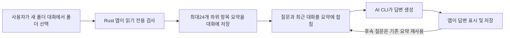

# AI 도우미의 폴더 대화 흐름

> 확인일: 2026-09-06
> 대상: Rust/Tauri 앱 v1.6.1의 내장 AI 도우미. 코드 확인만 수행했으며 실제 스캔이나 AI 요청은 실행하지 않았다.
>
> 이후 미출시 소스에는 앱 도구를 통한 빈 폴더 검사·후보 수정·최종 확인·휴지통 흐름이 추가되었다. 아래 내용은 **설치된 v1.6.1의 설명**으로 보존하며, 새 구현과 검증 범위는 [구현 계약](docs/plan/conversational-empty-folders/plan.md)과 [검증 기록](docs/plan/conversational-empty-folders/verification.md)을 참고한다.

## 한 줄 요약

BroomSweepy가 폴더를 읽기 전용으로 스캔해 요약을 만들고, 외부 AI CLI가 질문·최근 대화·저장된 요약을 받아 답변을 생성한다. 앱이 답변을 미리 완성해 단순히 문장으로 바꾸게 하는 것은 아니다.

## 비유로 이해하기

앱은 창고의 물건 수와 상자별 크기를 조사해 목록을 만드는 조사원이고, AI는 그 목록을 보고 우선순위를 설명하는 상담원이다. 상담원에게 창고 열쇠를 주고 직접 상자를 열어 보게 하는 대화 흐름은 구현되어 있지 않다.

비유의 한계: 이것은 앱의 데이터 전달 및 호출 흐름에 대한 설명이다. 특히 Codex의 읽기 도구를 운영체제 수준에서 완전히 차단했다는 의미는 아니다.

## 실제로 전달하는 것

- 사용자가 선택한 폴더 이름, 검사 시각, 전체 논리 용량, 파일·폴더 수, 읽지 못한 항목 수, 빈 폴더 수.
- 하위 항목 최대24개의 이름, 종류, 용량, 파일·폴더 수.
- 사용자 질문과 제한된 최근 대화 기록.
- 앱이 자동 생성한 폴더 요약에는 전체 경로나 파일 본문이 없다. 사용자가 질문에 직접 적은 내용까지 자동으로 익명화한다는 뜻은 아니다.

## 왜 이렇게 나누는가

폴더 검사는 앱의 로컬 스캔 정책 아래에서 수행하고, AI에는 제한된 요약을 보내 설명과 판단을 맡긴다. 따라서 파일 본문을 읽은 것처럼 말하거나, 요약만으로 삭제 안전성을 확정해서는 안 된다.

프롬프트는 AI에게 직접 디스크를 읽었다고 주장하지 말고, 도구를 사용하지 말며, 정보가 부족하면 추가 검사가 필요하다고 답하도록 지시한다. 삭제 승인·실행 역시 주장하지 못하게 한다.

## 흐름도

## 현재 한계와 별도 기능

- 폴더 대화는 질문마다 다시 스캔하지 않는다. 저장된 대화를 다시 열어도 그 대화에 저장된 요약을 사용한다.
- AI가 추가 조사가 필요하다고 판단해 앱의 폴더 스캔 도구를 호출하고 결과를 받아 다시 분석하는 반복 흐름은 현재 내장 대화에 없다.
- 파일 내용, 실제 사용 여부, 모든 깊이의 개별 항목을 AI가 안다고 볼 수 없다. 따라서 “무엇을 지워도 되는가?”에 확정적 답변을 하기 어렵다.
- Codex는 선택한 폴더가 아닌 앱 캐시의 전용 작업 폴더에서 읽기 전용 샌드박스로 실행된다. 사용자 설정·규칙을 무시하도록 지정하지만 읽기 도구 자체를 완전히 제거하는 옵션은 이 호출에 없다. 실제 도구 접근 범위는 설치된 Codex의 샌드박스 정책을 따른다.
- Claude Code는 도구·MCP·훅 등을 비활성화하는 인자를 사용한다. 공급자별 제한 방식이 같지는 않다.
- 화면의 외부 터미널 제어/MCP 권한은 별도 외부 클라이언트 연결용이다. 내장 채팅이 그 도구를 자동 호출한다는 뜻이 아니다.
- Docker 질문은 예외적으로 앱이 Docker CLI에서 최신 사용량 문맥을 준비해 추가할 수 있다. 이것 역시 AI가 직접 Docker를 조사하는 구조와 다르다.

## 코드 근거

- [App.tsx](/Users/dannysmacair/Documents/git/BroomSweepy/apps/desktop/src/App.tsx:905): 폴더 선택 후 앱의 디렉터리 검사 호출.
- [lib.rs](/Users/dannysmacair/Documents/git/BroomSweepy/apps/desktop/src-tauri/src/lib.rs:1412): Rust의 디렉터리 검사 실행.
- [AssistantView.tsx](/Users/dannysmacair/Documents/git/BroomSweepy/apps/desktop/src/views/AssistantView.tsx:154): 저장된 대화의 요약 사용.
- [AssistantView.tsx](/Users/dannysmacair/Documents/git/BroomSweepy/apps/desktop/src/views/AssistantView.tsx:439): 질문·최근 대화·요약 전달.
- [AssistantView.tsx](/Users/dannysmacair/Documents/git/BroomSweepy/apps/desktop/src/views/AssistantView.tsx:1041): 전달용 요약 생성.
- [assistant_provider.rs](/Users/dannysmacair/Documents/git/BroomSweepy/apps/desktop/src-tauri/src/assistant_provider.rs:458): 요약을 포함한 질문 입력 생성.
- [assistant_provider.rs](/Users/dannysmacair/Documents/git/BroomSweepy/apps/desktop/src-tauri/src/assistant_provider.rs:558): Codex 실행 인자 및 작업 폴더.
