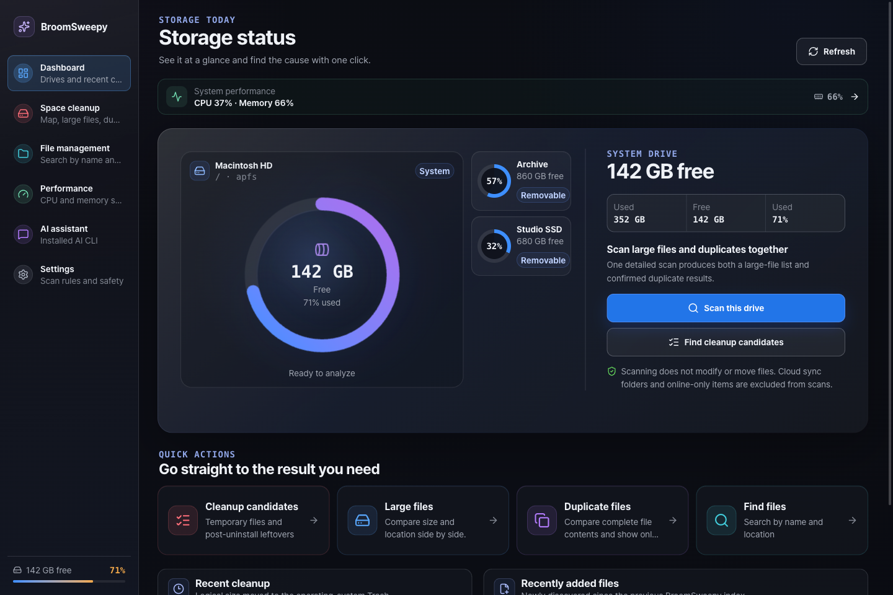
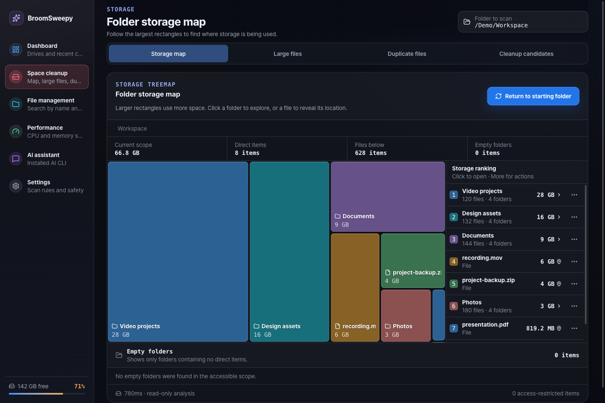
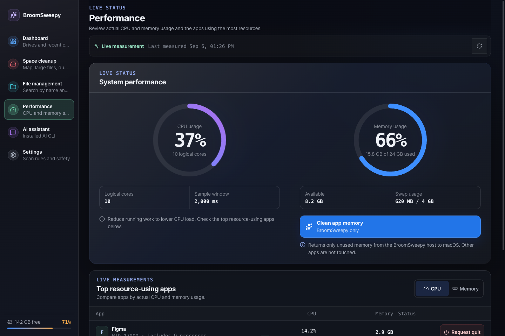
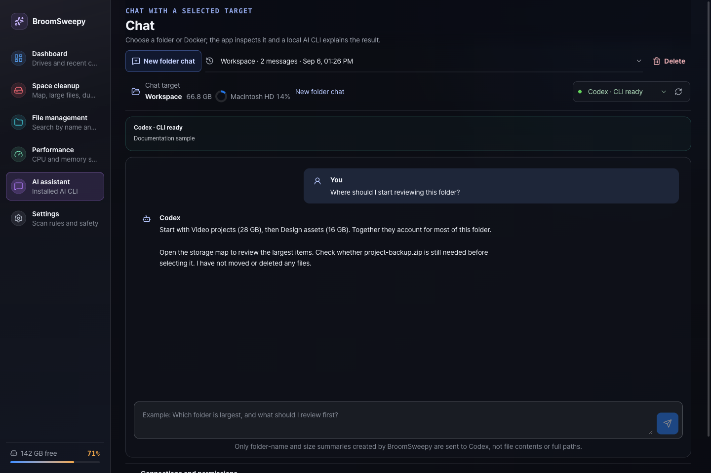
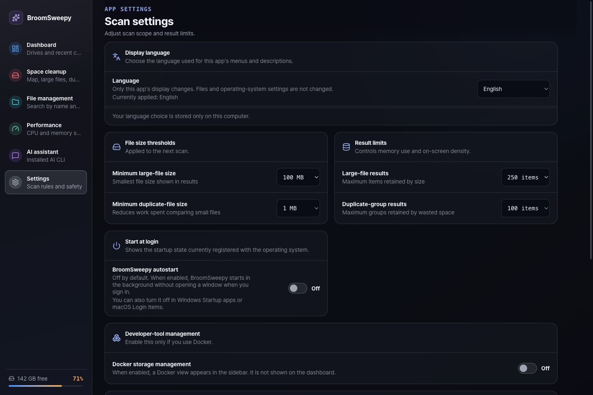

# BroomSweepy — Conversational File Management System

<p align="center">
  
</p>

<p align="center">
  <strong>English</strong> |
  <a href="README.md">한국어</a> |
  <a href="README.ja.md">日本語</a> |
  <a href="README.zh-CN.md">简体中文</a>
</p>

BroomSweepy is a project building a **conversational file management system** for Windows and macOS. Its goal is to make conversation the primary way to find files, scan folders, review candidates, refine conditions, confirm actions, and inspect results in one continuous workflow.

**Rust + Tauri 2 + React is the primary project**, carrying forward the spacious cards, clear icons, and glass-inspired experience of the original SwiftUI app. The Swift source in `BroomSweepy/` remains a legacy reference implementation. Large-file analysis, verified duplicates, and document search run locally in Rust; existing browsing and scanning views remain usable without an AI connection. One installation supports English, Korean, Japanese, and Simplified Chinese; English is the first-run default. Change it under `Settings > Display language`.

## v1.7.0 — Conversational tools and resource safeguards

[Stable release and downloads](https://github.com/Dannykkh/bloomsweepy/releases/tag/v1.7.0) · [Changelog](CHANGELOG.md)

- **Conversational empty-folder cleanup** connects local rescans, candidate cards, conversational exclusions, final confirmation, and per-item results.
- **Folder actions and opening files** add separately reviewed whole-folder Trash moves from the storage map, with distinct Open and Reveal actions.
- **App management** lists installed apps and searches substrings in names, publishers, and paths. Mac app bundles and related data are reviewed separately; Windows uses the operating system's removal page.
- **Empty system Trash** requires separate irreversible confirmation for the user's entire Trash. AI has no authority to invoke it.
- **Resource safeguards** use bounded streaming traversal, index memory/disk budgets, and an isolated document worker.
- **macOS menu bar** uses a native panel for RAM, CPU, and system-disk readings every 10 seconds. The optional RAM title persists. Closing hides the window; Open restores it; Quit/⌘Q exits. No additional WebView is created.

Navigation: **Dashboard → Performance → App management → Space cleanup → File management → AI assistant → Settings**. Docker management is off by default and appears only when enabled.

### Conversational empty-folder workflow

1. Select a local folder in AI assistant and ask to scan for empty folders.
2. Review the app's refreshed candidate card and exclude folders through chat or checkboxes.
3. Review the exact paths and selection, then use the **final confirmation button** to move them to Trash.
4. Check each item's completed, failed, or skipped result.

Review is limited to 200 candidates and each AI page to 24. Counts identify omissions due to protection, changes, or limits. Plans are single-use, expire after five minutes, and are invalidated by selection changes, rescans, or restarts. A chat message or AI response cannot grant final approval. General file moves and renaming through conversation are not supported yet. **End-to-end validation of the new tool flow with a real Codex CLI is still pending.**

### App management and opening files

`App management` lists apps without a full-drive scan. On Mac, use the app's official uninstaller first; ordinary app bundles can be moved to Trash after separate confirmation. Related data cleanup is a separate opt-in review limited to caches and preferences matched by exact app identifier. Documents, Application Support, Containers, and shared data are excluded from automatic candidates. Windows opens the official Installed apps removal page; BroomSweepy does not guess and delete app folders, registry entries, or AppData. Opening that page does not mean removal has completed.

Explicit Open actions launch ordinary documents/media in their default viewer and ordinary folders in the file manager. Executables, scripts, and app packages are revealed instead of executed. Reveal location and in-app folder drilldown remain separate actions. These features do not grant new removal permissions to AI, CLI, or MCP.

### Local processing, tokens, and transmitted data

File searches, scans, aggregation, and candidate management run on your computer, with bounded summaries sent to AI. Local file operations themselves do not use LLM tokens. The potential saving comes from sending relevant summaries instead of complete file lists—not from Rust itself. A well-designed general CLI can be similarly efficient; savings for equivalent completed tasks have not been measured.

Cloud AI providers receive names, sizes, counts, candidate IDs, questions, and chat history. App-generated folder summaries and new candidate pages do not automatically contain file bodies or full paths, but paths or contents you type can be included in questions and history. A local CLI or read-only permission does not mean fully offline processing or guaranteed prevention of data transmission. Separately authorized MCP file/document searches may return paths and matching snippets. No zero-transmission or fixed token-saving claim is made.

### Resource boundaries and verification limits

Heavy work stops cooperatively above 512 MiB of host-process memory or below 256 MiB of available system RAM. PDF/Office workers use a 128 MiB Rust-allocation budget and a 15-second limit. Failed indexing preserves the last completed index. These are not whole-app/WebView/CLI OS memory quotas or proof that memory leaks are resolved. Hiding the main window retains its existing state and memory.

- Local automated checks: 273 Rust and 43 frontend tests passed; one opt-in live CLI diagnostic skipped.
- Not yet verified: the new real-Codex tool flow, long-running whole-process memory stability, real user-app deletion, and actual Trash emptying.
- Menu-bar preference persistence, restart, and full quit were checked. Direct icon clicks, popover controls, and keyboard interaction still need visual verification.
- Total app size, installation date, and selectable name/date/size sorting are not implemented. Substring search is available.
- Windows installers and automated checks are built in CI. Passing CI does not prove interactive installation, GUI, or Recycle Bin behavior.

## Preview

These historical v1.6.0 captures render actual React components with synthetic documentation data. They do not show v1.7.0 navigation, app management, new confirmation flows, or the native menu bar. Drives, files, metrics, and conversations are examples, not real AI responses or user files. Browser captures do not reproduce macOS native window materials.

### Multi-drive dashboard



### Storage treemap



### CPU and memory



### AI assistant



### Settings and display language



## What's new in v1.6.0

- Dark glass-inspired surfaces, prominent action buttons, clear icons, and streamlined navigation.
- A large selected-drive card beside compact drive cards. Selecting another drive exchanges their positions and sizes with an animated transition.
- CPU and memory rings, top-app usage, smooth transitions between samples, and reduced-motion support.
- macOS app-memory cleanup returns only unused allocator pages from the BroomSweepy host process. Zero bytes returned is a valid completion.
- Treemap navigation and individual-file actions with identity/path revalidation and a Trash-operation journal.
- Distinct missing, broken, incompatible, and sign-in-required AI CLI states, plus improved conversation, cancellation, and saved-history handling.

## Safety and cloud exclusions

Scans do not modify files. Large-file/duplicate scans, drive summaries, treemaps, file catalogs, and document indexes exclude known cloud-sync roots and online-only entries. The policy prunes macOS `~/Library/CloudStorage`, `~/Library/Mobile Documents`, and recognized Google Drive, iCloud, OneDrive, and Dropbox paths before traversal; selecting a recognized cloud root directly is also rejected. Even downloaded files inside recognized cloud roots are excluded. Arbitrarily relocated sync folders and every possible provider cannot be identified reliably.

Duplicates pass size grouping, partial/full BLAKE3, and final byte comparison. File moves require selection, revalidation, final confirmation, and journaling before using the OS Trash or Recycle Bin. v1.7.0 empty-folder moves require separate final confirmation. Empty system Trash is a distinct irreversible exception described below. Trashed logical bytes do not equal newly available disk space. Automatic registry deletion is not provided.

v1.7.0 adds `Open Trash` and `Empty system Trash` above storage views. The latter asks the OS to empty the current user's Trash across connected drives, including items from other apps, not just the selected folder. It requires a separate warning, acknowledgment checkbox, and single-use confirmation valid for 2 minutes. It is not exposed to AI/CLI/MCP, does not pre-scan the entire Trash, and does not guarantee freed space. The warning dialog and cancellation were checked in a local Mac installation; actual native emptying was not performed.

Memory cleanup does not purge system RAM, other apps, WebView helper processes, swap, or memory leaks. There is no CPU-cleanup action. On macOS, requesting a normal app exit is a separate confirmation flow with no force-kill fallback. Windows performance is read-only; swap is a commit-based estimate, not current pagefile usage.

Docker management is off by default. When enabled, cleanup uses fixed commands, excludes volumes, and requires a separate irreversible-action confirmation.

## AI, CLI, and MCP

Installing the Codex desktop app does not establish that the Codex CLI is installed. Check your provider's CLI installation, compatible version, and sign-in state in BroomSweepy. The earlier summary-response flow was checked with Codex; the new v1.7.0 empty-folder tool flow still needs end-to-end validation. Adapters also exist for Claude Code, Grok, Antigravity, and Ollama, but not all were live-tested for this Mac release.

In-app chat sends a bounded folder summary containing item names and sizes, plus your question and conversation history, to the selected provider. A local CLI does not mean offline model processing. MCP cleanup tools expose anonymous candidate IDs and bounded summaries, with no approval or deletion-execution tools. Separately enabling file or document search can expose paths and matching excerpts to external clients. Final file actions stay behind confirmation in the app.

## Platforms and development

Requirements: Rust stable, Node.js 22+, and npm; WebView2 and MSVC Build Tools on Windows; Xcode Command Line Tools on macOS.

- `apps/desktop/`: primary Tauri/React app
- `crates/bloomsweepy-core/`: shared Rust analysis engine
- `crates/bloomsweepy-control/`, `apps/bloomsweepy-mcp/`: local control protocol and CLI/MCP bridge
- `BroomSweepy/`: legacy SwiftUI reference

These features were implemented and partly checked in a local Apple Silicon development build. See the verification limits above. Windows installers are built in CI; native Windows runtime checks remain separate. Mac builds are ad-hoc signed and not Apple-notarized. See [Releases](https://github.com/Dannykkh/bloomsweepy/releases) for downloads and platform notes.

```sh
cd apps/desktop
npm ci
npm run tauri dev
```

```sh
# Repository root
cargo fmt --all -- --check
cargo clippy --workspace --all-targets -- -D warnings
cargo test --workspace
cd apps/desktop
npm run check
npm run test:all
npm run build
npm run tauri build
```

## Documentation

[Changelog](CHANGELOG.md) · [CLI connection and control](docs/cli-control.md) · [Performance and memory boundaries](docs/architecture/startup-memory-status.md) · [Safe Trash actions](docs/architecture/safe-trash-actions.md) · [Document search](docs/architecture/document-search.md) · [File search](docs/architecture/fast-file-search.md) · [Design](DESIGN.md) · [Reproduce screenshots](docs/assets/screenshots/README.md)

## Important: data loss and recovery responsibility

BroomSweepy is designed to act only on items the user selected and confirmed. Recovery can still depend on operating-system permissions, Trash settings, sync services, and external or network-drive behavior. Docker cleanup does not use the operating-system Trash and completed steps cannot be restored.

Back up important data and verify every selected path, file, and Docker category before running cleanup. The project providers and contributors are not responsible for data loss or failed recovery caused by user-initiated file moves, deletion, Trash emptying, or Docker cleanup, except where liability cannot legally be excluded.
