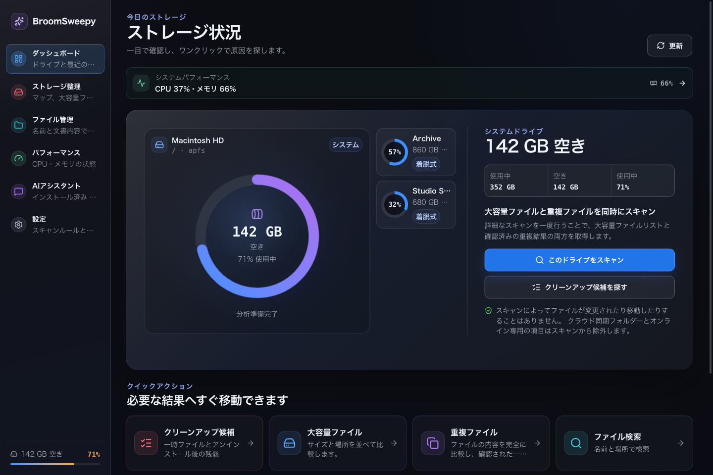
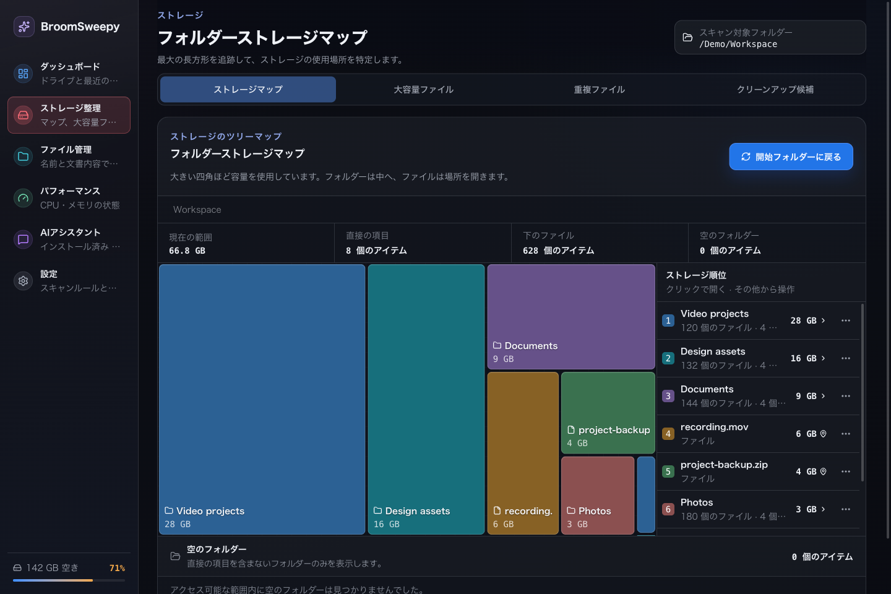
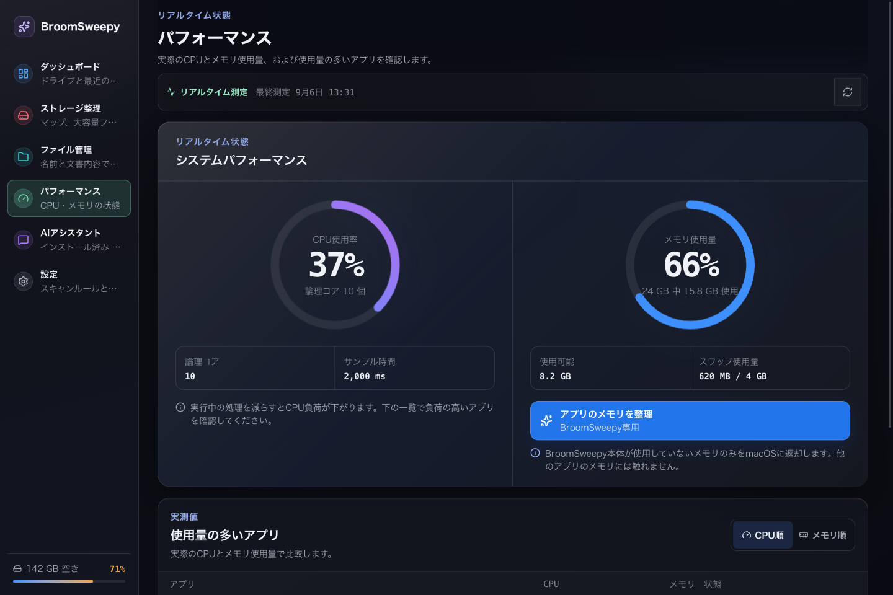
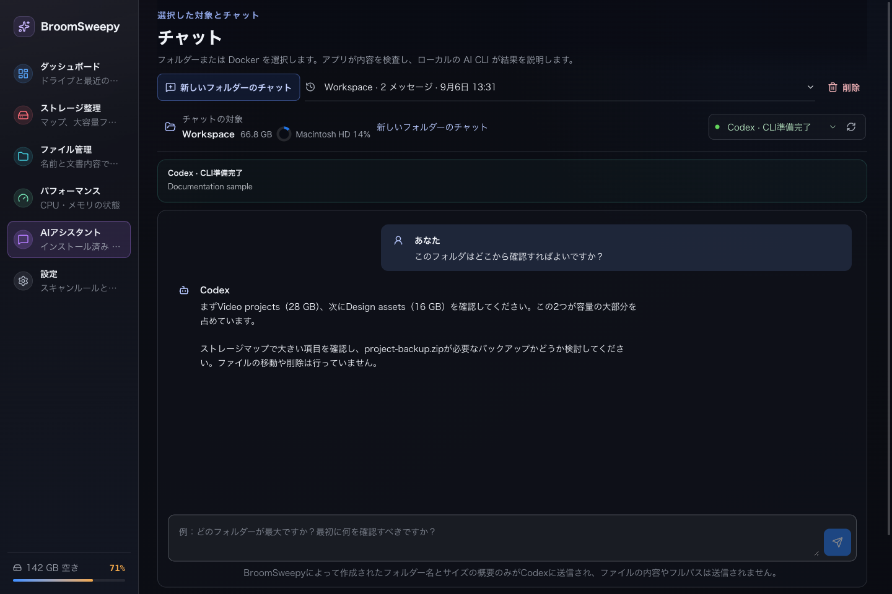
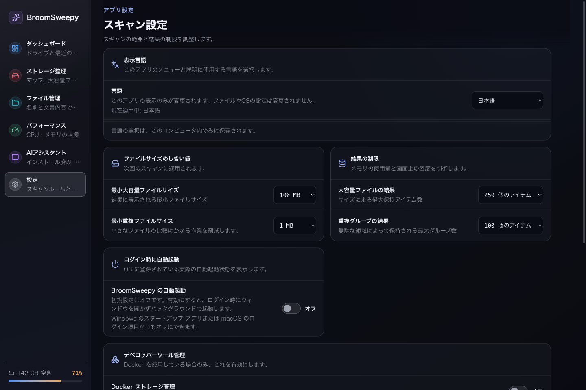

# BroomSweepy — 対話型ファイル管理システム

<p align="center">
  
</p>

<p align="center">
  <a href="README.en.md">English</a> |
  <a href="README.md">한국어</a> |
  <strong>日本語</strong> |
  <a href="README.zh-CN.md">简体中文</a>
</p>

BroomSweepyは、WindowsとmacOS向けの**対話型ファイル管理システム**を開発するプロジェクトです。会話を主な操作方法として、ファイル検索からスキャン、候補の検討、条件の調整、最終確認、実行結果の確認までを一つの流れで進められる体験を目指しています。

**Rust + Tauri 2 + Reactがメインプロジェクト**となり、従来のSwiftUIアプリの広々としたカード、分かりやすいアイコン、ガラス調のUIを受け継ぎます。`BroomSweepy/`のSwiftソースは従来版の参考実装です。大容量ファイル、内容を検証した重複ファイル、文書検索はローカルのRustエンジンで処理し、既存の閲覧・スキャン画面はAI接続なしでも利用できます。1つのアプリで英語・韓国語・日本語・簡体字中国語に対応し、初回は英語で表示します。`Settings > Display language`で変更できます。

## v1.7.0 — 対話型ツールとリソース保護

[正式リリースとダウンロード](https://github.com/Dannykkh/bloomsweepy/releases/tag/v1.7.0) · [変更履歴](CHANGELOG.md)

- **対話型の空フォルダ整理**：ローカル再検査、候補カード、会話による除外、最終確認、項目別の結果を接続しました。
- **フォルダ操作とファイルを開く機能**：容量マップからフォルダ全体のゴミ箱移動を個別に確認し、「開く」と「場所を表示」を区別します。
- **アプリ管理**：名前・提供元・パスの部分一致検索に対応。Macは本体と関連データを別々に確認し、WindowsはOSの削除画面を開きます。
- **システムのゴミ箱を空にする**：ユーザーのゴミ箱全体を対象とする完全削除で、別途確認が必要です。AIにはこの権限を渡しません。
- **リソース保護**：上限付きストリーミング探索、索引のメモリ・ディスク予算、独立した文書処理プロセスを追加しました。
- **macOSメニューバー**：RAM・CPU・システムディスクを10秒ごとにネイティブパネルで表示します。RAM数値の表示設定を保存し、閉じると非表示、開くと復元、終了/⌘Qで完全終了します。追加のWebViewは作成しません。

メニュー順は **ダッシュボード → パフォーマンス → アプリ管理 → ストレージ整理 → ファイル管理 → AIアシスタント → 設定**。Docker管理は初期状態で無効です。

### 対話型空フォルダ整理の使い方

1. AIアシスタントでローカルフォルダを選び、空フォルダの検査を依頼します。
2. 再検査した候補カードを確認し、会話またはチェックボックスで残すフォルダを除外します。
3. 正確なパスと選択内容を確認し、**最終確認ボタン**でゴミ箱移動を実行します。
4. 項目別の成功・失敗・スキップを確認します。

候補は最大200件、AIに渡す1ページは最大24件です。保護・変更・上限による除外数を表示します。計画は5分間有効な使い切りで、選択変更・再検査・再起動により無効になります。会話やAIの返答だけでは実行しません。一般ファイルの移動・名前変更を会話で行う機能は未対応です。**実際のCodex CLIを使った新ツールのエンドツーエンド検証は未完了です。**

### アプリ管理とファイルを開く操作

`アプリ管理`で全ドライブの検査なしに一覧を表示します。Macは専用アンインストーラを優先し、通常のアプリ本体のみ個別確認後にゴミ箱へ移動します。関連データは正確なアプリ識別子に一致するキャッシュと環境設定だけを別途選択・確認します。書類、Application Support、Containers、共有データは自動候補から除外します。Windowsは正式な「インストールされているアプリ」の削除画面を開き、アプリフォルダ・レジストリ・AppDataの推測削除は行いません。画面が開いても削除完了を意味しません。

「開く」は通常の書類・メディアを既定のアプリで、通常のフォルダをファイルマネージャで開きます。実行ファイル・スクリプト・アプリパッケージは実行せず場所を表示します。場所の表示とアプリ内の下位フォルダ探索は別の操作です。AI・CLI・MCPへの削除権限追加はありません。

### ローカル処理・トークン・送信範囲

検索・検査・集計・候補管理は手元のコンピューターで行い、AIには上限付きの要約を渡します。ローカルのファイル操作自体はLLMトークンを使いません。節約の要因はRustではなく、全ファイル一覧の代わりに必要な要約を送ることです。適切に構成した一般CLIでも同程度の効率が得られます。同じ作業を完了する条件での削減率は未測定です。

クラウドAIには名前・サイズ・件数・候補番号と質問・会話履歴が送信されます。アプリのフォルダ要約と新しい候補ページに本文・フルパスは自動挿入しませんが、直接入力したパスや内容は質問・履歴に含まれ得ます。ローカルCLIや読み取り専用権限は、完全オフラインや外部送信の完全防止を意味しません。別途許可したMCPファイル・文書検索ではパスや一致箇所が返る場合があります。外部送信ゼロや一定のトークン削減率は保証しません。

### リソースの範囲と検証の制限

本体メモリ512 MiB超過、またはシステム空きRAM256 MiB未満で重い処理を協調的に中断します。PDF・Office処理はRust割り当て128 MiBと15秒の制限を使用し、索引更新に失敗した場合は前回完了した索引を保持します。アプリ全体・WebView・CLIに対するOSのハード上限でも、メモリリーク解消の保証でもありません。ウインドウを隠しても状態とメモリは保持します。

- ローカル自動検査：Rust273件・フロントエンド43件成功。任意の実CLI診断1件は未実行。
- 未検証：新しいCodexツール連携、長時間の全プロセスメモリ安定性、実際のユーザーアプリ削除・ゴミ箱の完全消去。
- メニューバー設定の保存・再起動・完全終了は確認済み。アイコンの直接クリック、パネル内操作、キーボードの視覚検証は残っています。
- アプリ全体の容量・インストール日・名前/日付/容量による並べ替え選択は未対応。部分一致検索は利用できます。
- Windowsのインストーラーと自動検査はCIで実行します。CI成功は実際のインストール・GUI・ゴミ箱操作の検証を意味しません。

## 画面プレビュー

以下はv1.6.0時点のReactコンポーネントをサンプルデータで描画した参考画像です。v1.7.0のメニュー・アプリ管理・確認フロー・メニューバーは反映していません。ファイル・数値・会話は例であり、実際のAI応答や利用者のファイルではありません。macOSネイティブ材質も再現していません。

### 複数ドライブのダッシュボード



### ストレージツリーマップ



### CPUとメモリ



### AIアシスタント



### 設定と言語



## v1.6.0の主な更新

- ガラス調のダークUI、大きな操作ボタン、分かりやすいアイコンと整理されたナビゲーション。
- 選択したドライブを大きなカード、他を小さなカードで表示し、選択時に位置とサイズをアニメーションで交換します。
- CPU・メモリの円形グラフ、上位アプリの使用量、測定間の滑らかな遷移とモーション軽減への対応。
- macOSのアプリメモリ整理はBroomSweepy本体の未使用allocatorページだけをOSに返します。返却量0も正常な完了です。
- ツリーマップと個別ファイル操作、ファイルの同一性・パスの再検証、ゴミ箱操作の記録。
- AI CLIの未導入・実行不可・非互換・ログイン必要を区別し、会話、キャンセル、保存履歴の処理を改善しました。

## 安全性とクラウドの除外

スキャンはファイルを変更しません。大容量・重複検査、ドライブ集計、ツリーマップ、ファイル一覧、文書索引は既知のクラウド同期ルートとオンライン専用項目を除外します。macOSの`~/Library/CloudStorage`、`~/Library/Mobile Documents`と認識済みのGoogle Drive・iCloud・OneDrive・Dropboxパスは走査前に除外し、直接選択しても検査しません。認識済みルート内のダウンロード済みファイルも除外します。任意の場所へ移動した同期フォルダや、すべてのプロバイダーの自動識別は保証しません。

重複はサイズ、部分・全体BLAKE3、最終バイト比較で検証します。ファイル移動は選択、再検証、最終確認、記録を経てOSのゴミ箱を利用します。v1.7.0の空フォルダ移動は最終確認が必要です。以下のゴミ箱を空にする操作は、個別確認を伴う完全削除の例外です。移動した論理サイズは増えた空き容量と同じではありません。レジストリの自動削除は提供しません。

v1.7.0では、ストレージ画面上部に「ゴミ箱を開く」と「システムのゴミ箱を空にする」を追加しました。後者は、接続されたドライブにある現在のユーザーのゴミ箱全体をOSに空にするよう要求します。他のアプリで捨てた項目も含まれ、選択フォルダには限定されません。警告、確認チェックボックス、2分間有効な使い切り確認を別途必要とします。AI/CLI/MCPには公開せず、ゴミ箱全体の事前スキャンや空き容量の保証もしません。Macのローカルインストール版で警告画面とキャンセルを確認しました。実際にゴミ箱を空にする操作は未実施です。

メモリ整理はシステム全体、他のアプリ、WebView補助プロセス、スワップ、メモリリークを解消しません。CPU整理機能はありません。macOSの通常終了要求は別の確認操作で、強制終了には切り替えません。Windowsのパフォーマンスは読み取り専用で、スワップはページファイルの現在使用量ではなくコミット量ベースの推定値です。

Docker管理は初期状態で無効です。有効時も固定コマンドだけを使い、ボリュームを除外し、復元不可の操作として別途確認します。

## AI・CLI・MCP

Codexデスクトップアプリを入れただけでは、Codex CLIが導入されているとは限りません。利用するCLIの導入、互換バージョン、ログイン状態をアプリで確認してください。従来の要約応答はMacのCodexで確認しましたが、v1.7.0の新しい空フォルダツールのエンドツーエンド検証は未完了です。Claude Code・Grok・Antigravity・Ollamaのアダプターもありますが、今回すべての実動作を検証したわけではありません。

アプリ内チャットは項目名とサイズを含む上限付きのフォルダ要約、質問、会話履歴を選択したプロバイダーへ送ります。ローカルCLIでもモデル処理がオフラインとは限りません。MCP整理ツールは匿名候補IDと制限付き要約を提供し、承認・削除実行ツールは持ちません。ファイル・文書検索を別途許可すると、パスや一致部分が外部クライアントへ渡る場合があります。最終操作はアプリで確認します。

## 対応環境と開発

Rust stable、Node.js 22+、npmが必要です。WindowsではWebView2とMSVC Build Tools、macOSではXcode Command Line Toolsも必要です。

- `apps/desktop/`: メインのTauri/Reactアプリ
- `crates/bloomsweepy-core/`: 共通Rust分析エンジン
- `crates/bloomsweepy-control/`, `apps/bloomsweepy-mcp/`: ローカル制御規格とCLI/MCPブリッジ
- `BroomSweepy/`: 従来のSwiftUI参考実装

今回の機能はApple Silicon Macのローカル開発ビルドで実装と一部の動作を確認しました。検証範囲と未検証項目は上記を参照してください。最新のWindows実行検証は別途必要で、インストーラーはWindows CIで作成します。Mac検証ビルドはad-hoc署名で、Appleの公証済みではありません。配布ファイルと注意事項は[リリース](https://github.com/Dannykkh/bloomsweepy/releases)で確認してください。

```sh
cd apps/desktop
npm ci
npm run tauri dev
```

```sh
# Repository root
cargo fmt --all -- --check
cargo clippy --workspace --all-targets -- -D warnings
cargo test --workspace
cd apps/desktop
npm run check
npm run test:all
npm run build
npm run tauri build
```

## ドキュメント

[変更履歴](CHANGELOG.md) · [CLI接続と制御](docs/cli-control.md) · [パフォーマンスとメモリの範囲](docs/architecture/startup-memory-status.md) · [安全なゴミ箱操作](docs/architecture/safe-trash-actions.md) · [文書検索](docs/architecture/document-search.md) · [ファイル検索](docs/architecture/fast-file-search.md) · [デザイン](DESIGN.md) · [画面の再現](docs/assets/screenshots/README.md)

## 重要：データ損失と復元に関する責任

BroomSweepyは、利用者が選択して最終確認した項目だけを処理するよう設計されています。ただし、復元の可否はOS権限、ゴミ箱設定、同期サービス、外付け・ネットワークドライブの状態に左右されます。DockerクリーンアップはOSのゴミ箱を使用せず、完了した処理は元に戻せません。

実行前に重要なデータをバックアップし、選択したパス、ファイル、Docker分類を必ず確認してください。法律上免責できない場合を除き、利用者が実行したファイル移動・削除・ゴミ箱を空にする操作・Dockerクリーンアップによるデータ損失や復元失敗について、プロジェクト提供者および貢献者は責任を負いません。
