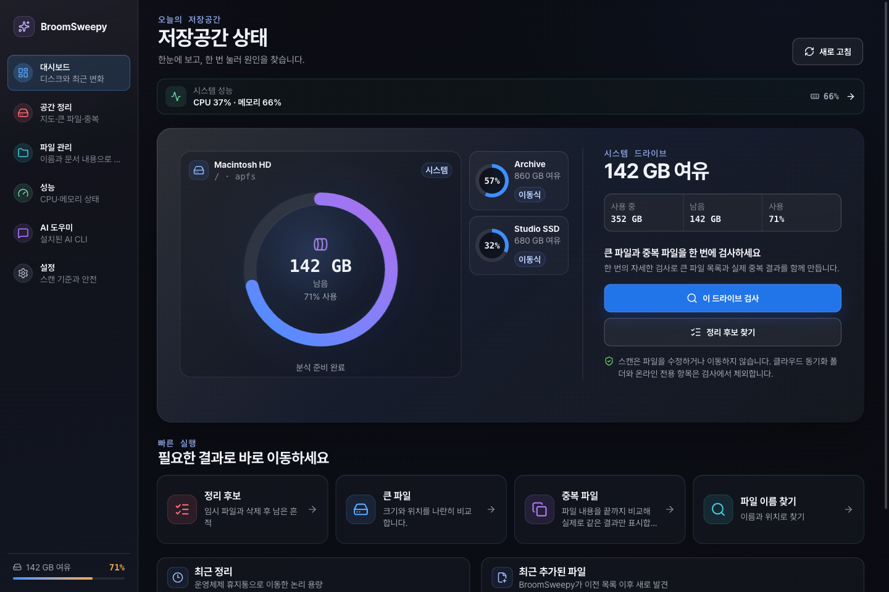
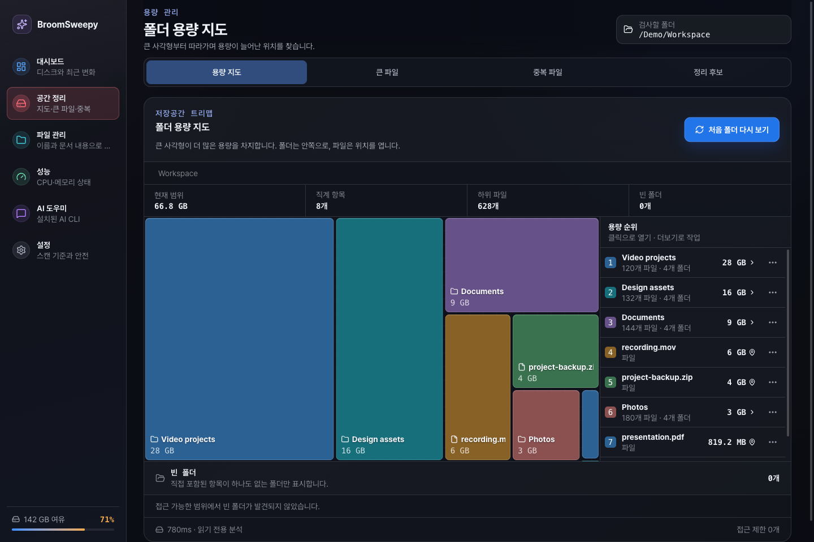
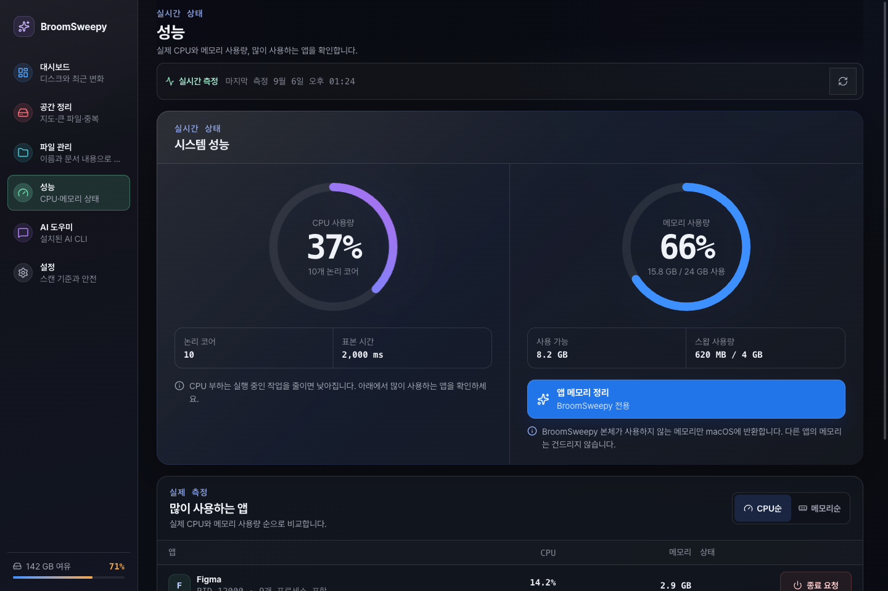
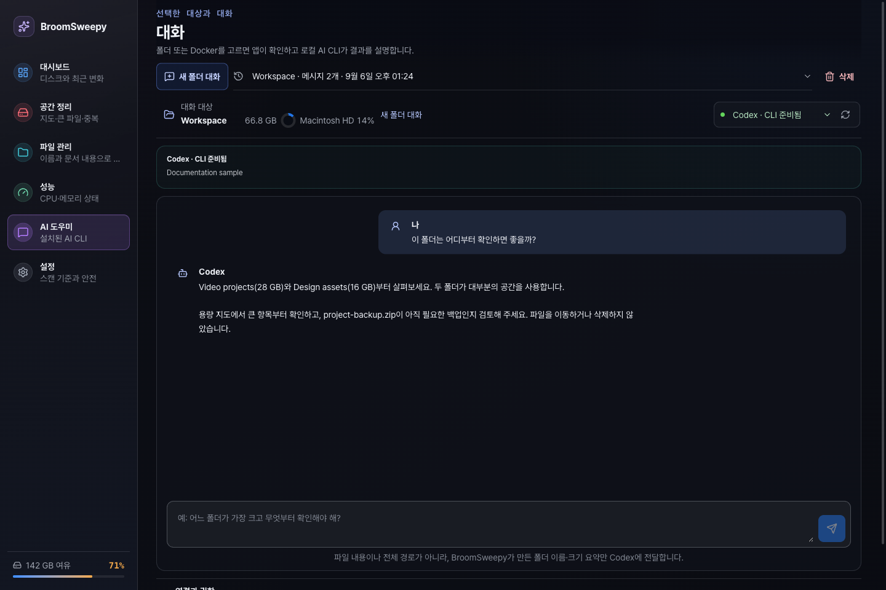
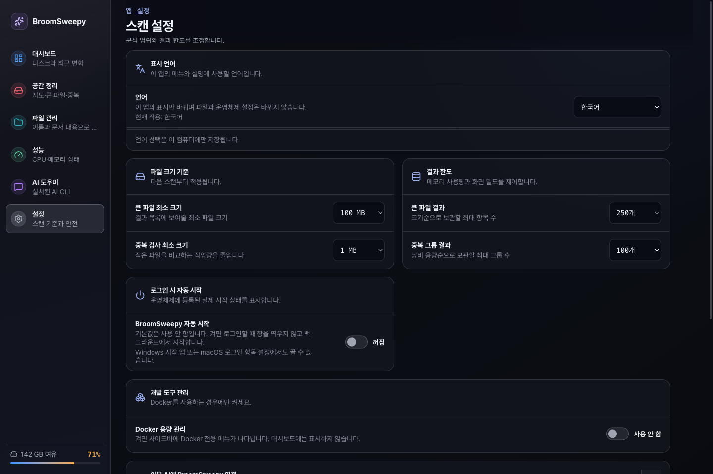

# BroomSweepy

<p align="center">
  
</p>

<p align="center">
  <a href="README.en.md">English</a> |
  <strong>한국어</strong> |
  <a href="README.ja.md">日本語</a> |
  <a href="README.zh-CN.md">简体中文</a>
</p>

BroomSweepy는 Windows와 macOS의 저장공간을 살펴보고, 정리할 파일을 직접 검토하는 데스크톱 앱입니다. **Rust + Tauri 2 + React가 기본 프로젝트**이며, 기존 SwiftUI 앱의 시원한 카드·아이콘·글래스 UI 경험을 이어갑니다. `BroomSweepy/`의 Swift 소스는 레거시 참고 구현입니다.

큰 파일·검증된 중복 파일·문서 검색은 로컬 Rust 엔진으로 동작합니다. AI 연결은 선택 사항입니다. 하나의 설치본에서 English·한국어·日本語·简体中文을 지원하며, 첫 실행 언어는 영어입니다. `Settings > Display language`에서 바꿀 수 있습니다.

## 빠른 시작

1. 대시보드에서 드라이브를 고르거나 `공간 정리`에서 로컬 폴더를 선택합니다. 폴더를 고르면 용량 지도가 만들어집니다.
2. 큰 사각형부터 확인하고, 폴더를 클릭해 안쪽으로 이동합니다. 더보기 메뉴에서 위치를 열거나 개별 파일의 휴지통 이동을 검토합니다.
3. 큰 파일·중복 검사는 한 번에 실행하고, 결과에서 필요한 항목을 직접 선택합니다. 실제 이동 전에는 앱의 최종 확인이 필요합니다.
4. `성능`에서 CPU·메모리를 함께 확인하고, 이름·본문 검색은 `파일 관리`, 자연어 질문은 `AI 도우미`를 사용합니다.

## 새로운 화면

현재 Rust 앱의 실제 React 컴포넌트를 공개용 예시 데이터로 렌더링한 캡처입니다. 드라이브·파일·수치·대화는 예시이며, 실제 AI 응답이나 사용자의 파일이 아닙니다. 브라우저 캡처이므로 macOS 네이티브 창 재질과는 차이가 있습니다.

### 다중 드라이브 대시보드



### 폴더 용량 지도



### CPU와 메모리



### AI 도우미



### 설정과 표시 언어



## v1.6.0 주요 변경

- 다크 글래스 화면, 큰 실행 버튼, 명확한 아이콘과 정리된 사이드바.
- 선택한 드라이브는 큰 카드로, 나머지는 작은 카드로 표시합니다. 클릭하면 카드가 자리를 바꾸며 확대·축소됩니다.
- CPU·메모리 원형 그래프와 상위 앱 사용량, 측정값 사이를 부드럽게 잇는 전환과 모션 줄이기 설정 대응.
- macOS의 `앱 메모리 정리`: BroomSweepy 본체의 사용하지 않는 allocator 메모리만 OS에 반환합니다. 반환량 0도 정상 결과입니다.
- 트리맵 탐색과 개별 파일 작업, 파일 변경·경로 우회 재검증, 휴지통 작업 기록.
- AI CLI의 미설치·실행 불가·버전 비호환·로그인 필요를 구분하고, 채팅·취소·저장된 대화 흐름을 개선했습니다.

## 안전과 클라우드 제외

스캔은 파일을 바꾸지 않습니다. 큰 파일·중복 검사, 드라이브 집계, 트리맵, 파일 카탈로그, 문서 색인은 알려진 클라우드 동기화 경로와 온라인 전용 항목을 제외합니다. macOS의 `~/Library/CloudStorage`, `~/Library/Mobile Documents`와 알려진 Google Drive·iCloud·OneDrive·Dropbox 경로를 순회 전에 차단하며, 인식된 클라우드 폴더를 직접 선택해도 검사하지 않습니다. 내려받아 둔 파일도 인식된 클라우드 루트 안에 있으면 제외됩니다. 임의 위치로 옮긴 동기화 폴더나 모든 공급자를 자동 식별한다고 보장하지는 않습니다.

중복은 크기 → 부분/전체 BLAKE3 → 바이트 비교로 검증합니다. 파일 이동은 선택·재검증·최종 확인·작업 기록을 거쳐 운영체제 휴지통으로 보냅니다. 빈 폴더 탐색은 읽기 전용입니다. 일반 파일 영구 삭제, 휴지통 비우기, 레지스트리 자동 삭제는 제공하지 않습니다. 휴지통 이동 용량은 논리 크기이며 실제 여유 공간 증가와 같지 않습니다.

메모리 정리는 시스템 전체 RAM·다른 앱·WebView 보조 프로세스·스왑·메모리 누수를 정리하지 않습니다. CPU 정리 기능은 없습니다. macOS의 일반 앱 정상 종료 요청은 별도 확인 동작이며 강제 종료하지 않습니다. Windows에서는 성능 조회만 제공하며 스왑은 페이지 파일 현재 사용량이 아닌 커밋 기반 추정치입니다.

Docker 관리는 기본적으로 꺼져 있습니다. 켠 경우에만 고정된 정리 명령을 사용하며, 볼륨은 제외하고 복구 불가 작업임을 따로 확인받습니다.

## AI·CLI·MCP

Codex 데스크톱 앱을 설치했다고 Codex CLI가 설치된 것은 아닙니다. 사용할 공급자의 CLI 설치·호환 버전·로그인 상태를 앱에서 확인하세요. 이번 Mac 채팅 흐름은 Codex로 검증했습니다. Claude Code·Grok·Antigravity·Ollama 어댑터도 있지만 이번 Mac 릴리스에서 모두 실사용 검증한 것은 아닙니다.

앱 채팅은 항목 이름·크기 등이 담긴 제한된 폴더 요약과 질문·대화 이력을 선택한 공급자에 전달합니다. 로컬 CLI를 쓴다고 모델 처리까지 오프라인인 것은 아닙니다. MCP 정리 도구는 익명 후보 ID와 제한된 요약만 제공하며 승인·삭제 실행 도구는 없습니다. 파일·문서 검색을 별도로 허용하면 경로와 일치 문맥이 외부 클라이언트에 전달될 수 있습니다. 최종 파일 작업은 앱 안에서 확인합니다.

## 플랫폼과 개발

Rust stable, Node.js 22+, npm이 필요합니다. Windows는 WebView2와 MSVC Build Tools, macOS는 Xcode Command Line Tools가 필요합니다.

- `apps/desktop/`: 기본 Tauri/React 앱
- `crates/bloomsweepy-core/`: 공용 Rust 분석 엔진
- `crates/bloomsweepy-control/`, `apps/bloomsweepy-mcp/`: 로컬 제어 규격과 CLI/MCP 브리지
- `BroomSweepy/`: 레거시 SwiftUI 참고 구현

이번 변경은 Apple Silicon Mac에서 빌드·설치·로컬 파일 검사 및 Codex 채팅 흐름을 검증했습니다. 최신 Windows 실행 검증은 별도이며 Windows 설치 파일은 Windows CI에서 빌드합니다. Mac 검증 빌드는 ad-hoc 서명이며 Apple 공증 완료를 의미하지 않습니다. 설치 파일과 플랫폼별 주의사항은 [릴리스](https://github.com/Dannykkh/bloomsweepy/releases)에서 확인하세요.

```sh
cd apps/desktop
npm ci
npm run tauri dev
```

```sh
# Repository root
cargo fmt --all -- --check
cargo clippy --workspace --all-targets -- -D warnings
cargo test --workspace
cd apps/desktop
npm run check
npm run test:all
npm run build
npm run tauri build
```

## 문서

[변경 기록](CHANGELOG.md) · [CLI 연결과 제어](docs/cli-control.md) · [성능·메모리 범위](docs/architecture/startup-memory-status.md) · [안전한 휴지통 작업](docs/architecture/safe-trash-actions.md) · [문서 검색](docs/architecture/document-search.md) · [파일 검색](docs/architecture/fast-file-search.md) · [디자인](DESIGN.md) · [화면 재현](docs/assets/screenshots/README.md)

## 중요: 데이터 손실과 복구 책임

BroomSweepy는 사용자가 선택하고 최종 확인한 항목만 정리하도록 설계됐지만, 운영체제 권한·휴지통 설정·동기화 서비스·외장 또는 네트워크 드라이브 상태에 따라 파일 복원 가능성을 보장할 수 없습니다. Docker 정리는 운영체제 휴지통을 거치지 않으며 완료된 단계는 복구할 수 없습니다.

정리를 실행하기 전에 중요한 파일을 별도 저장장치나 신뢰할 수 있는 백업 서비스에 보관하고, 선택한 경로·파일·Docker 범주를 직접 확인해야 합니다. 사용자가 실행한 파일 이동·삭제·휴지통 비우기·Docker 정리로 발생한 데이터 손실이나 복구 실패에 대해 프로젝트 제공자와 기여자는 책임을 지지 않습니다. 다만 관련 법률상 배제할 수 없는 책임에는 해당 법률이 적용됩니다.
