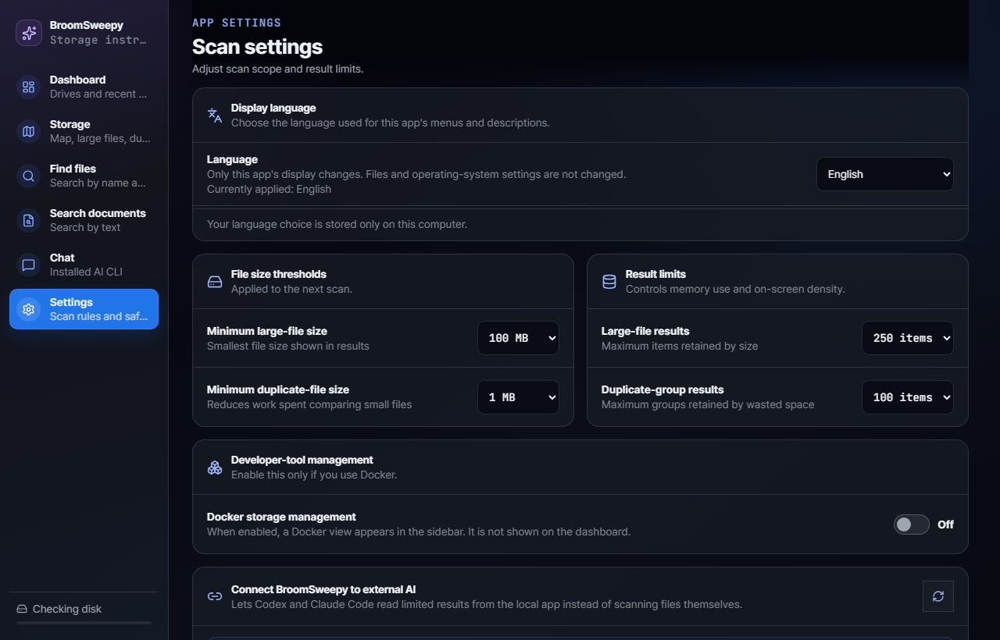
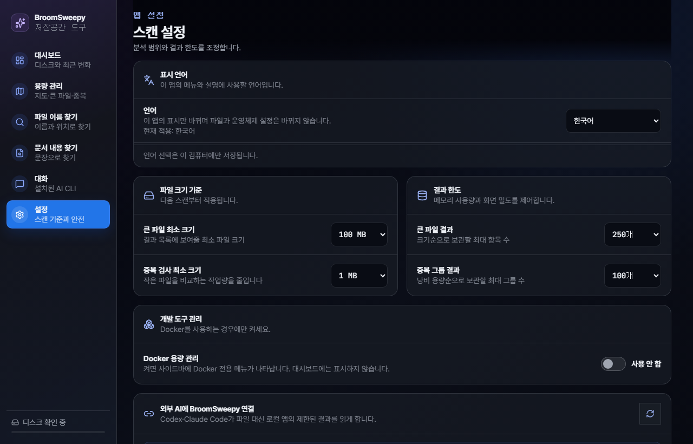
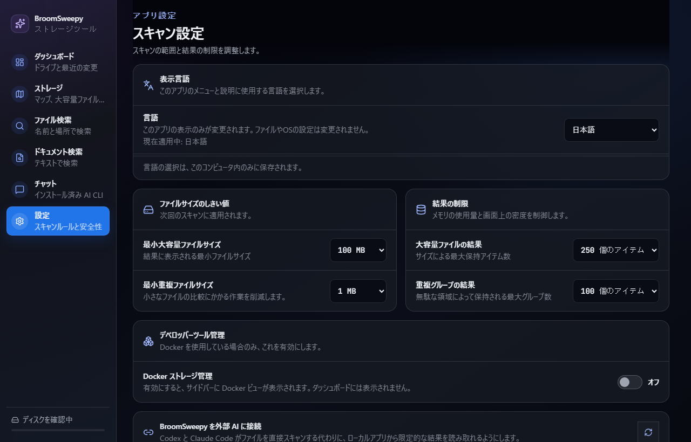
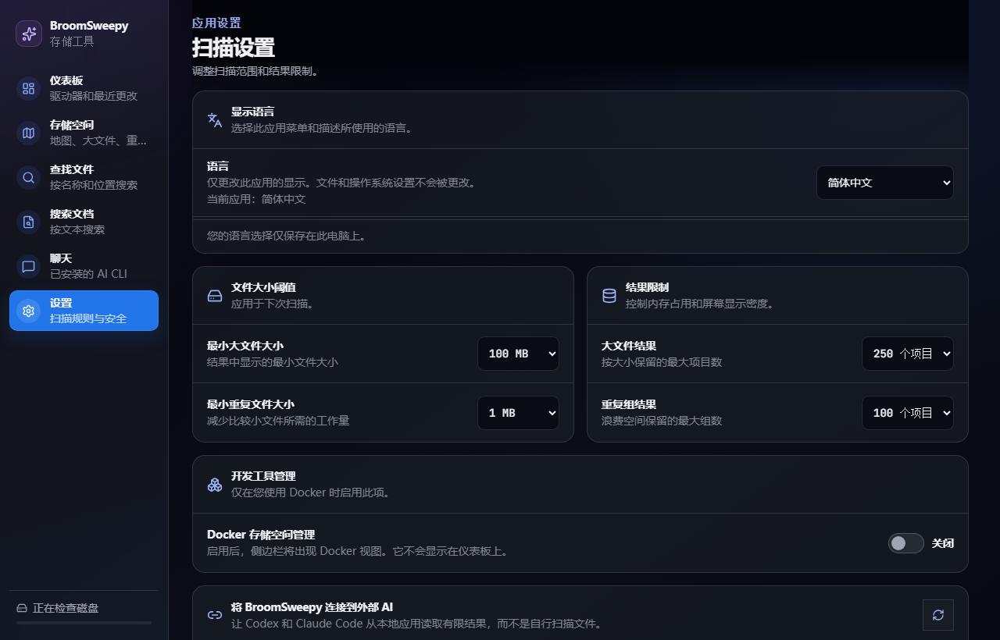
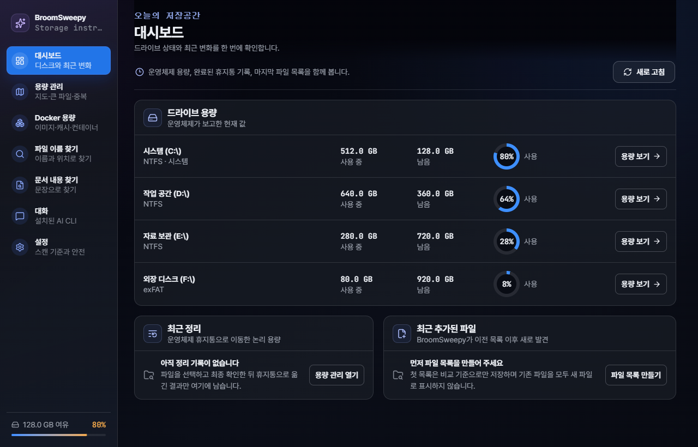
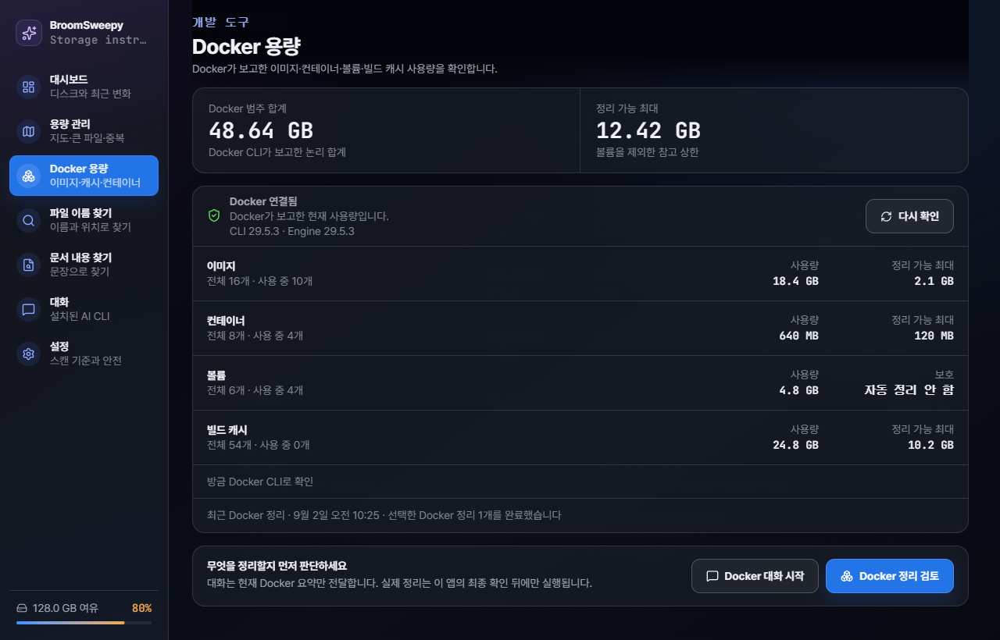
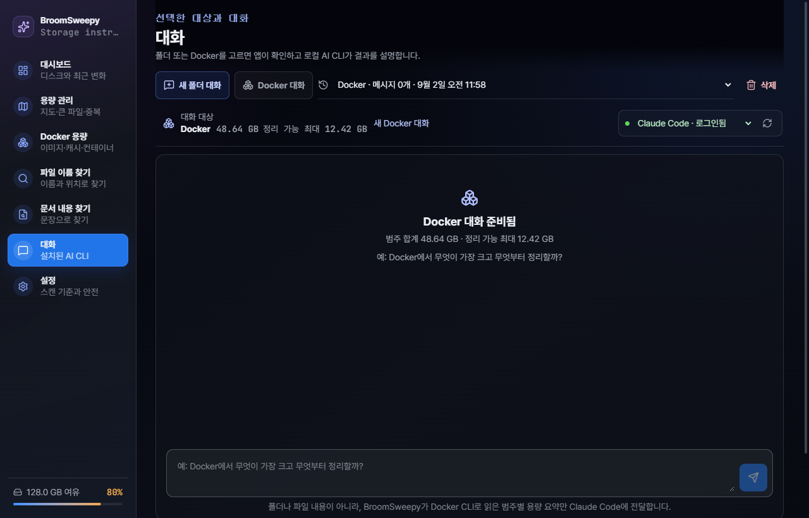

# BroomSweepy

<p align="center">
  
</p>

<p align="center">
  <a href="README.en.md">English</a> |
  <strong>한국어</strong> |
  <a href="README.ja.md">日本語</a> |
  <a href="README.zh-CN.md">简体中文</a>
</p>

BroomSweepy는 저장공간을 분석하고 파일·큰 파일·검증된 중복 파일·문서 안의 문장을 찾는 데스크톱 도구입니다. 기존 macOS SwiftUI 앱은 유지하면서, Windows와 macOS에서 같은 분석 엔진과 UI를 사용할 수 있는 Tauri 2 기반 앱을 함께 개발합니다.

설치 파일은 언어별로 나뉘지 않습니다. 첫 실행은 영어이며, `Settings > Display language`에서 English·한국어·日本語·简体中文 중 하나를 고르면 화면, Windows 트레이 메뉴, AI 응답 언어가 즉시 바뀌고 이 컴퓨터에 저장됩니다.

현재 Tauri 앱은 분석 결과에서 사용자가 직접 선택한 중복 파일과 Temp·캐시·AppData 후보를 운영체제 휴지통으로 이동할 수 있습니다. 일반 파일 영구 삭제와 휴지통 비우기는 제공하지 않으며, 제거 프로그램 레지스트리는 계속 읽기 전용입니다. 선택형 Docker 정리는 예외적으로 휴지통을 거치지 않으므로 별도 확인과 제한된 고정 명령을 사용합니다.

## 가장 쉬운 사용법

1. `용량 관리`에서 검사할 폴더를 고릅니다.
2. `폴더 용량 지도 만들기`를 누릅니다. 큰 사각형일수록 용량을 많이 쓰며, 폴더 사각형을 누르면 안쪽으로 들어갑니다.
3. 더 자세히 보려면 `큰 파일·중복 찾기`를 한 번 실행합니다. 결과는 같은 화면의 `큰 파일`, `중복 파일`, `정리 후보` 탭에서 확인합니다.
4. 이동할 항목은 목록에서 직접 고르고 최종 확인한 뒤 운영체제 휴지통으로 보냅니다. 휴지통을 비우기 전에는 복원할 수 있습니다.

파일 이름만 빨리 찾을 때는 `파일 이름 찾기`, 문장이나 본문으로 찾을 때는 `문서 내용 찾기`를 사용합니다. 이 기본 기능들은 AI나 CLI 연결 없이 모두 동작합니다. 설치된 Codex·Claude Code·Grok·Antigravity·Ollama와 자연어로 대화하고 싶을 때만 별도 `대화` 화면을 사용하며, 외부 터미널 제어 권한도 이 화면에서 따로 설정합니다.

## 화면 미리보기

아래 캡처의 드라이브 이름과 용량은 공개 문서용 예시 값입니다.

| English | 한국어 |
|---|---|
|  |  |

| 日本語 | 简体中文 |
|---|---|
|  |  |



| Docker 전용 용량 화면 | 폴더 선택이 필요 없는 Docker 대화 |
|---|---|
|  |  |

## v1.4.0 주요 업데이트

- 하나의 설치본에서 English·한국어·日本語·简体中文을 즉시 전환하고, 기본 언어는 English로 고정
- 선택 언어를 앱 화면·HTML 언어 정보·Windows 트레이 메뉴·AI 응답 언어에 함께 적용하고 이 컴퓨터에 저장
- 작은 작업 표시줄·Dock 크기에서도 빗자루가 먼저 보이도록 앱 아이콘을 굵은 실루엣으로 개선
- Windows 설치 파일에 `bloomsweepy-mcp` 보조 프로그램을 함께 넣고, 설정 화면에서 Codex와 Claude Code에 사용자가 직접 등록·해제
- 외부 AI에는 경로 없는 제한된 후보 요약과 익명 번호만 전달하고, 5분짜리 정리 계획의 정확한 경로와 최종 확인은 BroomSweepy 앱에서만 처리
- MCP 도구에 승인·삭제·휴지통 실행 명령을 두지 않고, 앱이 검사·재검증·작업 기록·운영체제 휴지통 이동을 계속 전담
- Windows MSI·NSIS에서 보조 프로그램 포함 여부와 버전을 확인하는 CI 및 macOS sidecar 검증 추가
- 네이티브 창 제목에 패키지 버전을 자동 표시해 현재 실행 중인 빌드를 바로 확인

## v1.2.0 주요 업데이트

- 드라이브별 사용량·남은 공간·사용 비율, 최근 휴지통 정리와 최근 추가 파일을 한 화면에 모은 대시보드
- 폴더 또는 Docker를 대화 대상으로 고르고, 앱을 다시 실행해도 이어서 열거나 직접 삭제할 수 있는 SQLite 대화 세션
- Codex·Claude Code·Grok·Antigravity·Ollama 중 로컬에서 사용할 수 있는 공급자를 고르는 대화 화면
- 설정에서 켠 경우에만 나타나는 `Docker 용량` 전용 메뉴와 이미지·컨테이너·볼륨·빌드 캐시 사용량 조회
- Docker 볼륨을 항상 제외하고 7일 기준의 고정 명령만 허용하는 복구 불가 정리 미리보기·최종 확인·실행 이력
- 드라이브 문자 정렬, Google Drive 같은 클라우드 가상 드라이브 제외, 최근 파일 비교 목록과 안전한 파일 열기 정책
- 휴지통 작업 이력과 중단 복구 근거를 대시보드에 연결하고, 760×600 최소 창에서도 14px 이상으로 유지하는 반응형 화면

## 현재 구현

- Windows와 macOS를 위한 Rust 공용 스캔 코어
- 시스템 드라이브의 범주별 사용량과 큰 위치를 점진적으로 집계하는 드라이브 스캐너
- 폴더별 용량을 비례사각형으로 표시하고 하위 폴더로 이동하는 저장공간 트리맵
- 접근 제한 경로를 제외하고 직접 포함 항목이 없는 빈 폴더를 찾는 읽기 전용 탐색
- Windows 설치 앱 레지스트리와 macOS `.app/Contents/Info.plist`를 읽기 전용으로 대조하는 앱 인벤토리
- 7일 이상 오래된 사용자 Temp, 90일 이상 변경되지 않은 AppData, 깨진 제거 정보의 정리 후보 분석
- 병렬 디렉터리 순회와 큰 파일 정렬
- 파일 본문을 열지 않고 이름·경로·종류·확장자·크기·수정 시각을 SQLite FTS 카탈로그로 즉시 검색
- 파일·폴더 필터, 확장자·최소 크기 필터, 관련도·이름·용량·수정 시각 정렬과 입력 중 검색
- 따옴표 문구, 제외어, 제한된 `OR`·파일명 `glob:`과 `ext:`·`type:`·`path:`·`size:`·`after:`·`before:` 조건을 조합하는 구조화 파일 검색
- 선택 폴더의 TXT·Markdown·코드·PDF·DOCX·XLSX·PPTX·HWPX 내용을 로컬 SQLite FTS 색인으로 검색
- 수정되지 않은 문서를 다시 읽지 않는 증분 색인, 재실행 후 캐시 재사용, 일치 문맥 강조
- 크기 그룹, 부분 BLAKE3, 전체 BLAKE3, 바이트 비교 순서의 중복 검증
- 내용이 같은 사진만 모아 보는 사진 필터와 서로 다른 폴더의 중복 위치 안내
- 결과 행 더블클릭 시 문서·미디어 허용 형식만 기본 앱으로 열고 그 밖의 파일은 탐색기 위치 표시
- Windows 파일 ID와 Unix device/inode를 이용한 하드링크 제외
- UI·레지스트리 조회와 분리된 백그라운드 스캔, 청크 단위 취소와 진행 상태
- 문서·파일 색인 갱신 중에도 코어 읽기 경로는 마지막 완료 스냅샷의 상태·검색을 읽고, 확정 단계 취소 시 새 세대를 롤백
- Windows 공유 읽기 핸들, 변경 중 파일 배제, 메모리·스레드 안전 상한
- 실행 중인 앱에만 연결해 상태·드라이브·허용한 기존 파일·문서 목록을 조회하고, 앱에서 별도로 허용한 폴더 검사를 작업 번호로 시작·조회·취소하는 CLI와 MCP 도구
- 완료된 검사에서 경로 없는 정리 후보 요약과 익명 후보 번호만 받아 5분짜리 확인 계획을 만들고, 정확한 경로와 최종 실행은 앱 안에 남기는 MCP 정리 검토
- 기본 용량 관리 화면과 분리해 로컬 AI CLI, 저장된 대화, 검색 허용 범위와 외부 검사 진행을 확인하는 `대화` 화면
- 서버가 보관한 스캔 결과를 기준으로 파일 ID·크기·수정 시각·내용 또는 폴더 구조를 재검증하는 휴지통 사전검사
- 중복 그룹별 보관본 한 개 강제, AppData 별도 확인, 최대 500개 작업 상한
- 운영체제 휴지통 이동, 디스크 동기화 JSONL 작업 기록, 취소와 항목별 부분 실패 보고
- 시작 시 중단 저널을 원본 경로와 운영체제 휴지통에 대조하고 모호한 항목만 직접 확인하도록 안내하는 복구 상태
- Windows 트레이 아이콘의 열기·진행 상태·종료와 기존 macOS 앱의 메뉴 막대·선택적 검사 완료 알림
- 설정에서 직접 켠 경우에만 `Docker 용량` 메뉴를 표시하고, 전용 화면에서 사용량을 확인한 뒤 볼륨을 제외한 7일 이상 빌드 캐시·매달린 이미지·중지 컨테이너를 별도 복구 불가 확인 뒤 정리하는 개발 도구 관리
- 기존 BroomSweepy 분위기를 잇는 다크 글래스 Tauri UI
- Windows MSI와 NSIS 설치 프로그램 빌드

드라이브 스캐너는 파일을 열어 해시하지 않고 메타데이터의 논리 크기를 집계합니다. Windows에서는 전체 파일을 개별적으로 열어 NTFS 하드링크를 확인하는 방식이 지나치게 느리므로, 현재 범주 결과는 `논리 크기 기준`으로 표시합니다. 할당량 기준의 정밀 집계는 향후 MFT/USN 어댑터가 담당합니다.

이 사각형 지도 방식의 일반 명칭은 `저장공간 트리맵(storage treemap)`입니다. 기존 SwiftUI 화면은 사각형을 한 방향씩 잘라 나누는 `slice-and-dice treemap`이고, 현재 Tauri 화면은 균형 잡힌 두 영역으로 재귀 분할하는 `binary treemap`에 가깝습니다. Tauri 트리맵은 현재 폴더의 직계 항목만 UI에 전달하고, 폴더 용량은 Rust가 하위 파일을 순회해 집계합니다. 화면에는 가장 큰 15개 항목만 그리며 작은 항목은 `기타`로 합칩니다. 빈 폴더는 직접 포함된 파일·폴더·링크가 전혀 없는 엄격한 빈 폴더를 뜻하며, 권한 때문에 내부를 확인하지 못한 폴더는 빈 폴더로 판정하지 않습니다.

Windows 정리 후보는 Temp, Local AppData, Roaming AppData, Uninstall 레지스트리를 서로 다른 근거로 분류합니다. 오래된 Temp는 `정리 가능성 높음`, 설치 앱 이름과 맞지 않는 AppData와 경로 증거가 둘 이상 끊긴 제거 정보는 `검토 필요`로 표시합니다. 파일 후보는 선택 후 운영체제 휴지통으로 이동할 수 있지만 AppData는 별도 확인을 요구합니다. 레지스트리 후보는 직접 삭제하지 않고 계속 위치와 근거만 제공합니다.

macOS Tauri 앱은 `/Applications`, `/System/Applications`, `~/Applications`의 직접 `.app` 정보에서 표시 이름과 bundle ID를 읽습니다. 다만 이 목록만으로 다른 위치의 앱까지 모두 확인했다고 볼 수 없으므로 Application Support와 앱 컨테이너는 기본 정리 후보에 넣지 않습니다. 기존 SwiftUI 앱은 기기·파일 번호·종류·크기·수정 시각이 같은 일반 파일을 같은 디스크의 비공개 위치로 원자 이동해 다시 확인한 뒤에만 휴지통으로 보내며, 중단 복구 기록과 실제 휴지통 결과도 함께 보존합니다. 실제 이동에 성공한 논리 용량만 결과에 더합니다. 재귀 내용을 증명하지 못한 폴더·앱 번들, 앱 언어 리소스, 이름 패턴 기반 의심 항목, 소유권이 불확실한 앱 관련 파일과 설정 파일은 Finder 검토 전용입니다.

휴지통 작업은 선택 전체를 먼저 검사하고 작업 계획을 로컬 JSONL 기록에 동기화한 다음 한 항목씩 다시 검사해 이동합니다. 항목 하나가 변경되거나 잠겨 있거나 이동에 실패하면 이후 항목을 건드리지 않고 실패·건너뜀 결과를 반환합니다. 표시 용량은 휴지통으로 이동한 `논리 용량`이며, 실제 여유 공간은 사용자가 운영체제 휴지통을 비운 뒤에 늘어납니다.

앱 시작 시 `moving` 또는 미완결 작업이 남아 있으면 원본 존재 여부와 운영체제 휴지통의 원래 경로·삭제 시각·파일 크기를 대조합니다. Windows와 Freedesktop 환경은 휴지통 목록을 직접 확인하고, 목록 API가 없는 macOS나 근거가 충돌하는 항목은 자동 확정하지 않습니다. 복구 화면은 자동 복원·영구 삭제 없이 운영체제 휴지통만 열어 줍니다.

중복 사진 보기는 확장자가 사진 형식이고 전체 해시와 바이트 비교까지 통과한 파일만 포함합니다. 구도가 비슷하거나 편집본인 사진을 찾는 지각 해시는 아직 포함하지 않습니다. 파일 결과를 더블클릭하면 명시적으로 허용한 문서·이미지·영상·오디오 형식만 기본 앱으로 열고, 실행 가능 여부가 불명확한 나머지 형식과 링크는 탐색기에서 위치만 표시합니다.

문서 검색은 사용자가 선택한 폴더만 링크 추적 없이 읽고 앱 캐시의 `document-search-v1.sqlite3`에 본문과 로컬 전문 색인을 저장합니다. 다음 업데이트에서는 경로·크기·수정 시각이 같은 문서를 재사용하고 변경되거나 사라진 문서만 갱신합니다. 색인은 트랜잭션으로 교체하므로 취소나 비정상 종료 시 마지막 완료 색인이 유지됩니다. 앱 화면에서 직접 검색할 때 검색어와 문서 본문은 외부 서비스로 전송하지 않습니다. 사용자가 `대화` 화면에서 이번 실행의 파일·문서 검색을 허용한 경우에만 선택한 공급자가 검색어와 반환된 파일 경로·일치 문맥을 받을 수 있으며, 앱을 다시 켜면 허용은 자동으로 꺼집니다.

채팅에서 새 폴더 검사를 시작하는 권한은 기존 목록 검색과 분리되어 있습니다. 사용자가 `대화` 화면에서 현재 폴더와 설정을 확인하고 이번 앱 실행에만 허용하면, CLI는 경로나 설정을 보내지 않고 시작 요청만 전달합니다. 앱이 폴더를 다시 확인하고 기존 Rust 검사 엔진을 실행하며, CLI에는 작업 번호와 제한된 집계만 반환합니다. 잘못된 작업 번호는 현재 검사를 취소하지 못하고, 폴더·설정 변경이나 앱 재시작 뒤에는 다시 허용해야 합니다.

정리 검토도 별도 권한입니다. MCP는 완료된 시스템 정리 또는 중복 검사에서 종류·용량·신뢰도와 익명 후보 번호만 받고, 최대 50개 후보로 5분짜리 확인 계획을 만들 수 있습니다. MCP에는 승인·삭제·휴지통 실행 도구가 없습니다. 사용자가 앱에서 정확한 경로와 이유를 보고 최종 확인한 경우에만 앱이 현재 검사 번호와 파일 상태를 다시 확인하고 기존 작업 기록·운영체제 휴지통 경계로 실행합니다. 레지스트리 변경과 휴지통 비우기는 제공하지 않습니다.

빠른 파일 찾기는 별도의 `file-catalog-v1.sqlite3`에 파일 본문 없이 메타데이터만 저장합니다. Windows에서 NTFS 드라이브 루트를 선택하고 원시 볼륨 읽기 권한이 있으면 `windowsNtfs` 공급자가 MFT로 전체 카탈로그를 만들고 USN Journal 위치를 저장합니다. 다음 `색인 업데이트`에서는 파일 변경분만 반영하며, 폴더 구조 변경·저널 유실은 안전한 전체 MFT 갱신으로 전환합니다. 권한이 없거나 NTFS가 아니거나 하위 폴더를 선택한 경우와 macOS에서는 관리자 권한이 필요 없는 `portableWalk`가 자동으로 동작합니다. 이름과 전체 경로 검색은 같은 로컬 FTS 계약을 사용합니다. `OR`는 이름·경로·파일명 glob 분기만 묶고 확장자·종류·크기·날짜·제외 조건과 화면 필터는 전체 결과에 교집합으로 적용합니다. 구조화 조건은 셸 명령으로 바꾸지 않고 매개변수화된 SQLite 쿼리로 처리하며, 취소 시에는 마지막 완료 카탈로그를 보존합니다.

Windows Tauri 앱에서 창 닫기는 프로세스 종료가 아니라 트레이로 숨기기입니다. 트레이의 `종료`를 선택해야 실행 중 검사를 취소하고 로컬 CLI 제어 서버를 정리한 뒤 끝납니다. 기존 SwiftUI macOS 앱은 창을 닫아도 메뉴 막대에 남으며, 설정에 따라 메모리 퍼센트와 검사 완료 알림을 표시합니다.

Docker 용량 관리는 기본적으로 꺼져 있으며, 꺼진 동안 앱은 Docker CLI를 찾거나 실행하지 않습니다. 설정에서 켜면 사이드바의 `용량 관리` 다음에 `Docker 용량` 메뉴가 나타나고, 대시보드에는 Docker 정보를 섞지 않습니다. 전용 화면은 `docker system df --format json`으로 이미지·컨테이너·볼륨·빌드 캐시 사용량을 읽으며, 폴더 선택 없이 Docker 대상 대화를 시작할 수 있습니다. 정리 미리보기는 7일 기준의 `docker builder prune`, `docker image prune`, `docker container prune`만 허용하고 `system prune`, `--all`, `--volumes`와 임의 AI 생성 명령은 실행하지 않습니다. Docker 볼륨과 Docker Desktop의 가상 디스크 파일은 사용량만 안내하며 직접 삭제하지 않습니다. AI CLI는 설명과 제안만 만들고 최종 범주 선택·복구 불가 확인·실행은 앱이 담당합니다.

일반 텍스트는 UTF-8·UTF-16·CP949·Windows ANSI를 처리합니다. PDF는 내장된 텍스트 계층만 읽으며 이미지형 PDF에 OCR을 수행하지 않습니다. 구형 바이너리 HWP, 암호 문서, 의미 기반 RAG 검색은 현재 범위 밖이고 HWPX는 지원합니다. 검색 결과는 삭제 근거로 사용하지 않으며 더블클릭으로 원문을 열거나 파일 탐색기에서 위치를 확인합니다.

## 저장소 구조

| 경로 | 역할 |
|---|---|
| `BroomSweepy/` | 기존 macOS SwiftUI 앱 |
| `crates/bloomsweepy-core/` | 운영체제와 UI에 독립적인 Rust 분석 코어 |
| `crates/bloomsweepy-control/` | 앱과 얇은 CLI가 공유하는 로컬 제어 규격 |
| `apps/desktop/` | Tauri 2, React, TypeScript 데스크톱 앱 |
| `apps/bloomsweepy-mcp/` | 실행 중인 앱에 구조화된 검색·검사·정리 검토 요청만 전달하는 CLI·MCP 브리지 |
| `DESIGN.md` | 공용 데스크톱 UI 디자인 정본 |
| `docs/design-refs/` | 경험 계약과 디자인 결정 |
| `docs/ui-audit/` | 실제 렌더 감사 결과와 스크린샷 |

## 개발 실행

필수 도구는 Rust stable, Node.js 22 이상, npm, Windows의 WebView2 및 MSVC Build Tools입니다.

```powershell
cd apps/desktop
npm install
npm run tauri dev
```

전체 검증과 Windows 번들 빌드:

```powershell
cargo fmt --all -- --check
cargo clippy --workspace --all-targets -- -D warnings
cargo test --workspace
cd apps/desktop
npm run check
npm run build
npm run tauri build
```

채팅 도구 연결 방법과 현재 제한은 [채팅 CLI 연결](docs/cli-control.md), 별도 검사 허용·작업 번호·취소 경계는 [채팅 CLI 검사 제어 v2](docs/architecture/cli-control-v2.md), 익명 후보·앱 최종 확인 경계는 [MCP 정리 검토 v3](docs/architecture/mcp-cleanup-v3.md), Docker의 선택형 사용량·복구 불가 경계는 [Docker 경험 계약](docs/design-refs/2026-09-01-experience-docker-management.md)을 참고하세요. 자세한 경계와 다음 단계는 [크로스플랫폼 아키텍처](docs/architecture/cross-platform-desktop.md), 이름·경로 카탈로그와 GitHub 프로젝트 대조는 [빠른 파일 찾기 아키텍처](docs/architecture/fast-file-search.md), 문서 형식·색인·개인정보 경계는 [문서 검색 아키텍처](docs/architecture/document-search.md), 프리징·잠금·누수 계약과 검증값은 [스캔 런타임 안전성](docs/architecture/scan-runtime-safety.md), 휴지통 작업의 사전검사·저널·부분 실패 경계는 [안전한 휴지통 작업](docs/architecture/safe-trash-actions.md)을 참고하세요.

## 중요: 데이터 손실과 복구 책임

BroomSweepy는 사용자가 선택하고 최종 확인한 항목만 정리하도록 설계됐지만, 운영체제 권한·휴지통 설정·동기화 서비스·외장 또는 네트워크 드라이브 상태에 따라 파일 복원 가능성을 보장할 수 없습니다. Docker 정리는 운영체제 휴지통을 거치지 않으며 완료된 단계는 복구할 수 없습니다.

정리를 실행하기 전에 중요한 파일을 별도 저장장치나 신뢰할 수 있는 백업 서비스에 보관하고, 선택한 경로·파일·Docker 범주를 직접 확인해야 합니다. 사용자가 실행한 파일 이동·삭제·휴지통 비우기·Docker 정리로 발생한 데이터 손실이나 복구 실패에 대해 프로젝트 제공자와 기여자는 책임을 지지 않습니다. 다만 관련 법률상 배제할 수 없는 책임에는 해당 법률이 적용됩니다.
