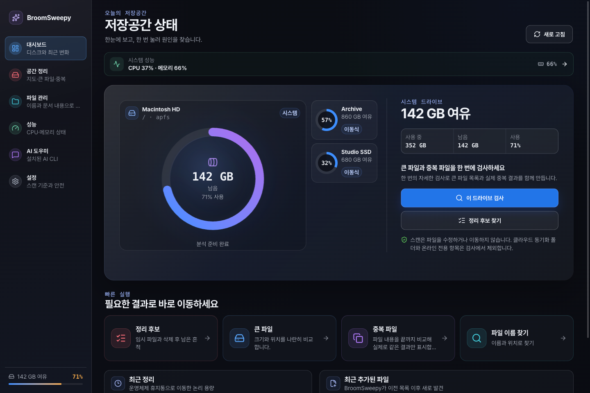
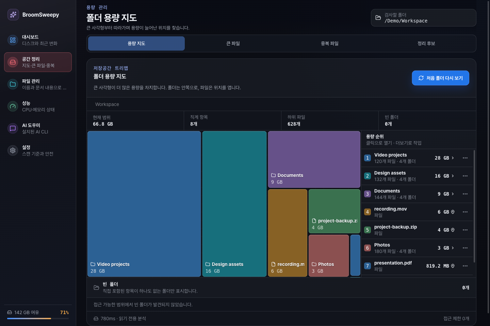
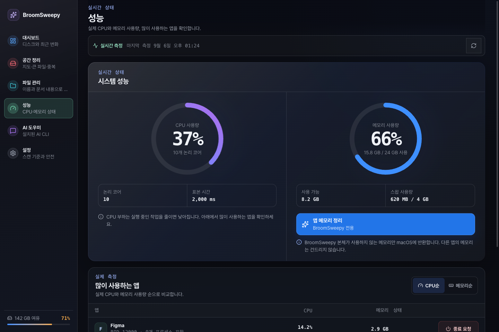
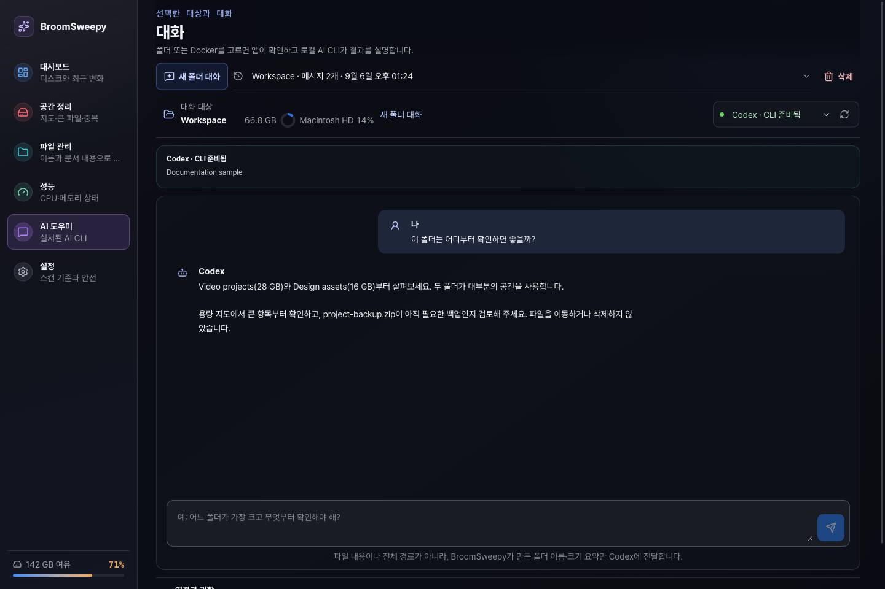
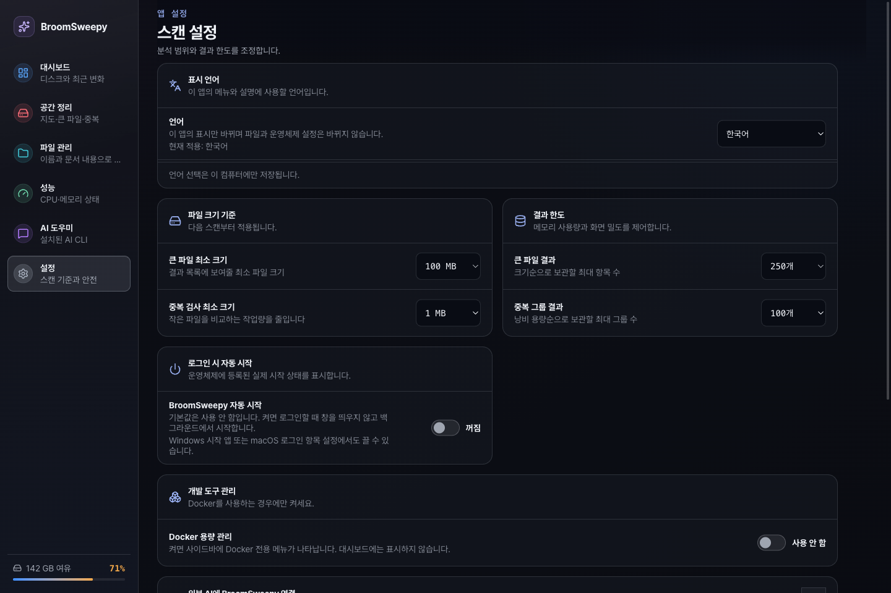

# BroomSweepy — 대화형 파일관리 시스템

<p align="center">
  
</p>

<p align="center">
  <a href="README.en.md">English</a> |
  <strong>한국어</strong> |
  <a href="README.ja.md">日本語</a> |
  <a href="README.zh-CN.md">简体中文</a>
</p>

BroomSweepy는 Windows와 macOS용 **대화형 파일관리 시스템**을 만드는 프로젝트입니다. 대화를 주된 조작 방식으로 삼아, 파일 검색부터 검사·후보 검토·조건 조정·최종 확인·작업 결과 확인까지 한 흐름으로 이어가는 경험을 목표로 개발합니다.

**Rust + Tauri 2 + React가 기본 프로젝트**이며, 기존 SwiftUI 앱의 시원한 카드·아이콘·글래스 UI 경험을 이어갑니다. `BroomSweepy/`의 Swift 소스는 레거시 참고 구현입니다. 큰 파일·검증된 중복 파일·문서 검색은 로컬 Rust 엔진으로 동작하며, 기존 탐색·검사 화면은 AI 연결 없이도 사용할 수 있습니다. 하나의 설치본에서 English·한국어·日本語·简体中文을 지원하며, 첫 실행 언어는 영어입니다. `Settings > Display language`에서 바꿀 수 있습니다.

## 15초 브랜드 필름

<p align="center">
  <a href="docs/assets/video/BroomSweepy-15s.mp4">
    
  </a>
</p>

<p align="center">
  <a href="docs/assets/video/BroomSweepy-15s.mp4"><strong>▶ 영상 보기 — AI야. 정리해. 끝.</strong></a>
</p>

매일 쌓이는 파일·캐시·앱·메모리 앞에서 무엇부터 지울지 고민하는 순간을 15초에 담았습니다. 실제 BroomSweepy 화면과 브랜드 연출을 결합했으며, 노트북을 닫는 한 번의 동작으로 정리가 끝나는 감각을 표현합니다.

## 현재 개발본 — 대화에서 일반 파일·폴더 관리

대화 화면은 중앙 대화 기록과 항상 보이는 하단 입력창으로 구성됩니다. CLI 준비·응답 대기·앱 조회·결과 분석 단계와 경과 시간을 표시하고 응답을 중단할 수 있습니다. 조회 목록은 접어서 보여주며 최종 검토·실패·권한 부족은 기본 펼침입니다. 연결과 권한은 **설정** 및 대화 대상 옆 버튼에서 확인합니다. 토큰 스트리밍이나 추정 완료율을 표시하는 기능은 아닙니다. 공개 v1.7.0에는 포함되지 않은 개발본 UI입니다. [채팅 검증 기록](docs/qa/2026-10-05-chat-workbench.md)

**정리 후보 → 폴더 트리**에서 파일과 하위 폴더를 펼쳐 전체·개별 선택할 수 있습니다. 상위 체크는 하위에도 적용되며, 하위 항목을 해제하면 상위 폴더 전체를 이동하지 않습니다. 용량지도와 AI의 측정 목록에서 같은 검사 결과로 진입하고 최종 검토 후 휴지통으로 이동합니다. 이 새 페이지의 폴더 검토는 숨은 보호 항목·링크·클라우드·장치 경계를 더 엄격하게 검사합니다. 트리는 최대 2,048개 노드, 화면은 200개 행으로 제한하며 미측정·부분·만료 결과를 구분합니다. 이 맥의 새 설치본에서 임시3대상209B 이동, 하위 파일 보존·취소·재검사·AI 로컬 카드 진입·재실행 기록을 검증했습니다. Windows·외부 LLM 조사 종단·장시간 메모리 검증은 남아 있습니다. [트리 검증 기록](docs/qa/2026-10-05-cleanup-tree.md) · [맥 설치형 QA](docs/qa/2026-10-05-cleanup-tree-native.md)

“여기서 가장 큰 폴더나 데이터는 뭐야? 삭제해도 돼?”라고 물으면 현재 폴더의 직계 항목을 새로 측정해 용량순으로 보여줍니다. 폴더 용량은 하위 합계이며, 크기만으로 삭제 안전성을 확정하지 않습니다. 카드의 **같은 결과 용량지도 보기**는 그 검사 결과를 타일맵에 재사용합니다. 이름만 찾은 폴더는 하위 항목을 검사한 뒤 지도에 반영하며, 부분 결과·읽기 실패·만료를 구분합니다. 이 질문만으로 삭제 대상을 선택하거나 삭제하지 않습니다.

AI 도우미에서 “파일을 검사해”, “영상 이름을 찾아줘”, “promo-video 지워줘”처럼 요청하면 Rust 앱이 실제 이름 검색·용량 검사·하위 탐색·삭제 검토를 수행합니다. 내용이 있는 일반 폴더도 지원합니다. 같은 대화의 카드에서 열기·위치 표시·선택 조정·최종 확인·항목별 결과까지 이어집니다. AI에 삭제 권한을 주지 않고 앱의 검증된 휴지통 루틴을 연결했습니다.

이름 검색은 최대 200개, 모델과 화면 페이지는 24개, 한 번의 삭제 검토는 100개입니다. 검색된 폴더 용량은 검사 전까지 ‘미측정’으로 구분합니다. 이름이 중복되거나 결과가 불완전하면 하나를 자동 선택하지 않습니다. 전체 경로·포함 항목·논리 용량을 확인하고, 폴더는 하위 내용 확인 체크 후 별도 버튼으로 휴지통에 보냅니다. 계획은 5분 일회용이며 실행 직전 변경·링크·클라우드·보호 경로를 재검증합니다. 영구 삭제, 임의 셸, 대화형 이름 변경·일반 이동·새 폴더 생성은 제공하지 않습니다.

현재 소스의 추가 기능이며 기존 GitHub v1.7.0 다운로드에는 포함되지 않습니다. 실제 Codex의 일반 검사/비어 있지 않은 폴더 검토 요청과 합성 항목의 macOS 휴지통 이동을 검증했습니다. Windows 런타임과 장시간 자원 검증은 남아 있습니다.

macOS에서 일반 폴더 내부의 `node_modules/.bin` 같은 심볼릭 링크는 링크 자체만 포함하고 원본을 따라가지 않습니다. 최종 카드에 링크 수를 따로 표시하고 대상 변경을 재검사합니다. 선택 대상/부모의 링크, 클라우드·다른 장치·특수 항목 보호는 유지합니다. Windows 재분석 지점/정션은 계속 차단합니다. [현재 개발본 검증 기록](docs/qa/2026-10-04-conversational-files.md)

## v1.7.0 — 대화형 파일관리와 저자원 보호

아래 범위와 미검증 표시는 공개 v1.7.0 당시 기준입니다. 현재 개발본의 추가 기능과 검증은 위 절을 참고하세요.

[정식 릴리스와 설치 파일](https://github.com/Dannykkh/bloomsweepy/releases/tag/v1.7.0) · [변경 기록](CHANGELOG.md)

- **대화형 빈 폴더 정리**: 앱의 로컬 재검사, 후보 카드, 대화로 제외 조건 조정, 최종 확인, 항목별 결과를 연결했습니다.
- **폴더 정리와 열기**: 용량 지도에서 일반 폴더 전체의 휴지통 이동을 별도로 검토하고, 파일·폴더 열기와 위치 표시를 구분합니다.
- **앱 관리**: 설치된 앱 목록과 이름·제작사·경로의 포함 단어 검색. Mac 앱 본체와 관련 데이터는 따로 검토하고, Windows는 운영체제 제거 화면으로 연결합니다.
- **운영체제 휴지통 비우기**: 사용자 휴지통 전체를 대상으로 하는 별도 영구 삭제 확인입니다. AI에는 이 권한을 주지 않습니다.
- **저자원 보호**: 제한된 스트리밍 탐색, 색인 메모리·디스크 예산, 별도 문서 처리 프로세스를 추가했습니다.
- **macOS 메뉴 막대**: 네이티브 패널로 RAM·CPU·시스템 디스크를 10초마다 표시합니다. 숫자 표시 설정을 저장하고, 창 닫기는 숨김·열기는 복원·종료/⌘Q는 완전 종료로 구분합니다. 별도 WebView는 만들지 않습니다.

메뉴는 **대시보드 → 성능 → 앱 관리 → 공간 정리 → 파일 관리 → AI 도우미 → 설정** 순서입니다. Docker 관리는 기본 꺼짐이며 사용자가 켠 경우에만 나타납니다.

### 대화형 빈 폴더 정리 사용법

1. AI 도우미에서 검사할 로컬 폴더를 선택하고 “빈 폴더를 검사해 줘”라고 요청합니다.
2. 앱이 재검사한 후보 카드를 확인하고, 대화나 체크박스로 남겨둘 폴더를 제외합니다.
3. 정확한 경로와 선택 내용을 최종 검토한 뒤 **확인 버튼**으로 휴지통 이동을 실행합니다.
4. 항목별 성공·실패·건너뜀 결과를 확인합니다.

검토 후보는 최대 200개, AI 후보 페이지는 최대 24개입니다. 보호·변경·상한 때문에 빠진 항목 수를 표시합니다. 확인 계획은 5분간 한 번만 유효하며 선택 변경·재검사·재시작으로 무효화됩니다. “삭제해”라는 대화나 AI 응답만으로 실행하지 않습니다. 일반 파일의 이동·이름 변경까지 대화로 처리하는 기능은 아직 지원하지 않습니다. **실제 Codex와 새 도구 흐름의 종단 검증은 남아 있습니다.**

### 앱 관리·파일 열기

`앱 관리`는 전체 드라이브 검사 없이 앱을 조회합니다. Mac에서는 전용 제거기를 우선 사용하도록 안내하고, 일반 앱 본체만 별도 확인 후 휴지통으로 옮깁니다. 관련 데이터는 정확한 앱 식별자에 연결된 캐시·환경설정만 추가로 선택·검토하며 사용자 문서, Application Support, Containers, 공유 데이터는 자동 후보에서 제외합니다. Windows는 정식 `설치된 앱` 제거 화면으로 연결하고 앱 폴더·레지스트리·AppData를 추측 삭제하지 않습니다. 제거 화면을 열었다고 제거가 완료된 것은 아닙니다.

공간 정리 결과의 `열기`는 일반 문서·미디어를 기본 앱으로, 일반 폴더를 파일 탐색기로 엽니다. 프로그램·스크립트·앱 패키지는 실행하지 않고 위치만 표시합니다. `위치 표시`와 앱 안의 `하위 폴더 탐색`은 별도 행동입니다. 새 기능은 내장 AI/CLI/MCP의 제거 권한을 확대하지 않습니다.

### macOS 메뉴 막대

현재 소스에는 Swift 버전의 메뉴 막대 상주 흐름을 Rust로 추가했습니다. 창을 닫으면 앱은 숨겨지고, 메뉴 막대 아이콘에서 메모리·CPU·시스템 디스크와 실제 버전을 확인하거나 같은 창을 다시 열 수 있습니다. 아이콘 옆 메모리 사용률은 패널 또는 `설정 > 메뉴 막대`에서 표시·숨김을 전환하며 선택을 저장합니다. 숫자를 숨겨도 아이콘은 남습니다. 완전히 종료하려면 패널의 `종료` 또는 `⌘Q`를 사용하세요.

패널은 별도 WebView 없이 macOS 네이티브 UI를 사용하며, 파일·앱 목록 대신 집계 수치만 10초마다 읽습니다. 숨겨진 메인 창의 상태와 기존 메모리는 유지되므로 창을 닫는 것이 메모리 해제를 뜻하지는 않습니다. Windows 트레이 동작은 변경하지 않았습니다.

### 로컬 처리·토큰·전송 범위

파일 검색·검사·집계·후보 관리는 내 컴퓨터에서 처리하고, AI에는 판단에 필요한 제한된 요약을 전달하는 구조입니다. 로컬 파일 작업 자체는 LLM 토큰을 사용하지 않습니다. 절약의 핵심은 Rust라는 언어가 아니라 전체 파일 목록 대신 필요한 요약을 보내는 것입니다. 잘 구성된 일반 CLI도 비슷한 효율을 낼 수 있으며, 동일 작업 기준 토큰 절감률은 아직 측정하지 않았습니다.

클라우드 AI를 사용하면 이름·크기·개수·후보 번호와 질문·대화 기록은 공급자에게 전달됩니다. 앱의 폴더 요약과 새 후보 페이지에는 파일 본문과 전체 경로를 자동으로 넣지 않지만, 사용자가 직접 입력한 경로나 내용은 질문·기록에 포함될 수 있습니다. 로컬 CLI 실행이나 읽기 전용 권한은 완전한 오프라인 처리·외부 전송 차단을 뜻하지 않습니다. 별도 허용한 MCP 파일·문서 검색은 경로와 일치 문맥을 제공할 수 있습니다. 따라서 “파일 정보가 외부로 전혀 나가지 않는다”거나 일정 비율의 토큰 절약을 보장하지 않습니다.

### 자원 보호 범위와 검증 한계

본체 작업 메모리 512 MiB, 시스템 여유 RAM 256 MiB 기준으로 무거운 작업을 협조적으로 중단합니다. PDF·Office 처리 도구는 Rust 할당 예산 128 MiB와 15초 제한을 사용합니다. 색인 실패 시 이전 완료 색인을 보존합니다. 이는 전체 앱·WebView·CLI의 OS 하드쿼터나 메모리 누수 해결 보장이 아닙니다. 창을 숨겨도 기존 작업 상태와 메모리는 유지됩니다.

- 로컬 자동 검사: Rust 273개와 프런트엔드 43개 통과, 선택적 실제 CLI 진단 1개 제외.
- 미검증: 새 Codex 대화형 도구 종단 흐름, 장시간 전체 프로세스 메모리 안정성, 실제 사용자 앱 삭제·휴지통 비우기.
- 메뉴 막대 설정 저장·재시작·완전 종료는 확인했지만 아이콘 직접 클릭, 팝오버 내부 버튼·키보드 조작의 시각 검증은 남아 있습니다.
- 앱 전체 용량·설치 날짜·이름/날짜/용량 정렬 선택은 아직 제공하지 않습니다. 앱 목록의 포함 단어 검색은 지원합니다.
- Windows 설치 프로그램 빌드와 자동 검사는 CI에서 수행합니다. CI 통과가 실제 Windows 설치·GUI·휴지통 작업 검증을 뜻하지 않습니다.

## 새로운 화면

아래는 v1.6.0 당시 실제 React 컴포넌트를 공개용 예시 데이터로 렌더링한 참고 캡처입니다. v1.7.0의 새 메뉴·앱 관리·확인 흐름·메뉴 막대는 이 이미지에 반영되어 있지 않습니다. 드라이브·파일·수치·대화는 예시이며, 실제 AI 응답이나 사용자의 파일이 아닙니다. 브라우저 캡처이므로 macOS 네이티브 창 재질과는 차이가 있습니다.

### 다중 드라이브 대시보드



### 폴더 용량 지도



### CPU와 메모리



### AI 도우미



### 설정과 표시 언어



## v1.6.0 주요 변경

- 다크 글래스 화면, 큰 실행 버튼, 명확한 아이콘과 정리된 사이드바.
- 선택한 드라이브는 큰 카드로, 나머지는 작은 카드로 표시합니다. 클릭하면 카드가 자리를 바꾸며 확대·축소됩니다.
- CPU·메모리 원형 그래프와 상위 앱 사용량, 측정값 사이를 부드럽게 잇는 전환과 모션 줄이기 설정 대응.
- macOS의 `앱 메모리 정리`: BroomSweepy 본체의 사용하지 않는 allocator 메모리만 OS에 반환합니다. 반환량 0도 정상 결과입니다.
- 트리맵 탐색과 개별 파일 작업, 파일 변경·경로 우회 재검증, 휴지통 작업 기록.
- AI CLI의 미설치·실행 불가·버전 비호환·로그인 필요를 구분하고, 채팅·취소·저장된 대화 흐름을 개선했습니다.

## 안전과 클라우드 제외

스캔은 파일을 바꾸지 않습니다. 큰 파일·중복 검사, 드라이브 집계, 트리맵, 파일 카탈로그, 문서 색인은 알려진 클라우드 동기화 경로와 온라인 전용 항목을 제외합니다. macOS의 `~/Library/CloudStorage`, `~/Library/Mobile Documents`와 알려진 Google Drive·iCloud·OneDrive·Dropbox 경로를 순회 전에 차단하며, 인식된 클라우드 폴더를 직접 선택해도 검사하지 않습니다. 내려받아 둔 파일도 인식된 클라우드 루트 안에 있으면 제외됩니다. 임의 위치로 옮긴 동기화 폴더나 모든 공급자를 자동 식별한다고 보장하지는 않습니다.

중복은 크기 → 부분/전체 BLAKE3 → 바이트 비교로 검증합니다. 파일 이동은 선택·재검증·최종 확인·작업 기록을 거쳐 운영체제 휴지통으로 보냅니다. v1.7.0의 빈 폴더 이동은 별도 최종 확인이 필요합니다. 휴지통 비우기는 현재 사용자의 연결된 드라이브 휴지통 전체와 다른 앱의 항목도 포함하는 영구 삭제이며, 경고·체크박스·2분 유효 일회용 확인을 거칩니다. AI/CLI/MCP에는 제공하지 않습니다. 휴지통 이동 용량은 논리 크기이며 실제 여유 공간 증가와 같지 않습니다. 레지스트리 자동 삭제는 제공하지 않습니다.

메모리 정리는 시스템 전체 RAM·다른 앱·WebView 보조 프로세스·스왑·메모리 누수를 정리하지 않습니다. CPU 정리 기능은 없습니다. macOS의 일반 앱 정상 종료 요청은 별도 확인 동작이며 강제 종료하지 않습니다. Windows에서는 성능 조회만 제공하며 스왑은 페이지 파일 현재 사용량이 아닌 커밋 기반 추정치입니다.

Docker 관리는 기본적으로 꺼져 있습니다. 켠 경우에만 고정된 정리 명령을 사용하며, 볼륨은 제외하고 복구 불가 작업임을 따로 확인받습니다.

## AI·CLI·MCP

현재 개발본은 LLM이 사람 대신 앱의 성능·설치 앱·검색·검사·정리 후보 조회를 선택하고, 앱이 반환한 실제 목록을 분석하며 추가 조회하는 구조로 확장하고 있습니다. native와 MCP가 [공통 기능 정본](docs/architecture/app-capability-contract.md)을 공유하며 최종 삭제·종료는 사용자 확인에 남습니다. 새 조사 루프의 전체 설치 검증은 진행 중이며 GitHub v1.7.0 배포본과는 구분해야 합니다.

Codex 데스크톱 앱을 설치했다고 Codex CLI가 설치된 것은 아닙니다. 사용할 공급자의 CLI 설치·호환 버전·로그인 상태를 앱에서 확인하세요. 기존 요약 응답은 Mac에서 Codex로 검증했지만, v1.7.0의 새 빈 폴더 도구 종단 흐름은 아직 미검증입니다. Claude Code·Grok·Antigravity·Ollama 어댑터도 있지만 이번 Mac 릴리스에서 모두 실사용 검증한 것은 아닙니다.

앱 채팅은 항목 이름·크기 등이 담긴 제한된 폴더 요약과 질문·대화 이력을 선택한 공급자에 전달합니다. 로컬 CLI를 쓴다고 모델 처리까지 오프라인인 것은 아닙니다. MCP 정리 도구는 익명 후보 ID와 제한된 요약만 제공하며 승인·삭제 실행 도구는 없습니다. 파일·문서 검색을 별도로 허용하면 경로와 일치 문맥이 외부 클라이언트에 전달될 수 있습니다. 최종 파일 작업은 앱 안에서 확인합니다.

폴더 검사는 별도 허용 스위치 없이 앱에서 폴더를 선택하면 사용할 수 있습니다. 외부 MCP의 검사 요청도 그 선택 폴더와 앱 검사 기준으로만 실행하며 임의 경로를 받지 않습니다. 폴더를 바꾸면 기존 외부 검사 범위를 먼저 해제하고 새 범위를 연결합니다. 앱 자체의 폴더 검사는 외부 AI 연결 없이도 사용할 수 있습니다. 삭제·앱 제거·프로세스 종료의 최종 확인은 별개입니다.

개발본의 **설정 → 연결과 권한 → 권한 유지 방식**에서 `이번 실행만`(기본값) 또는 `이 컴퓨터에서 기억`을 선택할 수 있습니다. 기억하기는 사용자가 허용한 시스템·앱 조회, 검색 폴더, 앱에서 선택한 검사 폴더·기준, 정리 계획 검토 허용만 로컬에 저장합니다. 유지 방식만 바꿔도 꺼진 공개 권한은 자동으로 켜지지 않습니다. 선택한 폴더와 검사 기준 변경은 검사 범위에 바로 반영하며, 사라진 폴더나 대상이 바뀐 링크는 재시작 시 복원하지 않습니다. `이번 실행만`으로 돌아가면 저장된 범위·허용은 지우되 현재 실행에서는 완전히 종료할 때까지 유지합니다. 창 닫기는 메뉴 막대에 상주할 수 있으므로 완전 종료와 다릅니다. 삭제·앱 제거 등의 최종 확인과 정리 계획은 기억하지 않습니다. 공개 v1.7.0과 구분되는 변경입니다.

## 플랫폼과 개발

Rust stable, Node.js 22+, npm이 필요합니다. Windows는 WebView2와 MSVC Build Tools, macOS는 Xcode Command Line Tools가 필요합니다.

- `apps/desktop/`: 기본 Tauri/React 앱
- `crates/bloomsweepy-core/`: 공용 Rust 분석 엔진
- `crates/bloomsweepy-control/`, `apps/bloomsweepy-mcp/`: 로컬 제어 규격과 CLI/MCP 브리지
- `BroomSweepy/`: 레거시 SwiftUI 참고 구현

이번 기능은 Apple Silicon Mac 로컬 개발 빌드에서 구현과 일부 설치형 동작을 확인했습니다. 실제 검증 범위와 미검증 항목은 위 목록을 참고하세요. 최신 Windows 실행 검증은 별도이며 Windows 설치 파일은 Windows CI에서 빌드합니다. Mac 검증 빌드는 ad-hoc 서명이며 Apple 공증 완료를 의미하지 않습니다. 설치 파일과 플랫폼별 주의사항은 [릴리스](https://github.com/Dannykkh/bloomsweepy/releases)에서 확인하세요.

```sh
cd apps/desktop
npm ci
npm run tauri dev
```

```sh
# Repository root
cargo fmt --all -- --check
cargo clippy --workspace --all-targets -- -D warnings
cargo test --workspace
cd apps/desktop
npm run check
npm run test:all
npm run build
npm run tauri build
```

## 문서

[변경 기록](CHANGELOG.md) · [CLI 연결과 제어](docs/cli-control.md) · [성능·메모리 범위](docs/architecture/startup-memory-status.md) · [안전한 휴지통 작업](docs/architecture/safe-trash-actions.md) · [문서 검색](docs/architecture/document-search.md) · [파일 검색](docs/architecture/fast-file-search.md) · [디자인](DESIGN.md) · [화면 재현](docs/assets/screenshots/README.md)

## 중요: 데이터 손실과 복구 책임

BroomSweepy는 사용자가 선택하고 최종 확인한 항목만 정리하도록 설계됐지만, 운영체제 권한·휴지통 설정·동기화 서비스·외장 또는 네트워크 드라이브 상태에 따라 파일 복원 가능성을 보장할 수 없습니다. Docker 정리는 운영체제 휴지통을 거치지 않으며 완료된 단계는 복구할 수 없습니다.

정리를 실행하기 전에 중요한 파일을 별도 저장장치나 신뢰할 수 있는 백업 서비스에 보관하고, 선택한 경로·파일·Docker 범주를 직접 확인해야 합니다. 사용자가 실행한 파일 이동·삭제·휴지통 비우기·Docker 정리로 발생한 데이터 손실이나 복구 실패에 대해 프로젝트 제공자와 기여자는 책임을 지지 않습니다. 다만 관련 법률상 배제할 수 없는 책임에는 해당 법률이 적용됩니다.
