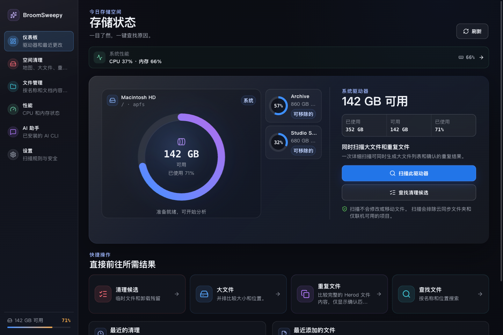
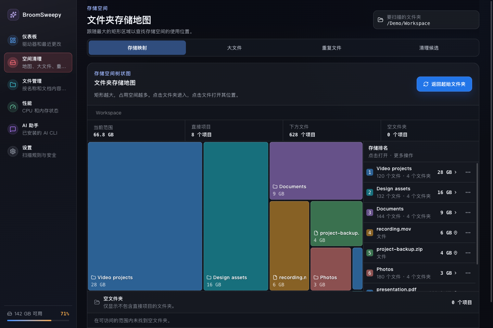
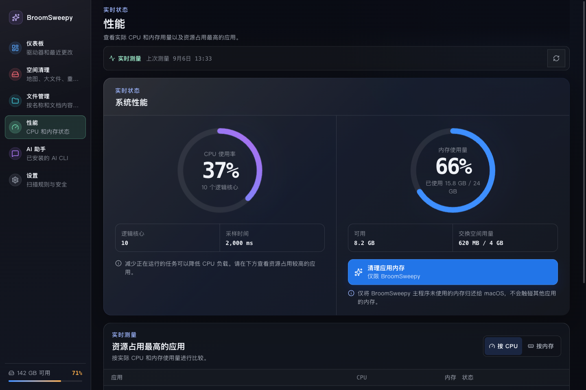
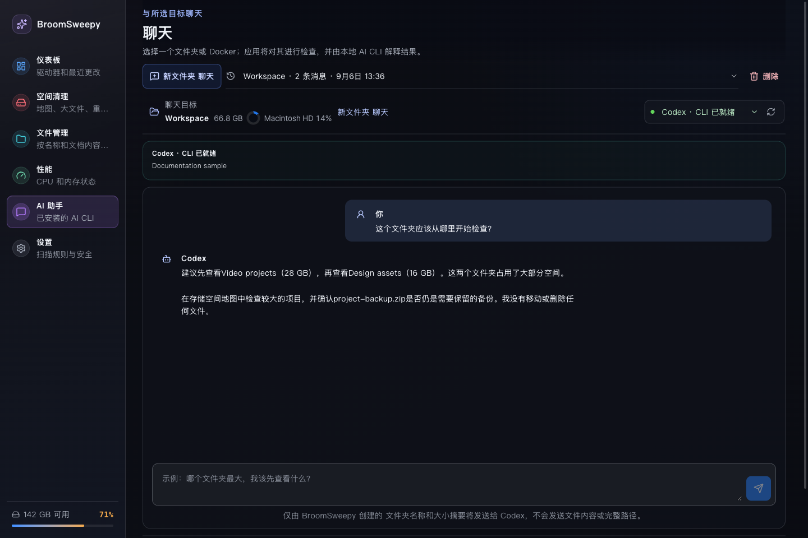
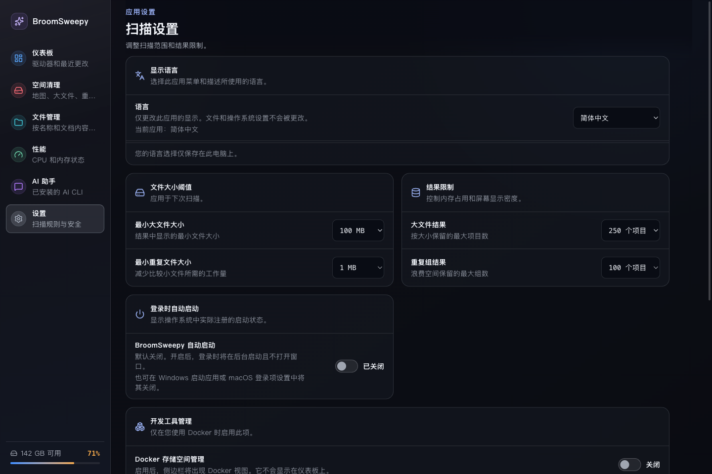

# BroomSweepy — 对话式文件管理系统

<p align="center">
  
</p>

<p align="center">
  <a href="README.en.md">English</a> |
  <a href="README.md">한국어</a> |
  <a href="README.ja.md">日本語</a> |
  <strong>简体中文</strong>
</p>

BroomSweepy 是一个面向 Windows 和 macOS 的**对话式文件管理系统**开发项目。项目以对话为主要操作方式，目标是让文件搜索、扫描、候选项审核、条件调整、最终确认和结果查看在同一工作流程中连续完成。

**Rust + Tauri 2 + React 是主项目**，延续了原 SwiftUI 应用宽敞的卡片、清晰的图标和玻璃质感界面。`BroomSweepy/` 中的 Swift 源码作为旧版参考实现保留。大文件分析、经过验证的重复文件和文档搜索由本地 Rust 引擎处理；现有的浏览与扫描界面无需连接 AI 也可使用。一个安装版本支持英语、韩语、日语和简体中文，首次启动默认英语，可在 `Settings > Display language` 中更改。

## v1.7.0 — 对话式工具与资源保护

[正式发布与下载](https://github.com/Dannykkh/bloomsweepy/releases/tag/v1.7.0) · [更新日志](CHANGELOG.md)

- **对话式空文件夹清理**：连接本地重新扫描、候选卡片、对话排除、最终确认和逐项结果。
- **文件夹操作与打开文件**：从空间地图单独审核整个文件夹的回收站移动，区分“打开”与“显示位置”。
- **应用管理**：按名称、发布者和路径进行包含词搜索。Mac 的应用本体和相关数据分别审核；Windows 打开系统卸载页面。
- **清空系统回收站**：针对当前用户整个回收站的永久删除，需要单独确认，AI 无权调用。
- **资源保护**：有上限的流式遍历、索引内存与磁盘预算，以及独立文档处理进程。
- **macOS 菜单栏**：原生面板每10秒显示 RAM、CPU 和系统磁盘。保存内存数字显示设置；关闭窗口会隐藏，打开会恢复，退出/⌘Q 会完全结束应用。不创建额外 WebView。

菜单顺序为 **仪表板 → 性能 → 应用管理 → 空间清理 → 文件管理 → AI 助手 → 设置**。Docker 管理默认关闭。

### 对话式空文件夹清理流程

1. 在 AI 助手中选择本地文件夹，请求扫描空文件夹。
2. 审核重新扫描后的候选卡片，通过对话或复选框排除要保留的文件夹。
3. 核对准确路径和选择，点击**最终确认按钮**移入回收站。
4. 查看逐项成功、失败和跳过结果。

最多审核200项，每页向 AI 提供最多24项，并显示保护规则、变更或上限导致的遗漏数量。计划仅可使用一次，有效期五分钟，修改选择、重新扫描或重启会使其失效。聊天消息或 AI 回复本身不能授权执行。暂不支持通过对话移动普通文件或重命名。**新工具流程与实际 Codex CLI 的端到端验证仍未完成。**

### 应用管理与打开文件

`应用管理`无需扫描整个驱动器即可查看列表。Mac 优先使用应用的专用卸载程序，普通应用本体须单独确认后移入回收站。相关数据仅限通过准确应用标识符匹配的缓存和偏好设置，另行选择和审核。文档、Application Support、Containers 和共享数据不纳入自动候选项。Windows 打开系统正式的“已安装的应用”卸载页面，不推测删除应用文件夹、注册表或 AppData。打开页面不代表卸载完成。

“打开”会使用默认应用打开普通文档或媒体，使用文件管理器打开普通文件夹。可执行文件、脚本和应用包仅显示位置，不会执行。显示位置与应用内的子文件夹浏览是不同操作。这些功能不会扩大 AI、CLI 或 MCP 的删除权限。

### 本地处理、令牌与传输范围

文件搜索、扫描、汇总和候选项管理在本机完成，仅向 AI 提供有限摘要。本地文件操作本身不消耗 LLM 令牌。潜在节省来自发送必要摘要而非完整文件列表，并不是 Rust 语言本身的优势。设计良好的普通 CLI 也可能达到类似效率；尚未测量完成相同任务时的令牌节省比例。

云端 AI 会收到名称、大小、数量、候选项编号、问题和对话历史。应用生成的文件夹摘要和新候选项页面不会自动包含文件正文或完整路径，但用户输入的路径或内容可能进入问题和历史。本地 CLI 或只读权限不等于完全离线，也不保证阻止所有外部传输。另行授权的 MCP 文件和文档搜索可能返回路径与匹配片段，因此不承诺零数据传输或固定的令牌节省比例。

### 资源边界与验证限制

主进程内存超过512 MiB或系统可用 RAM 低于256 MiB时，协作式中断重任务。PDF、Office 工作进程采用128 MiB Rust 分配预算和15秒限制；索引失败保留上次完成的索引。这不是整个应用、WebView、CLI 的操作系统硬配额，也不保证解决内存泄漏。隐藏窗口仍保留原有状态与内存。

- 本地自动检查：273项 Rust 与43项前端测试通过，跳过1项可选实际 CLI 诊断。
- 尚未验证：新 Codex 工具流程、长时间全进程内存稳定性、实际用户应用删除和真正清空回收站。
- 已检查菜单栏设置保存、重启和完全退出。图标直接点击、面板内部按钮和键盘操作的视觉验证仍待完成。
- 暂不提供应用总容量、安装日期及名称/日期/容量排序选择；支持包含词搜索。
- Windows 安装程序与自动检查在 CI 中完成。CI 通过不代表实际安装、GUI 和回收站操作已验证。

## 界面预览

以下是 v1.6.0 时期实际 React 组件与公开演示数据的参考截图，不包含 v1.7.0 的导航、应用管理、新确认流程和原生菜单栏。驱动器、文件、数值和对话均为示例，并非真实 AI 回复或用户文件。浏览器截图不包含 macOS 原生窗口材质效果。

### 多驱动器仪表板



### 存储空间树状图



### CPU 与内存



### AI 助手



### 设置与显示语言



## v1.6.0 主要更新

- 深色玻璃质感界面、大尺寸操作按钮、清晰图标和简化的导航。
- 当前驱动器显示为大卡片，其他驱动器显示为小卡片；点击后以动画交换位置并缩放。
- CPU 与内存环形图、主要应用用量、采样间平滑过渡，以及减少动态效果支持。
- macOS 应用内存清理仅将 BroomSweepy 主进程中未使用的 allocator 页面归还给系统，归还 0 字节也是正常完成。
- 树状图导航与单文件操作、文件身份及路径重新验证、回收站操作日志。
- 区分 AI CLI 未安装、无法执行、版本不兼容和需要登录的状态，改进对话、取消和历史记录处理。

## 安全与云端排除

扫描不会修改文件。大文件及重复检查、驱动器汇总、树状图、文件目录和文档索引会排除已知云同步根目录与仅在线项目。macOS 的 `~/Library/CloudStorage`、`~/Library/Mobile Documents` 以及可识别的 Google Drive、iCloud、OneDrive、Dropbox 路径在遍历前就会被排除，直接选择也不会扫描。已下载但位于识别出的云目录内的文件同样排除。无法保证识别任意迁移位置的同步文件夹或所有提供商。

重复文件依次通过大小、部分及完整 BLAKE3、最终字节比较验证。文件移动须经选择、重新验证、最终确认和日志记录后进入系统回收站。v1.7.0 的空文件夹移动需要最终确认。下述清空回收站是需要单独确认的永久删除例外。移入回收站的逻辑大小不等于新增可用空间。不提供自动删除注册表的操作。

v1.7.0 在存储界面顶部新增了“打开回收站”和“清空系统回收站”。后者请求操作系统清空当前用户在已连接驱动器上的整个回收站，包括其他应用丢弃的项目，而非仅所选文件夹。必须经过单独警告、确认复选框和有效期为 2 分钟的一次性确认。不向 AI/CLI/MCP 开放，不预先扫描整个回收站，也不保证释放的空间大小。已在本地 Mac 安装版本中验证警告对话框和取消操作，但未实际清空回收站。

内存清理不会清理系统整体 RAM、其他应用、WebView 辅助进程、交换空间或内存泄漏，也没有 CPU 清理功能。macOS 正常退出应用的请求是独立确认操作，不会回退到强制结束。Windows 性能功能为只读，交换空间为基于提交量的估算值，而非页面文件当前用量。

Docker 管理默认关闭。启用后也仅使用固定命令，排除卷，并单独确认操作不可恢复。

## AI、CLI 与 MCP

安装 Codex 桌面应用并不代表已经安装 Codex CLI。请在应用中检查所用提供商 CLI 的安装、兼容版本和登录状态。此前的摘要回答已在 Mac 上使用 Codex 验证，但 v1.7.0 新空文件夹工具流程尚未完成端到端验证。虽然也有 Claude Code、Grok、Antigravity、Ollama 适配器，但并未为本次 Mac 发布逐一完成实际运行验证。

应用聊天会向所选提供商发送包含项目名称和大小的有限文件夹摘要、问题与对话历史。本地 CLI 不意味着模型处理离线进行。MCP 清理工具仅提供匿名候选 ID 和有限摘要，不提供批准或执行删除的工具。另行允许文件或文档搜索后，路径和匹配上下文可能传给外部客户端。最终文件操作仍须在应用内确认。

## 平台与开发

需要 Rust stable、Node.js 22+ 和 npm。Windows 还需 WebView2 与 MSVC Build Tools，macOS 还需 Xcode Command Line Tools。

- `apps/desktop/`：主 Tauri/React 应用
- `crates/bloomsweepy-core/`：共享 Rust 分析引擎
- `crates/bloomsweepy-control/`、`apps/bloomsweepy-mcp/`：本地控制协议与 CLI/MCP 桥接
- `BroomSweepy/`：旧版 SwiftUI 参考实现

本次功能已在 Apple Silicon Mac 的本地开发构建中实现并检查部分安装运行行为，验证范围及待验证项见上文。最新 Windows 运行验证需单独完成，安装程序由 Windows CI 构建。Mac 验证构建采用 ad-hoc 签名，并非已经 Apple 公证。下载与平台注意事项请查看[发布页](https://github.com/Dannykkh/bloomsweepy/releases)。

```sh
cd apps/desktop
npm ci
npm run tauri dev
```

```sh
# Repository root
cargo fmt --all -- --check
cargo clippy --workspace --all-targets -- -D warnings
cargo test --workspace
cd apps/desktop
npm run check
npm run test:all
npm run build
npm run tauri build
```

## 文档

[更新日志](CHANGELOG.md) · [CLI 连接与控制](docs/cli-control.md) · [性能与内存边界](docs/architecture/startup-memory-status.md) · [安全回收站操作](docs/architecture/safe-trash-actions.md) · [文档搜索](docs/architecture/document-search.md) · [文件搜索](docs/architecture/fast-file-search.md) · [设计](DESIGN.md) · [复现截图](docs/assets/screenshots/README.md)

## 重要提示：数据丢失与恢复责任

BroomSweepy 设计为只处理用户选择并最终确认的项目。但是，是否能够恢复仍可能受到操作系统权限、回收站设置、同步服务，以及外置或网络驱动器状态的影响。Docker 清理不使用操作系统回收站，已完成的步骤无法恢复。

执行清理前，请备份重要数据，并核对所有选定路径、文件和 Docker 分类。除法律规定不得排除的责任外，项目提供者和贡献者不对用户发起的文件移动、删除、清空回收站或 Docker 清理造成的数据丢失或恢复失败承担责任。
