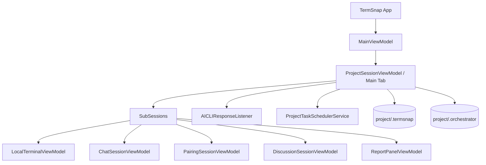
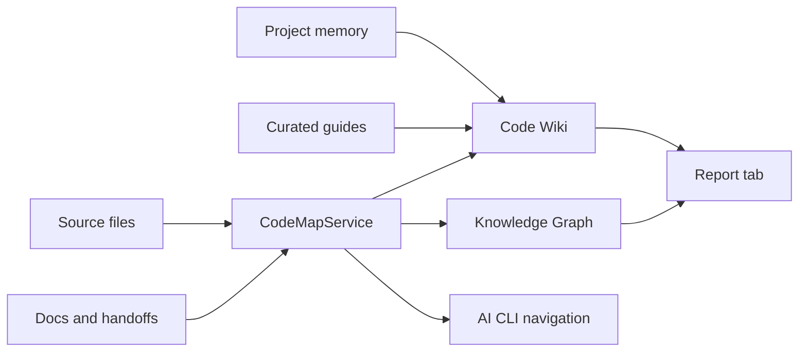

# System Map

> 프로젝트 구성도와 리포트/코드맵 지식 표면을 함께 보는 Code Wiki 뷰입니다.

## Runtime Ownership

## Code Knowledge Surface

## Current CodeMap Shape

- Projects: 0
- Files: 290
- Documents/assets: 40 / 239
- Routes/API/UI signals: 0 / 0 / 79

## Main Implementation Areas

| Area | Files | Why it matters |
|------|-------|----------------|
| [views](../views.md) | 37 | WPF View/Window/Panel |
| [apps-desktop](../apps-desktop.md) | 27 | .tsx×12, .rs×8, .ts×7 |
| [services](../services.md) | 22 | 서비스 클래스/메서드 |
| [crates-bloomsweepy-core](../crates-bloomsweepy-core.md) | 11 | .rs×11 |
| [apps-bloomsweepy-mcp](../apps-bloomsweepy-mcp.md) | 3 | .rs×3 |
| [broomsweepy](../broomsweepy.md) | 2 | .swift×2 |
| [broomsweepy-models](../broomsweepy-models.md) | 2 | .swift×2 |
| [crates-bloomsweepy-control](../crates-bloomsweepy-control.md) | 1 | .rs×1 |
| [viewmodels](../viewmodels.md) | 1 | ViewModel 클래스/속성/명령 |
