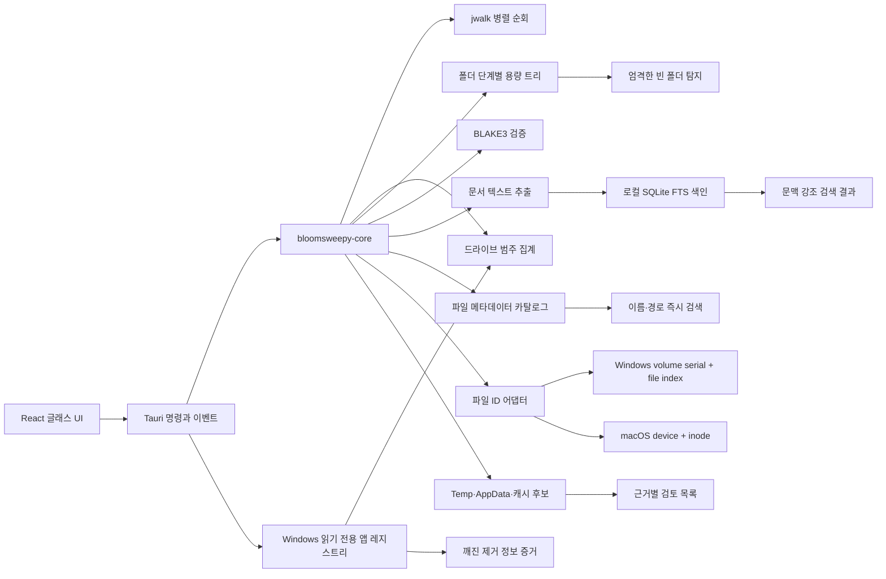

# BroomSweepy 크로스플랫폼 데스크톱 아키텍처

## 결정

새 데스크톱 앱은 Tauri 2와 Rust 공용 코어를 사용합니다. 기존 macOS SwiftUI 앱을 즉시 제거하지 않고, 공용 코어가 안정화되는 동안 나란히 유지합니다.

UI는 스캔 설정과 상태 조합만 담당합니다. Tauri 셸은 폴더 선택, 시스템 볼륨 조회, 백그라운드 작업, 진행 이벤트를 담당합니다. 실제 파일 판정 규칙은 `bloomsweepy-core`에만 둡니다.

## 저장공간 트리맵 파이프라인

1. 사용자가 선택한 드라이브나 폴더를 링크 추적 없이 Rust에서 순회합니다.
2. UI에는 현재 폴더의 직계 자식만 반환하고, 각 폴더 크기는 모든 하위 파일의 논리 크기로 집계합니다.
3. Tauri는 `directory-scan-progress` 이벤트와 공용 취소 토큰만 중계합니다.
4. React는 최대 15개 비례사각형을 그리며 나머지 항목은 `기타` 한 칸으로 합칩니다.
5. 폴더 사각형을 선택하면 해당 경로를 새 루트로 같은 명령을 실행하고, 브레드크럼으로 이전 경로를 복원합니다.
6. 빈 폴더는 직접 포함 항목이 없는 폴더만 판정합니다. 접근 오류가 난 폴더는 오탐을 막기 위해 빈 폴더 후보에서 제외합니다.

대용량 결과가 WebView로 한꺼번에 넘어가지 않도록 코어 응답은 직계 자식 512개와 빈 폴더 경로 200개를 기본 상한으로 둡니다. 내부 직계 자식 집계도 기본 16,384개로 제한하고, 전체 개수와 생략된 논리 용량은 별도 합계로 보존합니다. 상한에 도달하면 결과의 `trackingLimitReached`로 불완전한 개별 목록임을 명시합니다.

## 드라이브 인벤토리 파이프라인

1. 시스템 볼륨 또는 사용자가 선택한 볼륨을 링크 추적 없이 순회합니다.
2. 파일 메타데이터의 논리 크기를 설치 앱, 시스템, 임시 파일, 사용자 콘텐츠, 개발 산출물 등의 공통 범주로 집계합니다.
3. 집계 중간값을 별도 `drive-scan-progress` 이벤트로 보내 범주별 결과를 점진적으로 표시합니다.
4. 큰 위치는 제한된 깊이의 경로 버킷으로 합산하고 상위 항목만 UI에 전달합니다.
5. Windows에서는 Tauri composition root가 Uninstall 레지스트리의 표시 이름, 게시자, 설치 위치, 추정 크기를 읽기 전용으로 수집해 완료 결과에 결합합니다.
6. macOS에서는 `/Applications`, `/System/Applications`, `~/Applications`의 직접 `.app` bundle에서 `Info.plist`를 읽고 표시 이름·버전·bundle ID를 보강 자료로 결합합니다.

레지스트리의 `EstimatedSize`는 앱 메타데이터일 뿐 실제 파일 용량의 정본이 아닙니다. 범주 용량은 파일시스템 스캔이 소유하고 레지스트리는 설치 앱의 정체를 설명하는 보강 자료로만 사용합니다. 레지스트리 키를 변경하거나 제거하는 명령은 제공하지 않습니다.

## 스캔 파이프라인

1. 링크를 따라가지 않는 병렬 디렉터리 순회로 파일 메타데이터를 수집합니다.
2. 운영체제 파일 ID가 같은 하드링크는 두 번째 항목부터 제외합니다.
3. 설정 기준 이상의 파일을 크기순 큰 파일 목록에 넣습니다.
4. 중복 후보를 논리 크기로 묶습니다.
5. 64KiB 머리와 꼬리의 BLAKE3 서명으로 후보를 줄입니다.
6. 남은 후보의 전체 내용을 BLAKE3로 해시합니다.
7. 같은 전체 해시끼리 다시 바이트 단위로 비교한 뒤에만 중복으로 확정합니다.

부분 해시와 전체 해시는 성능 필터이며, 최종 중복 판정은 실제 바이트 비교가 소유합니다.

## 빠른 파일 찾기 파이프라인

1. Windows의 정확한 NTFS 드라이브 루트는 읽기 권한이 있을 때 MFT를 직접 읽고, 그 밖의 범위와 macOS는 링크 추적 없는 공용 순회를 사용합니다.
2. 본문을 열지 않고 이름, 경로, 종류, 확장자, 논리 크기, 수정 시각만 공통 레코드로 수집합니다.
3. 앱 캐시의 SQLite 테이블과 FTS5 trigram 색인을 한 트랜잭션에서 갱신합니다. 전체 적재는 보조 인덱스와 FTS를 한 번 일괄 재구축합니다.
4. Windows MFT 공급자는 USN 위치를 저장하고 다음 수동 업데이트에서 파일 변경분만 반영합니다. 폴더 구조 변경이나 저널 유실은 전체 MFT 갱신으로 전환합니다.
5. 취소되면 불완전한 세대를 롤백하고 마지막 완료 카탈로그를 유지합니다.
6. React는 140ms 디바운스로 구조화된 필터 요청을 보내고 최대 100개 결과와 실제 공급자·갱신 모드를 표시합니다.

현재 공급자는 Windows `windowsNtfs`와 Windows·macOS 공용 `portableWalk`입니다. 원시 볼륨 권한이 없거나 NTFS가 아니거나 하위 폴더를 선택하면 공용 공급자로 자동 전환합니다. 선택적인 Everything IPC와 macOS FSEvents는 같은 요청·결과 계약 뒤의 후속 공급자입니다. 이름·경로 검색은 문서 본문 검색이나 삭제 추천으로 확대하지 않습니다. 세부 상한과 오픈소스 대조는 [빠른 파일 찾기 아키텍처](fast-file-search.md)에 기록합니다.

## 문서 검색 파이프라인

1. 사용자가 선택한 폴더를 공용 `ScanRuntime`의 블로킹 작업자에서 링크 추적 없이 순회합니다.
2. 확장자와 파일 크기 상한을 통과한 일반 텍스트, PDF, DOCX, XLSX, PPTX, HWPX만 문서 후보로 분류합니다.
3. Windows에서는 읽기·쓰기·삭제 공유 플래그를 허용한 읽기 핸들을 사용하고, 독점 잠긴 파일은 이슈로 남긴 뒤 건너뜁니다.
4. 앱 캐시의 SQLite 문서 메타데이터와 경로·크기·수정 시각을 대조해 바뀌지 않은 문서는 본문 추출을 생략합니다.
5. 변경된 문서의 텍스트를 형식별로 추출하고 FTS5 trigram 색인과 원문 미리보기를 한 트랜잭션 안에서 갱신합니다.
6. 취소·오류·비정상 종료 시 트랜잭션을 롤백해 마지막 완료 색인을 유지합니다.
7. 검색은 파일명·경로·본문을 함께 조회하고 일치 문맥만 최대 100개까지 React에 전달합니다.

색인은 재실행 뒤에도 재사용하지만 현재 자동 파일 감시자는 없습니다. 파일시스템 변경 뒤 사용자가 `색인 업데이트`를 실행하면 증분 대조합니다. 본문과 검색어는 로컬에 머물고 공급자 연결이나 RAG 호출은 문서 검색의 전제 조건이 아닙니다. 세부 형식·상한·개인정보 경계는 [문서 검색 아키텍처](document-search.md)에 기록합니다.

## 정리 후보 파이프라인

1. Tauri 셸이 현재 사용자 Temp와 OS별 캐시 위치를 구성합니다. Windows에서는 Local·Roaming AppData도 별도 위치로 추가합니다. macOS의 Application Support와 앱 컨테이너는 설치 앱 목록의 완전성을 증명할 수 없어 기본 후보에서 제외합니다.
2. Rust 코어는 링크를 따라가지 않고 직접 항목의 하위 용량, 항목 수, 가장 최근 변경 시각을 집계합니다.
3. Temp는 7일, AppData는 90일 동안 변경되지 않은 항목만 후보로 남깁니다.
4. AppData 이름을 현재 Windows 설치 앱의 표시 이름, 게시자, 설치 위치와 대조합니다. 일치하지 않는다는 사실은 삭제 근거가 아니라 `검토 필요` 근거로만 사용합니다.
5. Windows Uninstall 레지스트리에서 설치 위치, 표시 아이콘, 제거 프로그램 가운데 서로 다른 경로 증거가 둘 이상 존재하지 않는 항목만 깨진 제거 정보 후보로 표시합니다.
6. Temp가 많은 환경에서도 AppData가 누락되지 않도록 위치별 결과 상한을 적용합니다.

파일과 AppData 후보는 더블클릭으로 탐색기 위치를 확인할 수 있습니다. 문서·이미지·영상·오디오의 명시적 허용 형식만 기본 앱으로 열고, 그 밖의 파일과 링크는 실행하지 않고 위치만 표시합니다. 레지스트리는 읽기 전용이며 키 삭제 명령을 제공하지 않습니다.

## 플랫폼 경계

| 관심사 | 공용 | Windows | macOS |
|---|---|---|---|
| 순회, 크기 집계, 해시, 비교 | Rust 코어 | 동일 | 동일 |
| 파일 메타데이터 카탈로그와 이름·경로 FTS | Rust 코어 | NTFS MFT/USN, 공용 순회 폴백 | 공용 순회 |
| 문서 추출, 증분 FTS 색인, 검색 | Rust 코어 | 공유 읽기 핸들 | POSIX 읽기 |
| 하드링크 식별 | 명시적 계약 | volume serial + file index | device + inode |
| 볼륨 사용량 | Tauri 셸의 `sysinfo` | 지원 | 지원 |
| 범주별 드라이브 사용량 | Rust 코어 | Windows 경로 규칙 | macOS 경로 규칙 |
| 설치 앱 보강 | 명시적 선택 계약 | Uninstall 레지스트리 읽기 전용 | 직접 `.app`의 Info.plist 읽기 전용 |
| 폴더 선택 | Tauri dialog | 네이티브 선택기 | 네이티브 선택기 |
| 상주 셸 | 앱 수명주기 | 트레이 열기·상태·종료, 창 닫기 시 숨김 | 기존 SwiftUI 메뉴 막대·알림 |
| 패키징 | Tauri | MSI, NSIS | DMG, app bundle |

## 현재 안전 계약

- 분석 중 파일 쓰기, 이동, 삭제를 수행하지 않습니다.
- 심볼릭 링크를 따라가지 않습니다.
- 권한 오류는 결과에서 분리해 제한된 개수만 기록합니다.
- 후보와 결과 개수에 명시적 상한을 둡니다.
- 디렉터리 순회는 최대 4개, 전체 내용 해시는 최대 2개 작업자로 제한합니다.
- 실행 중인 스캔은 원자적 취소 플래그로 중단하며 큰 파일은 256KiB 청크마다 확인합니다.
- Windows 파일은 공유 읽기·쓰기·삭제를 허용해 분석 핸들이 다른 프로그램의 작업을 막지 않습니다.
- 발견 이후 크기나 수정 시각이 달라진 파일은 중복 결과에서 제외합니다.
- 문서 색인은 파일당 기본 32 MiB, 추출 텍스트 4 MiB, 문서 100,000개 상한을 적용합니다.
- 문서 색인 갱신은 SQLite 트랜잭션으로 수행해 취소 시 불완전한 상태를 노출하지 않습니다.
- 파일 카탈로그는 기본 2,000,000개, 절대 5,000,000개 상한과 최대 250개 검색 결과를 적용합니다.
- 파일 카탈로그 갱신도 SQLite 트랜잭션으로 수행하고 앱 내부 이동 뒤 오래된 검색을 잠급니다.

세부 위험 모델, 테스트와 남은 운영체제 한계는 [스캔 런타임 안전성](scan-runtime-safety.md)에 기록합니다.

## 아직 구현하지 않은 것

- 일반 사용자 앱을 위한 최소 권한 Windows MFT/USN 읽기 서비스와 검증된 IPC
- 폴더 구조 변경도 전체 MFT 경로 재계산 없이 반영하는 세밀한 USN 갱신
- Windows NTFS 할당량과 하드링크를 MFT 수준에서 보정한 범주 집계
- macOS FSEvents 기반의 증분 인덱스
- Windows USN Journal·macOS FSEvents 기반 자동 문서 색인 갱신
- 구형 바이너리 HWP 파서와 이미지형 PDF OCR
- 의미 기반 문서 검색과 명시적 공급자 전송 동의 흐름
- 다른 위치의 앱까지 증명하는 macOS 앱 인벤토리와 별도 승인 기반 Application Support·앱 컨테이너 검토
- 앱 내부 개별 복원 UI
- 추가한 macOS CI의 첫 성공 실행과 Intel Mac 네이티브 회귀 테스트
- 코드 서명, macOS 공증, 자동 업데이트

현재 구현은 공용 전체 순회 기준선 위에 선택적인 Windows MFT/USN 어댑터를 둡니다. 어댑터는 권한과 파일시스템 조건이 맞을 때만 선택되며 실패하면 같은 계약의 공용 순회로 돌아갑니다. Windows 호스트에는 Apple용 C 툴체인과 SDK가 없으므로 macOS 번들 검증은 macOS 러너에서 수행해야 합니다.
