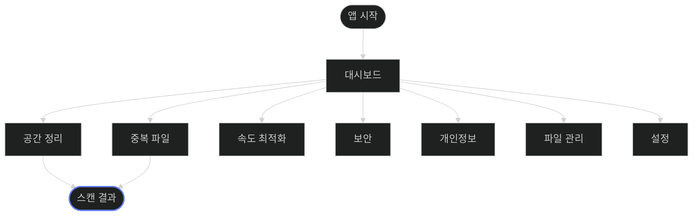

# Sitemap: BroomSweepy Cross-Platform Desktop

## Navigation Contract

- 첫 크로스플랫폼 vertical slice는 `대시보드 → 공간 정리/중복 파일 → 스캔 결과`를 완성한다.
- 나머지 페이지는 플랫폼 capability가 구현된 뒤 같은 사이드바 계약에 연결한다.
- 사용할 수 없는 기능을 성공 상태처럼 보이는 빈 화면으로 노출하지 않는다.
