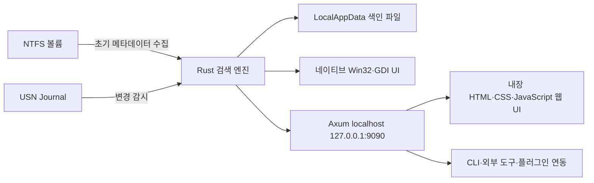

# FastFind 0.71.0 경쟁 제품 벤치마크

- 조사일: 2026-08-30
- 대상: FastFind 0.71.0 Windows x64 포터블 배포본
- 목적: BroomSweepy의 빠른 파일 찾기, 문서 검색, 드라이브 분석, 정리 UX에 반영할 요소를 구분
- 범위: 공식 문서, 배포본 무결성, PE·리소스·제한적 의사코드, 실제 데스크톱·웹 UI, 검색·자원·잔여물 관찰

## 결론

FastFind는 저장공간 정리 앱보다는 `Windows 전역 파일 색인기 + 로컬 웹 포털`에 가깝다. 이름·경로 검색, NTFS/USN 기반 갱신, 조밀한 키보드 UX, 질의 문법, 즐겨찾기·최근 파일·웹 API는 강하다. 반면 정리 안전성, 트리맵 탐색, AppData·레지스트리 잔여물 판정, 삭제 전 재검증은 BroomSweepy의 현재 경계가 더 깊다.

직접 가져올 대상은 검색 상호작용과 질의 모델이다. 구현 방식은 그대로 따라가면 안 된다. 실제 배포본은 전체 앱을 관리자 권한으로 실행하고, 첫 실행에 자동 시작 예약 작업과 약 504 MiB의 AppData 색인을 만들었다. 본문 검색 요청은 50초 이상 로컬 HTTP 서버를 막았고 Private 메모리가 약 457 MiB에서 738 MiB로 증가했다. 인증이 필요하다는 공식 개발자 문서와 달리 실제 0.71.0의 `/api/status`, `/api/search`는 토큰 없이 응답했고 CORS도 `*`였다.

## 근거와 한계

| 근거 | 확인 내용 |
|---|---|
| [공식 다운로드 매니페스트](https://fastfind.kr/downloads/manifest.json) | `local` 채널 0.71.0, ZIP·EXE 크기와 SHA-256 |
| [공식 사용법](https://fastfind.kr/guide) | 검색 문법, 중복·빈 폴더·본문 검색, CLI, 키보드 동작 |
| [공식 개발자 문서](https://fastfind.kr/dev) | localhost API, 인증 계약, 안정·비안정 엔드포인트, 플러그인 경계 |
| 실제 EXE·리소스 | x64 네이티브 Rust, GDI UI, 관리자 권한 매니페스트, Windows API import |
| Ghidra 12.1.3 제한 분석 | 6,612개 내부 함수와 348개 외부 함수 복구, 근거 연결 함수 22개만 의사코드 추출 |
| Windows 실제 실행 | 6개 드라이브 색인, UI·설정·웹 UI, 검색 시간, 메모리, 생성 파일, 예약 작업, 포트·CORS |

심볼이 제거된 네이티브 Rust 실행 파일이므로 원래 함수명·타입·소스 구조는 복원되지 않는다. 의사코드는 API·상수·제어 흐름을 교차 확인하는 근거일 뿐 원본 소스로 취급하지 않았다. 업데이트, 외부 접속, 실제 삭제, 탐색기 메뉴 등록, 플러그인 실행은 시험하지 않았다. 모바일 웹 화면도 본문 검색 부하 때문에 프로세스를 조기 종료하여 별도로 캡처하지 않았다.

## 배포본 검증

| 항목 | 결과 |
|---|---|
| ZIP | 2,892,496 bytes, SHA-256 `8b5c3414eaf00d773c0dee22828011ee56525ceb9eec6b713828333d7c9ec017` |
| EXE | 6,716,928 bytes, SHA-256 `99424cbb7615b14608cc788cbe9ec2ba5d7caa3864d69f117b7324caf48d0414` |
| 공식 매니페스트 대조 | ZIP·EXE 모두 일치 |
| Authenticode | 서명 없음 |
| ALYac 단일 파일 검사 | 1개 검사, 탐지 0, 종료 코드 0 |
| Windows Defender | 이 PC에서 비활성화되어 검사 근거로 사용하지 않음 |
| VirusTotal | 해당 해시의 공개 보고서를 찾지 못했으며 안전 판정으로 사용하지 않음 |

해시 일치와 단일 백신 무탐지는 배포본 동일성과 제한된 악성코드 신호만 뜻한다. 전체 관리자 권한 실행의 안전을 보증하지 않는다.

## 제품 구조

- .NET, Electron, Tauri, WebView2 기반 데스크톱 UI가 아니다. 배포 매니페스트가 순수 GDI 렌더링과 GDI 스케일링을 명시한다.
- 매니페스트는 `requireAdministrator`, `uiAccess=false`, `gdiScaling=true`, `dpiAware=false`다.
- Rust 빌드 경로에서 `engine/src/fold.rs`, `index.rs`, `search.rs`, `update.rs`가 확인됐다.
- 주요 크레이트는 Tokio 1.50, Axum 0.7.9, Hyper 1.8.1, Rayon 1.11, Regex 1.12.3, Serde JSON 1.0.149, Windows 0.52, Zip 2.4.2다.
- import와 의사코드에서 `CreateFileW`, `SetFilePointerEx`, `ReadFile`, `DeviceIoControl`, `RegisterHotKey`, 레지스트리 API, `SHFileOperationW`, Winsock, WinHTTP 사용을 확인했다.
- `FSCTL_QUERY_USN_JOURNAL(0x900f4)`과 `FSCTL_READ_USN_JOURNAL(0x900bb)`이 확인됐다. 후자는 64 KiB 출력 버퍼로 호출됐다.
- 휴지통 삭제는 `SHFileOperationW`의 `FO_DELETE`와 `FOF_ALLOWUNDO`가 포함된 플래그를 사용한다.

공식 설명은 관리자 권한이 없을 때 폴더 순회로 전환한다고 하지만, 실제 단일 EXE 매니페스트가 시작부터 관리자 권한을 요구한다. 취소된 UAC 상태에서 별도 일반 사용자 프로세스가 동작하는지는 확인되지 않았다.

## UI 해부

### 네이티브 데스크톱

기본 창은 1200×800의 어두운 고밀도 데이터 도구다. 위에서 아래로 메뉴, 단일 검색창, 종류·크기 필터, 결과 표, 상태 표시줄이 이어진다. 결과 열은 이름·경로·크기·수정일이며 목록과 설정 모두 장식보다 정보 밀도를 우선한다.

장점:

- 첫 화면에서 검색과 필터가 바로 보이고, 메뉴·단축키·상태 표시가 일관된다.
- 527만 항목을 색인한 뒤 빈 검색 상태에서도 목록 스크롤과 메뉴가 응답했다.
- 설정이 일반, 색인 범위, 키보드 단축키, 창 안 단축키, 시스템, 정보, 연동, 플러그인, 내 필터로 잘 분리된다.
- 파일 열기, 폴더 열기, 속성, 휴지통 삭제, 복사, 미리보기 같은 결과 행 작업이 키보드 문서로 노출된다.

약점:

- 전체 앱이 관리자 권한이라 검색 UI·웹 서버·업데이트 확인까지 같은 높은 권한 경계에 들어간다.
- 처음 실행하자마자 모든 선택 드라이브를 색인하고 자동 시작을 기본 활성화한다.
- 경로가 긴 결과는 표에서 잘리고, 삭제 가능성과 단순 검색 결과의 신뢰 경계가 첫 화면에서 분명하지 않다.
- 시스템 설정의 캐시 크기는 `fastfind_index.bin` 하나인 286.6 MiB만 표시하고, 별도 `fastfind_engine.ixd` 약 217.3 MiB는 합계에서 보이지 않았다.

### 웹 UI

웹 UI는 localhost 9090에서 제공되는 내장 HTML·CSS·JavaScript다. 상단 검색창과 검색, 최근 파일, 즐겨찾기, 디스크 분석, 탐색기, 업로드, 설정 탭을 제공한다. 데스크톱 GDI UI와 별도 구현이며 Google Fonts의 Inter를 외부에서 요청한다.

장점:

- 검색·최근·즐겨찾기·탐색·업로드를 브라우저에서 한 구조로 제공한다.
- 디스크 분석은 파일·폴더·총 논리 용량·중복 수 KPI와 대용량 파일, 확장자별 용량, 중복 표를 한 화면에 배치한다.
- 탐색기에서 드라이브·폴더를 이동하고 선택 항목을 ZIP으로 받을 수 있다.

약점:

- 디스크 분석은 표 중심이며 BroomSweepy의 비례사각형 트리맵 같은 공간 드릴다운이 없다.
- 빈 상태와 로딩 상태가 단순 문구뿐이고 장기 분석의 단계·진행률·취소가 없다.
- 웹 하단 버전은 `v0.1`로 표시되어 실제 0.71.0과 어긋난다.
- 모든 파일 경로와 최근 파일이 브라우저에 노출되므로 인증·CORS 계약이 특히 중요하다.

## 실제 기능 대조

| 기능 | FastFind 0.71.0 관찰 | 현재 BroomSweepy | 판단 |
|---|---|---|---|
| 전역 이름·경로 검색 | 527만 항목, 입력 중 검색, 다양한 접두사 | SQLite FTS5 카탈로그와 MFT/USN 공급자 구현 | 문법·상태 UX를 확장 |
| NTFS 초기 수집 | 관리자 앱에서 전 드라이브 자동 색인 | 정확한 NTFS 루트와 권한이 있을 때 MFT, 아니면 순회 | BroomSweepy의 폴백 경계 유지 |
| 변경 반영 | 상시 USN 감시 기본 활성화 | 사용자가 갱신할 때 USN 재생 | 제한된 감시 서비스 후보로 Adapt |
| 큰 파일 | `size:` 질의와 웹 분석 상위 표 | 드라이브 스캐너, 큰 위치, 트리맵 | 현재 구조가 더 깊음 |
| 빈 폴더 | `empty:` 질의 | 접근 제한을 오판하지 않는 엄격한 빈 폴더 | 질의 진입점만 추가, 판정은 유지 |
| 중복 | 이름·크기·날짜·내용 질의, 웹 분석 100그룹 | 크기→부분 BLAKE3→전체 BLAKE3→바이트 비교, 사진 필터 | 검증 파이프라인은 BroomSweepy 유지 |
| 문서 본문 | 설정 기본 비활성, 내부 API 존재 | 선택 폴더 증분 FTS, 형식·상한·취소·트랜잭션 | FastFind 방식은 채택하지 않음 |
| 파일 미리보기 | 이미지·영상·음악·PDF·텍스트 | 결과 열기·위치 표시 중심 | 읽기 전용 미리보기는 선택 확장 |
| 디스크 분석 | KPI·대용량·확장자·중복 표 | 범주·큰 위치·트리맵 드릴다운 | 보조 표만 Adapt |
| AppData·Temp·레지스트리 잔여물 | 정리 판정 기능 없음 | 근거 기반 후보와 레지스트리 읽기 전용 | BroomSweepy 차별점 유지 |
| 삭제 | 선택 항목 휴지통 이동 | 사전 재검증·저널·보관본 강제·부분 실패 중단 | BroomSweepy 계약이 더 안전함 |
| 최근·즐겨찾기·저장 검색 | 제공 | 빠른 검색 화면에는 제한적 | Adopt 후보 |
| 전역 단축키 | Ctrl+Shift+Space 등 | 앱 내부 내비게이션 중심 | 사용자가 켜는 opt-in으로 Adapt |
| 웹·REST API | localhost 웹 UI와 API | 없음 | 기본 범위 밖, 필요 시 인증 우선 |
| 플러그인 | 별도 EXE와 JSON stdout 계약 | 없음 | 현재는 Avoid |

## 실측

### 색인과 자원

| 지표 | 관찰값 |
|---|---:|
| 선택 드라이브 | C:, D:, E:, F:, G:, I: |
| 최종 색인 항목 | 약 5,276,000 |
| 주 색인 완료 파일 시각 | 실행 약 61초 뒤 |
| 보조 `.ixd` 완료 파일 시각 | 실행 약 132초 뒤 |
| `fastfind_index.bin` | 300,537,523 bytes, 286.6 MiB |
| `fastfind_engine.ixd` | 227,816,342 bytes, 217.3 MiB |
| AppData 전체 | 528,550,841 bytes, 504.1 MiB |
| 실행 직후 Private 메모리 | 약 12 MiB |
| 초기 색인 중 Private 메모리 | 약 691 MiB |
| 색인 후 관찰 Private 메모리 | 약 457 MiB |

공식 사이트의 측정값은 제작자 환경의 게시 수치이고 위 표는 이 PC에서 직접 관찰한 값이다. 서로 같은 하드웨어·파일 수·버전 조건이 아니므로 직접 우열 비교에는 사용하지 않는다.

### 검색과 분석

| 요청 | 전체 결과 | 엔진 또는 벽시계 시간 |
|---|---:|---:|
| `FastFind.exe` | 1 | 1.6104 ms |
| `FastFind.exe path:bloomsweepy` | 1 | 11.2208 ms |
| `empty: path:<repository-root>` | 5,416 | 14.1216 ms |
| `size:>1gb` | 261 | 8.227 ms |
| `/api/analysis` | 456만 파일·70만 폴더 집계 | 8,574 ms |

`empty:` 결과 수는 색인 관점의 결과일 뿐 삭제 안전성을 검증하지 않았다. 제외 경로·권한 실패·링크 의미를 반영하는 BroomSweepy의 엄격한 빈 폴더 판정과 같은 것으로 간주하면 안 된다.

### 본문 검색 부하

USN 감시가 새 TXT fixture를 2초 안에 이름 색인에 반영한 뒤, 고유 토큰으로 `/api/content-search`를 호출했다. 비공개 API에 `path`와 `max`를 함께 보냈지만 공식 문서가 이 필드를 보장하지 않으므로 실제 범위 제한이 적용됐다고 볼 수 없다.

- 30초 클라이언트 제한 안에 응답하지 않았다.
- 요청 연결 종료 후에도 `/api/status`가 추가 20초 이상 타임아웃됐다.
- 네이티브 창은 `Responding=True`였지만 localhost API 전체가 막혔다.
- Private 메모리는 약 457 MiB에서 738 MiB까지 증가했다.
- CPU 누적은 약 119초에서 269초까지 늘었다.
- 프로세스의 일반 닫기는 트레이 숨김으로 처리되어, 부하를 끝내려면 해당 PID를 강제 종료해야 했다.

이는 FastFind 전체 제품의 일반적 성능을 단정하는 결과가 아니라 0.71.0의 해당 내부 API 호출 한 건에 대한 재현이다. 다만 BroomSweepy의 문서 검색은 반드시 별도 블로킹 작업자, 문서·파일 크기 상한, 취소 확인, 요청 격리, 마지막 완료 색인 보존을 계속 유지해야 한다.

## 보안·잔여물 관찰

### 관리자 권한과 자동 시작

- 단일 EXE가 `requireAdministrator`다.
- 첫 실행 기본 설정은 Windows 시작 시 실행과 트레이 아이콘을 켠다.
- 실제로 루트 예약 작업 `FastFind`를 만들었고, 현재 Windows 사용자, `RunLevel=Highest`, 실행 대상은 조사용 EXE였다.
- 실행 종료 후 조사 과정에서 해당 예약 작업을 제거했다.

### 포터블 상태

EXE는 설치 없이 실행되지만 상태까지 포터블하지는 않다. `%LOCALAPPDATA%\FastFind`에 설정, 언어 파일, 로그, 두 색인 파일을 만들었다. 조사 후 C:에서 제거해 D:의 격리 폴더로 옮겼다.

기본 제외에는 `$Recycle.Bin`, `System Volume Information`, Recovery, WinSxS, Windows Installer·servicing·Temp·Prefetch·SoftwareDistribution과 `tmp`, `temp`, `bak`, `old`, `lnk`, `url`, `cache`, `dmp`, `etl`, `pf`, `chk`가 포함됐다. 파일 찾기에는 유용한 기본값이지만 저장공간 정리 제품은 바로 그 경로·확장자를 별도 위험 등급으로 분석해야 하므로 공용 제외 목록으로 복사하면 안 된다.

### localhost API 문서 불일치

[공식 개발자 문서](https://fastfind.kr/dev)는 토큰 없이는 API가 응답하지 않는다고 설명한다. 실제 0.71.0에서는 새 PowerShell 클라이언트가 쿠키·Authorization 없이 다음 결과를 받았다.

- `GET /api/status`: 200
- `GET /api/search?q=FastFind.exe&max=5`: 200
- 임의 `Origin` 헤더를 보낸 두 요청: `Access-Control-Allow-Origin: *`
- `OPTIONS /api/search`: 200, `Access-Control-Allow-Origin: *`

서버가 127.0.0.1에만 바인드된 점은 확인했다. 현대 브라우저의 Private Network Access 정책까지 포함한 공개 웹사이트 공격 재현은 하지 않았으므로 원격 악용 가능성을 확정하지 않는다. 그러나 로컬 파일 경로를 반환하는 API의 문서·배포 불일치와 와일드카드 CORS는 출시 차단 수준으로 다뤄야 한다.

## Adopt / Adapt / Avoid

### Adopt

- 하나의 검색창에서 `ext:`, `size:`, `mtime:`, `type:dir`, `path:`, `empty:` 같은 구조화 문법을 사용하고 UI 필터가 같은 질의를 만든다.
- 최근 파일, 즐겨찾기, 저장 검색을 파일 찾기의 2차 내비게이션으로 둔다.
- 결과 표에서 이름·전체 경로·크기·수정 시각을 기본 열로 제공하고 키보드로 열기·위치 표시·미리보기를 수행한다.
- 상태 화면에 공급자, 색인 항목 수, 색인 파일 실제 합계, 마지막 갱신, 감시 상태를 함께 표시한다.

### Adapt

- 상시 USN 반영은 일반 사용자 UI 프로세스가 아니라 수명·메모리·취소가 제한된 읽기 전용 공급자에서 수행한다. 저널 유실 때 전체 갱신으로 전환한다.
- 대용량·확장자·중복 표는 현재 트리맵 옆 보조 보기로 추가한다. 트리맵 드릴다운을 대체하지 않는다.
- 전역 단축키와 시작 시 실행은 모두 기본 꺼짐인 사용자 opt-in으로 제공한다.
- 미리보기는 허용 형식, 최대 바이트, 스트리밍·취소, 실행 파일 비실행 원칙을 적용한다.
- 질의 문법은 문자열을 셸에 넘기지 않고 현재 구조화된 Rust/Tauri 요청과 SQL 필터로 해석한다.

### Avoid

- 전체 앱과 웹 서버를 항상 관리자 권한으로 실행하지 않는다.
- 첫 실행에 전 드라이브 색인·자동 시작·업데이트 확인을 조용히 켜지 않는다.
- `포터블` 배포본이 설명 없이 AppData에 수백 MiB를 남기지 않는다.
- 본문 검색을 요청 스레드에서 즉석 전체 스캔하지 않는다.
- 인증 없는 localhost 파일 API, 와일드카드 CORS, 경로 기반 GET 부작용을 제공하지 않는다.
- 검색 결과나 이름·크기 중복을 삭제 추천으로 승격하지 않는다.
- FastFind의 평면 다크 UI나 Inter 기반 웹 외형을 BroomSweepy의 글래스 디자인에 그대로 복제하지 않는다.

## BroomSweepy 우선순위

### P0: 현재 안전 경계 고정

1. 관리자 권한은 Windows MFT 읽기 전용 공급자에만 한정하고 일반 사용자 `portableWalk` 폴백을 유지한다.
2. 문서 색인의 취소·상한·트랜잭션·마지막 완료 세대 계약을 실제 대용량 문서 폴더에서 회귀한다.
3. 앱의 모든 장기 작업 중 상태·취소 명령이 계속 응답하는 통합 테스트를 추가한다.
4. 향후 localhost API를 넣는다면 기본 비활성, 난수 토큰, 엄격한 Origin, 비GET 변경 작업, 경로 범위 검증을 출시 조건으로 둔다.

### P1: 검색 경험 확장

1. 현재 파일 카탈로그 요청 위에 제외어·OR·날짜·경로·폴더·빈 폴더 질의 빌더를 추가한다.
2. 최근 파일, 즐겨찾기, 저장 검색을 로컬 메타데이터로 제공한다.
3. `전체 갱신`과 `USN 변경분`뿐 아니라 마지막 완료·감시 지연·저널 폴백 이유를 상태 독에 표시한다.
4. 트리맵 옆에 상위 대용량 파일과 확장자별 용량 표를 제공한다.

### P2: 선택 기능

1. 안전한 이미지·텍스트·PDF 미리보기.
2. 기본 꺼짐 전역 빠른 검색창.
3. 일반 사용자 권한에서 동작하는 최소 권한 MFT 서비스와 인증된 IPC.

웹 업로드, 원격 웹 UI, 실행 파일 플러그인 생태계는 현재 저장공간 정리 핵심보다 위험·지원 비용이 크므로 보류한다.

## 파생 검증 항목

- 500만 항목에서 초기 색인 시간, DB 총합, 안정 시 Private 메모리 p50·peak를 측정한다.
- 색인 중 이름 검색과 취소가 200 ms 안에 응답하는지 확인한다.
- 본문 검색 요청을 취소해도 상태·다른 읽기 요청이 응답하고 메모리가 기준선으로 돌아오는지 확인한다.
- 잠긴 파일, 변경 중 파일, 삭제된 파일, 저널 유실, 폴더 이름 변경을 각각 회귀한다.
- 자동 시작·컨텍스트 메뉴·캐시를 기본 꺼짐으로 검증하고 제거 후 예약 작업·레지스트리·AppData 잔여물을 검사한다.
- 로컬 API가 토큰 없음, 잘못된 Origin, 경로 이탈, GET 변경 요청을 거부하는지 자동화한다.

## 로컬 산출물과 정리 상태

주요 조사 산출물:

- `.termsnap/benchmarks/fastfind-0.71.0-20260830/FastFind-0.71.0-x64.zip`
- `.termsnap/benchmarks/fastfind-0.71.0-20260830/portable/FastFind.exe`
- `.termsnap/benchmarks/fastfind-0.71.0-20260830/ghidra/FastFind.manifest.xml`
- `.termsnap/benchmarks/fastfind-0.71.0-20260830/ghidra/ghidra-evidence.md`
- `.termsnap/benchmarks/fastfind-0.71.0-20260830/ghidra/selected-decompilation.c`
- `.termsnap/benchmarks/fastfind-0.71.0-20260830/ui-settings-dialog.png`
- `.termsnap/benchmarks/fastfind-0.71.0-20260830/ui-web.png`
- `.termsnap/benchmarks/fastfind-0.71.0-20260830/ui-web-explorer.png`

개인 파일명이 보이는 `ui-web-analysis.png`, `ui-web-recent.png` 등은 로컬 조사 근거로만 두고 문서에 삽입하거나 배포하면 안 된다.

정리 완료:

- FastFind 프로세스 종료와 9090 리스너 소멸 확인
- 조사 중 생성된 `FastFind` 최고 권한 예약 작업 제거
- 조사 중 생성한 임시 아웃바운드 방화벽 규칙 제거
- C:의 `%LOCALAPPDATA%\FastFind`를 D: 격리 폴더로 이동

삭제 안전 장치가 재귀 영구 삭제를 거부해 다음 대용량 임시 자료는 D:에 남아 있다.

- `.termsnap/tools/ghidra_12.1.3_PUBLIC` 약 863.6 MiB
- `.termsnap/tools/ghidra_12.1.3_PUBLIC_20260817.zip` 약 543.1 MiB
- 로컬 Ghidra 프로젝트 `FastFind071.rep` 약 71.2 MiB. 정확한 경로는 Git에서 제외한 조사 정리 메모에 보존
- `.termsnap/benchmarks/fastfind-0.71.0-20260830/runtime-artifacts/FastFind-AppData` 약 504.1 MiB
- `.termsnap/benchmarks/fastfind-0.71.0-20260830/edge-profile` 약 12.6 MiB

영구 삭제 전에는 위 정확한 경로를 다시 확인해야 한다.
