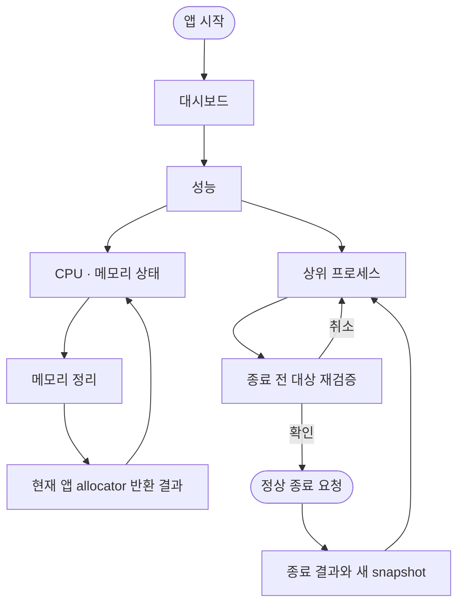

# Sitemap: Rust Performance Instrument

## Navigation Contract

- `성능`은 실제 기능이 있는 전역 route이며 파일 관리와 AI 도우미 사이에 둔다.
- 대시보드의 작은 CPU/RAM 상태는 같은 `성능` route로 이동한다.
- 메모리 정리는 확인창 없이 BroomSweepy 호스트 프로세스에만 실행하고, allocator가 보고한 반환량을 같은 pane에 표시한다.
- 종료는 목록에서 바로 실행되지 않고 backend preview와 사용자 확인을 거친다.
- raw PID를 받는 route나 강제 종료 route는 만들지 않는다.
