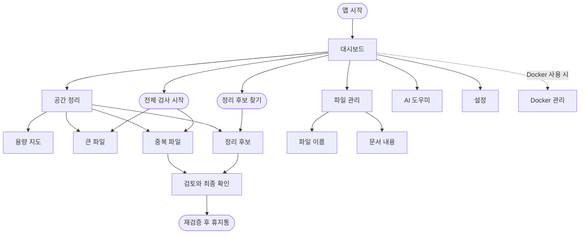

# Sitemap: Rust 기반 Swift 경험 통합

## Navigation Contract

- `ViewId`와 실제 leaf route는 유지한다. 상위 카테고리는 표시와 활성 상태만 묶는다.
- 공간 정리는 기존 `StorageSectionNav`로 용량 지도·큰 파일·중복 파일·정리 후보를 노출한다.
- 파일 관리는 같은 패턴의 보조 탭으로 파일 이름·문서 내용을 노출한다.
- Docker는 설정에서 실제로 켠 경우에만 AI 도우미 뒤에 보인다.
- 속도·보안·개인정보는 Rust route와 실제 기능이 생기기 전까지 메뉴에 만들지 않는다.
