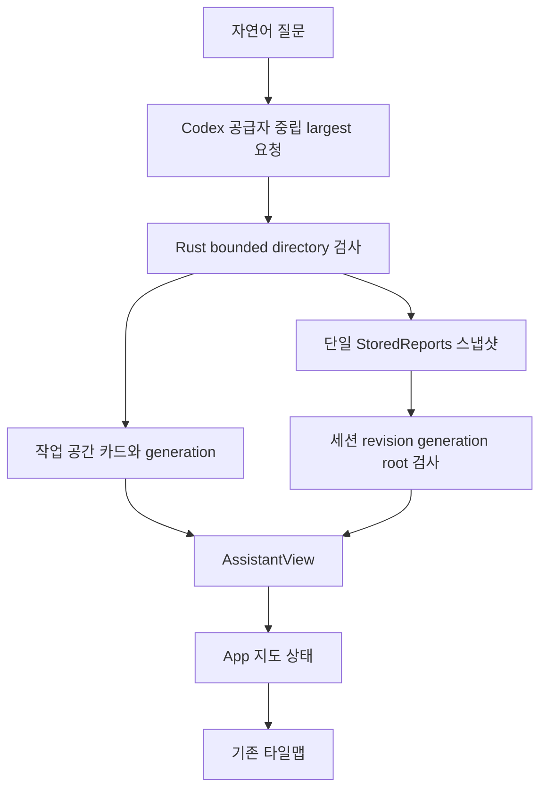
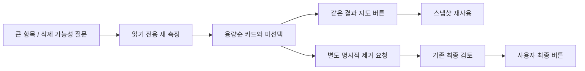

# Handoff: 자연어 큰 항목 발견과 대화·용량지도 공유

## Session Metadata

- Created: 2026-10-04 17:07:38 KST
- Project: BroomSweepy
- Branch: main (base842d916)
- Session: 01a06a3f-f2f6-72c0-9c0c-78a13e23b651
- Status: 구현/회귀/설치 및 실제 Codex 읽기 전용 질문→하위 검사→판단 설명→지도 검증 완료
- Continues from: [일반 파일 대화 작업](2026-10-04-120000-conversational-file-management.md) — 그 작업의 원래 범위는 완료했고 이 문서는 새 지도 공유 요구를 이어받음

## Origin

- 요구: “여기서 가장 용량이 큰 폴더나 데이터는 뭐야? 삭제해도 되나? 찾아줄래?” 자연어 발견과 찾은 폴더 정보의 용량지도 반영.
- 출처: 위 session의 현재 사용자 턴, 사용자 턴 시각 미확인. [대화 근거](../../conversations/2026-10-04-codex-storage-map.md)
- 문제: 과거 요약에 머물거나 제거 요청과 삭제 가능성 질문을 혼동하고, 채팅과 지도가 별도 검사 결과를 사용하는 불편.
- 권한 경계: 코드/검증/로컬 앱 교체만. 사용자 파일 삭제, 휴지통 비우기, 커밋/푸시/릴리스 없음.

## Current State Summary

`files/largest`가 현재 폴더를 새로 측정해 직계 항목 용량순 결과를 반환한다. 폴더는 하위 합계이고 부분 결과를 구분한다. 삭제 안전성은 크기/이름/수정일만으로 확정하지 않고 자동 선택/계획을 만들지 않는다. 같은 bounded directory snapshot이 채팅 카드와 타일맵에 공유된다. 설치 앱을 ad-hoc 서명한 새 빌드로 교체했고 기존 데이터/대화는 유지했다. Native 실제 질문·후속 하위 검사·Codex 판단 설명·지도·범위 유지 재검사를 확인했다.

## Feature/Flow/Decision Snapshot

### Implemented Features

| 기능 | 화면 동작 | 입력/근거 | 검증 |
|---|---|---|---|
| 큰 항목 발견 | 새 검사·상위5개 사실 응답·용량순 카드·선택0 | assistant_files.rs Largest/scan_workspace, assistant_tools.rs TOOL_CONTRACT | Rust 회귀·실제 Codex 합성 질문 통과 |
| 지도 공유 | 채팅 유지하며 동기화, 명시적 버튼만 overview 이동 | get_assistant_directory_report, AssistantView effect/showFileMap, App acceptAssistantDirectoryReport | 합성1,420,002,400 B 일치·키보드 이동 |
| 미측정/만료 구분 | 이름 검색 폴더는 미측정, 만료 지도는 재검사 안내 | query/mapGeneration/revision/generation/root 검사 | Rust 및 합성 UI 통과 |
| 대화 복귀 안정성 | 저장된 행과 새 pending 행이 겹치지 않음 | AssistantView saved/pending key 구분 | 복귀→검색 새 warning/error0 |

### Feature Boundary

- 범위: 기존 대화 루트 안의 현재 폴더 직계 항목 비교/하위 탐색, 같은 보고서의 지도 표시.
- 제외: 전체 재귀 파일별 순위 보장, 파일 본문 읽기, 크기만으로 안전 삭제 보장, 자동 제거, 영구 누적 트리 캐시.
- 삭제: 기존 앱 소유 검증/5분 일회용 계획/main WebView 최종 버튼/OS Trash 보호 유지.
- 원천: Rust directory scanner와 단일 StoredReports.directory. 모델은 이름/바이트/건수/시각/ID의 bounded 문맥을 읽음.

### Menu / Screen Map

| 메뉴 | 화면 | 역할 |
|---|---|---|
| AI 도우미 | AssistantView | 질문→큰 항목 카드→하위 검사→같은 결과 용량지도 보기 |
| 공간 정리 | OverviewView / StorageTreemapPanel | 동일 generation/root/바이트의 타일과 순위, 기존 검토 루틴 |

### Composition Diagram

### Flow Diagram

### Decision Records

| 결정 | 대안/배제 근거 | 기록/대체 대상 |
|---|---|---|
| 발견과 제거 분리 | 크기/캐시 유사 이름 자동 삭제 판단은 필요성·백업 근거 없음 | [003](../../memory/architecture/003-conversational-storage-map.md), 대체none(001 확장) |
| 단일 generation 공유 | 두 번 검사하면 비용/시점 차이, 모든 지도 영구 누적은 자원 환경에 부적절 | 003, 대체none |
| saved/pending 키 공간 분리 | sequence와 배열 index 같은 prefix는 실제 UI 경고 발생 | QA 기록, 기존 설계 변경 아님 |

## Codebase Understanding

### Architecture Overview

기존 Rust scanner/StoredReports/App UI 조합점을 사용한다. 모델은 largest/browse 같은 요청만, 앱은 검사·보고서 보존·최종 승인만 책임진다. 검색 결과와 측정 스냅샷을 구분하고 UI에 generation/root를 공유한다.

### Critical Files

| 파일 | 책임 |
|---|---|
| `apps/desktop/src-tauri/src/assistant_files.rs` | largest/작업 공간/단일 지도 스냅샷 조회/회귀 |
| `apps/desktop/src-tauri/src/assistant_tools.rs` | 발견·판단·제거·최종 승인 프로토콜 |
| `apps/desktop/src/views/AssistantView.tsx` | 사실 메시지/공유 조회/지도 버튼/행 키 |
| `apps/desktop/src/App.tsx` | 공유 결과 수용/최신 generation/화면별 실제 검사 범위 |

### Files Modified

- Backend: apps/desktop/src-tauri/src/assistant_files.rs, assistant_tools.rs, assistant_provider.rs (합성 실제 Codex3번째 질문), lib.rs (명령 등록).
- UI: apps/desktop/src/types.ts, lib/bridge.ts, views/AssistantView.tsx, components/AssistantFileCard.tsx/.css, App.tsx, assistant-tools-fixture.tsx, release-preview.tsx.
- Catalog: apps/desktop/src/i18n/index.tsx, ja.json, zh-CN.json 신규5문구.
- 정본 문서: DESIGN.md, README.md/en/ja/zh-CN, apps/desktop/README.md.
- 보고서: docs/qa/2026-10-04-conversational-storage-map.md; memory/architecture003, 001의 additive link, architecture index, MEMORY index, conversations/2026-10-04-codex-storage-map.md.
- 사용자 변경 docs/domain-dictionary.md와 기존 대량 dirty/untracked 자료는 건드리지 않음. 이전 구현 변경도 보존. 현재 GitHub v1.7.0은 이번 개발본을 포함하지 않음.

## Verification

[상세 QA](../qa/2026-10-04-conversational-storage-map.md)

- Rust275 통과 + ignored3, clippy workspace lib -D warnings 통과.
- TypeScript check/frontend43/production build 통과; 기존500 kB bundle 경고 남음.
- 실제 Codex 합성3요청 계약(일반 scan/명시적 review_named/사용자 한국어 질문 largest) 통과.
- 합성 UI: 단일 바이트 합계, 선택0/계획 없음/실행0, 이름 미측정, 만료 안내, Enter 지도 이동/복귀,325/760/1280px 가로넘침 없음.
- 키 충돌 수정 후 검사→지도→복귀→검색 새 error/warn0.
- arm64 app build3m27s 성공, host+sidecar2개 ad-hoc 서명 및 deep strict verify 통과.
- Native 실제 질문→31개 카드/target6 GB→readonly browse/debug5.4 GB·release600.7 MB/선택0→Codex 조건부 판단 설명→같은 지도 통과. 지도 header/restart는 target 범위를 유지하고 재검사297ms/접근 제한0 완료. Windows runtime/장시간 자원/라이트 native NOT RUN.

## Installed Artifact

- 경로: /Applications/BroomSweepy.app (버전1.7.0 local patched build; 새 공개 릴리스 아님)
- Host SHA256: e832fe1d31af3fb34ad5ab87c5bff19d015edef1285163adb19d234617a8ceb5
- 이전 앱 복구: /private/tmp/broomsweepy-map-rollback-9UnzVB/BroomSweepy.app
- 사용자의 데이터/대화/휴지통은 보존, 앱 본체만 교체.
- 이전 상태를 최신으로 착각하지 말 것: native 기존 대화/작업 기록에 사용자가17:00 이전 promo-video를1.2 GB 휴지통 이동한 결과가 관찰됨. 이 작업에서 실행한 삭제가 아니다.

## Pending Work

### Immediate Next Steps

요청 범위의 구현·검증·설치 작업은 완료했다. 별도 승인/범위로 남은 일은 Windows runtime, 라이트 native, 장시간 전체 프로세스 자원 검증 및 공개 릴리스다. 사용자 파일 삭제나 커밋/푸시/릴리스는 이번 요청에서 수행하지 않는다.

### Assumptions Made

사용자의 제안을 진행 중인 파일관리 구현의 자연어 발견/지도 연결 개선으로 해석했다. 사용자 파일의 제거 권한이나 릴리스 권한으로 확대하지 않았다.

### Potential Gotchas

채팅에서 지도 공유 시 global root를 덮어 다른 검사 결과와 섞지 않는다. map header/restart/detail scan은 해당 지도 root/첫 breadcrumb를 사용한다. 이후 다른 map scan은 old mapGeneration을 만료시킨다. Native 백그라운드 캡처가 animation 중간 픽셀을 반환하면 Window 메뉴의 현재 창 선택으로 활성화한 뒤 관찰하고 소스 오류로 단정하지 않는다.

## Environment State

### Important Context

- CUA: `finalStorageBroom` 현재 최종 설치 native 앱, browser2 `qaBrowser`; 합성 임시 탭 종료/viewport reset 완료. 앞선 native handle은 재설치 뒤 쓰지 않는다.
- Vite: exec session75482 종료(^C, exit130), localhost dev server 없음.
- Native PID26622, 최종 target 지도 화면. 실제 QA 질문/응답은 기존 대화에 추가됐다. 대화 원문/전체경로를 불필요하게 출력하지 않기.
- Cargo build 완료56949 및 최종46697. host RSS56,784 KiB 단일 시점만 확인, 전체 프로세스 peak/soak 검증이라고 주장하지 말 것. 이번에 만든 target/aarch64-apple-darwin800MB는 정확 경로만 정리했고 기존 debug 및 사용자 자료는 보존.
- Env names only: CODEX_THREAD_ID, CARGO_BUILD_JOBS, CARGO_PROFILE_RELEASE_DEBUG.
- temp rollback은 복구를 위해 보존. 새 릴리스/태그/커밋/푸시는 권한 없음.

## Session Memory Review

- 루트: 실제 .git 경계의 BroomSweepy, 기억/대화/핸드오프 절대 경로로 기록. Mktemp 임시 디렉터리를 기억 루트로 사용하지 않음.
- Doctor: SKIPPED — 실제 architecture 본문 있음, 마지막 진단2026-09-29로30일 미도래.
- Anchor query: assistant_files.rs 도구는 미연결로 출력했으나 인덱스/실제001 본문을 직접 읽음; 생성기는 dirty 파일001/002 연결을 확인. 기존001 확장,002 변경 없음.
- 기억: [003](../../memory/architecture/003-conversational-storage-map.md) 신규,001 additive 문구/링크, 두 인덱스 갱신. 기존 결정을 뒤집지 않아 supersedes 추가 없음.
- Retrieval: MEMORY의 largest-items/shared-treemap/read-only-advice→003 본문/QA/대화 링크 확인 완료.
- Observations: 현재 session의 UI key 충돌은 verified, 재현·회귀는 QA에 기록; 기존 관찰 백로그 정제/offset 갱신 없음.
- Skill improvement: candidate none — 프로젝트 전용 스킬 매핑/개선 요청 없음. 전역 스킬을 수정하지 않음.
- Component map: N/A — 프로젝트 codemap/component-map.json 없음, stale 코드맵은 구현 근거로 사용하지 않음.
- 검증: validate_handoff98/100 READY, 필수 항목/민감값/4개 파일 참조 확인. git diff --check 통과.

#tags: largest-items shared-treemap read-only-advice macos scan-generation arch:001 arch:003
