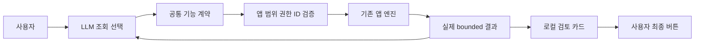

# Handoff: 앱 기능 계약과 LLM 조사 루프 — 개발본 연결, 네이티브 검증 남음

## Session Metadata

- Created: 2026-10-04 22:06:22 Asia/Seoul
- Project: /Users/dannysmacair/Documents/git/BroomSweepy
- Branch/base: main / 842d916
- Source: codex; 현재 세션 ID 미확인, 현재 대화와 장부만 근거로 사용.
- Continues from: none — 이전 용량지도 작업은 완료됐고 이번 연결 작업은 별도 요구.

## Origin

사용자가 “연결안된 구멍들 모두 메꿔볼까”, “앱에서 나온 리스트를 받아 분석”, “조회·검토·분석을 LLM이 사람 대신”이라고 요청했다. 최신 질문은 개념이 틀렸는지 확인하는 것으로, 개념은 맞지만 구현 연결이 미완료임을 설명했다. 근거: conversations/2026-10-04-team-daedalus-app-tools.md 및 docs/plan/app-tool-integration/plan.md.

## Current State Summary

WorkPM 조사/설계/공통22종 계약·dispatcher·4행동 조사 루프·결과/준비된 검토 UI 연결 완료. worker 소유권은 모두 반환됐고 메인이 최종 검사를 수행했다. control23/MCP12/desktop191/frontend43 검사, workspace Clippy, 프런트엔드 빌드 통과. 설치본은 기존1.7.0이며 이번 구현은 설치하지 않았다. 실제 설치앱 Codex 종단/전체 integration/Windows/장시간 메모리까지 완료했다고 보고하지 않는다. 현재 컨텍스트 압축 후 이 기존 핸드오프를 갱신해 이어간다.

## Feature/Flow/Decision Snapshot

### Implemented Features

| Feature | Entry | Implementation | Verification |
|---|---|---|---|
| 공통22종 요청/기능 catalog | MCP/native | crates/bloomsweepy-control/src/capabilities.rs | control23/MCP12 통과 |
| 앱 서비스 dispatcher | native/MCP bridge | apps/desktop/src-tauri/src/app_tools.rs | 모델/외부 presentation 비공개 및 재전송 검사 통과 |
| 성능·앱·검색 서비스 | 공통 dispatcher | apps/desktop/src-tauri/src/app_tools_system.rs, apps/desktop/src-tauri/src/app_tools_search.rs | projection/미측정/권한/상태 검사 통과 |
| bounded 반복 분석 | ask_assistant | apps/desktop/src-tauri/src/assistant_provider.rs | 실제 결과 재투입 scripted CLI/중복/예산/입력 timeout·cancel 통과 |
| 결과·준비된 검토 UI | AssistantView/App | apps/desktop/src/components/AssistantAppToolCard.tsx | frontend43/빌드 통과, CUA 합성 결과·분석/만료 계획 무실행 확인 |

### Feature Boundary

앱은 데이터 수집/검색/측정/실제 실행과 보호 규칙을 맡는다. LLM은 어떤 기능을 조회할지 결정하고 실제 결과를 분석한다. 삭제/앱 제거/프로세스 종료는 검토까지만 모델에 제공하고 최종 승인은 사용자 UI 버튼이다. CLI 자체 파일 조사, 임의 셸, 자동 승인 없음. 문서 본문 일부 공개에는 기존 문서 consent 필요. 외부 시스템 조회 consent는 closed-default.

### Menu / Screen Map

기존 성능/앱 관리/검색/정리 화면과 확인 대화상자를 재사용한다. 결과 카드와 최종 분석을 함께 보존하고 prepared application/process/Docker/host-memory 검토는 동일 계획을 사용한다. DESIGN.md 토큰을 유지했다. 유효한 모든 계획의 UI·키보드·밝은 테마·반응형은 추가 검증이 필요하다.

### Composition Diagram

### Flow Diagram

자세한 제한/분기는 docs/flow-diagrams/app-tool-investigation.mmd. UI presentation은 모델/직접 Control/MCP에 보내지 않는다. 같은세션 Native/External 작업 소유권과 원래 루트를 상태 공개 전에 저장하고, 현재 동의 철회 시 결과 조회를 막는다. 소유자 취소만 철회 후에도 허용하되 summary/수치/상세 메시지는 숨긴다.

## Work Completed / Files

- 계획/도면/기능 계약·QA·현재 대화·아키텍처004/인덱스 작성 및 README/cli-control 갱신.
- MCP12도구(기존10 유지), 공통 native dispatcher 및 앱 기존 성능/앱/검색/정리/Docker helper 연결.
- 조사 루프 최대4행동·48KiB 결과·192KiB 입력·10분 총 시간·중복 방지·취소. stdin 익명 파일로 읽지 않는 CLI 파이프 블록을 제거.
- 직접 Control 결과 비공개, await 후 동의 재확인, 세션/actor별 작업 상태·취소·16개 history, 변경 요청128개 wire 재전송 방지, executing/failed 상태 보완.
- 프런트엔드 결과·분석 보존/동일 prepared review/권한 opt-in 연결, TypeScript/Vite 및43 검사 통과.
- 원래 dirty 변경과 domain-dictionary는 사용자 변경이며 되돌리지 않음.

## Decisions Made

| Decision | Alternatives | Reason | 대체 대상 |
|---|---|---|---|
| 앱 공통 typed 계약 + 최대4행동 조사 루프 | 프롬프트 보강만 / CLI 자체 탐색 | 실제 앱 목록·후속 분석과 승인 경계 보존 | none — 이전001/003 계약 확장 |
| 모델용 data와 로컬 presentation 분리 | 전체 결과 전송 | 로컬 경로·승인 ID 불필요 공개 방지 | none |

## Worker Ownership Returned

- /root/research_control_contract: 공통 계약/MCP 후 관련 frontend 구현까지 완료, 소유권 반환.
- /root/research_performance_apps: 시스템/앱 helper 및 독립 읽기 리뷰 완료, 소유권 반환.
- /root/research_search_storage: 검색/저장공간/control 소유권·권한 보완 완료, 소유권 반환.
- Lead가 전체 검증/문서/완료 판정을 소유한다. 새 worker spawn은 thread cap로 불가하여 기존 관련 조사 worker를 구현 역할로 재개했고 파일 소유권을 유지했다.

## Immediate Next Steps

1. workspace lib 재실행은 control23/core81/desktop191/MCP12, 합계307 통과·3 ignored·실패0으로 QA에 기록했다. 첫 전체 테스트는2048MiB 최소 여유 guard 때문에 실패했으며 보호 규칙을 약화하지 않았다. 실패했던 macos_resource_stability integration 재실행도1개 통과했다. 나머지 integration/실제 저용량 장시간 검사와 구분한다.
2. 유효한 모든 prepared review와 검색/색인/정리 completion을 합성 UI에서 검사한다. focus/keyboard·밝은 테마·좁은 viewport 및 Main WebView 외 실행 거부 런타임은 NOT RUN이다.
3. 디스크 여유를 확인하고 전체 native 번들 빌드/설치 교체 후 실제 Codex 조회→앱 결과→추가 분석을 검증한다. 합성 응답을 실제 CLI 성공이라고 보고하지 않는다.
4. Windows/장시간 메모리 soak 및 남은 integration 회귀를 별도로 완료한다. 실제 사용자 파일 삭제·앱 제거·프로세스 종료/휴지통 비우기/Docker prune·권한 자동 승인 없음.

## Important Context / Environment

- 8GiB Mac. 디스크가 빌드 중1.9GiB까지 내려갔다. 이번 생성 단일 target/debug/deps/libbloomsweepy_desktop_lib.a(579,497,608바이트)만 확인 후 제거해2.7GiB 회복, frontend 검사 후 약2.4GiB. 다시 빌드하면 재생성된다. broad target/debug 정리·사용자 색인 삭제 없음.
- 설치앱 /Applications/BroomSweepy.app, rollback /private/tmp/broomsweepy-map-rollback-9UnzVB/BroomSweepy.app 유지. 이전 기능 QA는 이번 연결 검증 근거 아님.
- CUA 압축 후 rewriteDocumentation 필수. 실제 UI는 CUA만. 공개 release/commit/push 현 요청 권한 없음.
- 앱 목록 Mac 크기/설치일 미측정, 성능 Mac GUI 집계(전체 daemon 아님), 메모리 host allocator만. 없는 값0 위장 금지.

## Critical Files

- apps/desktop/src-tauri/src/app_tools.rs: 공통 dispatcher·projection·wire 재전송 이력.
- apps/desktop/src-tauri/src/assistant_provider.rs: 4행동 조사·실제 결과 입력·private stdin·시간/취소.
- apps/desktop/src-tauri/src/control_server.rs: external 동의·작업 소유권·범위.
- apps/desktop/src/components/AssistantAppToolCard.tsx 및 apps/desktop/src/App.tsx: local presentation·동일 검토 계획·배경 inert.
- docs/qa/2026-10-04-app-tool-integration.md: 실제 실행 결과/NOT RUN의 정본.

## Session Memory Review

- Architecture preflight: 생성기 확인, 기존 본문 있고 마지막 doctor5일 전; 이번 doctor SKIPPED.
- Anchor index: 생성기 기존001/002/003 근거 확인. 기존 기억을 뒤집지 않음.
- Memory/index updates: memory/architecture/004-app-tool-investigation.md, architecture/index.md 및 MEMORY.md에 반영. 기존001/003 확장으로 supersedes 없음. MEMORY.md73줄4906바이트로 상한 이내.
- Retrieval verification: MEMORY/index의004 링크와 실제 본문/현재 대화 근거를 재검색해 확인했다. 수정 전 build_anchor_index.py --file memory/architecture/004-app-tool-investigation.md 조회는 의존 항목 없음이었다.
- Observations: 세션 UUID 미확인으로 backlog 정제 안 함. 현재 대화 작업 근거만 사용.
- Skill improvement candidate: none — 프로젝트 전용 local skill 변경 대상 없음, 전역 수정 불필요.

## NOT RUN / Remaining

전체 native 번들/설치·실제 Codex 조사 흐름, 각 기능 유효한 확인 UI/키보드·반응형·밝은 테마, Windows 실제 실행·장시간 메모리 soak는 NOT RUN이다. native CLI 리뷰 엔진도 NOT RUN이며 독립 리뷰는 읽기 전용 팀 검토였다. 전체 regression의 첫 실패와 최종 재실행 결과는 QA에 기록한다. 문서 작성이나 단위 검사 통과를 사용자 목표 전체 완료로 간주하지 않는다.
