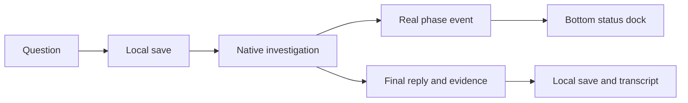

# Handoff: Conversation-first chat redesign

## Session Metadata

Date: 2026-10-05 11:11 KST. Project: BroomSweepy. Branch: main.
Session UUID/user turn timestamp unavailable. Created for context continuity;
original request remains active, not considered completed by this document.

## Origin

Latest user request: replace the unusual chat UI completely with a familiar
OpenAI-style conversation. Earlier requests: bottom input, visible progress,
connection permissions in settings/target-adjacent popup. No current commit/push.
Origin source: current user messages, summarized in conversations/2026-10-05-chat-workbench.md.

## Current State Summary

Code implemented; frontend53 and Rust provider25 PASS, production fixture checked.
Final native update restored7 saved messages and dock/Settings/popup/Codex readiness.
WKWebView Escape focus repair verified on the installed final build. Original request
is completed; changes are uncommitted/unpushed. QA has final SHA and rollback path.
Existing unrelated untracked demo-assets/ must remain untouched.

## Implemented Features

- Assistant-only bounded shell; compact header/scope; centered transcript; bottom dock.
- Actual preparing/querying/analyzing progress events, correlation guard, elapsed time.
- Next-question draft allowed during request; send guard/cancel retained.
- Read-only lazy evidence; critical reviews/permissions/errors start expanded.
- Shared control settings in Settings and native dialog, no permission default changes.
- Actual production-component synthetic fixture and locale coverage.

## Feature/Flow/Decision Snapshot

App queries and LLM analysis stay in the existing investigation loop. New phase
metadata feeds the dock independently of the final reply; its subscription is
bounded by the request/UI lifetime. The final reply is still saved locally and
review/execute authority remains separate. See architecture008 for the decision.

## Composition Diagram

User question → local save → native request → phase events → UI status/dock;
native app queries → actual result → CLI analysis → local save → transcript/evidence.
App controlSettings → Settings + chat dialog → existing permission callbacks.

## Feature Boundary / Menu / Screen Map

Only chat layout and connection controls placement change. Other page scrollers,
native chrome/glass007, provider isolation, final execution approval and session
storage stay intact. No token streaming, fake percentages or broader permissions.

## Critical Files / Files Modified

See apps/desktop/src/views/AssistantView.tsx, AssistantView.css, SettingsView.tsx;
apps/desktop/src/components/AppShell.tsx; apps/desktop/src-tauri/src/assistant_provider.rs;
apps/desktop/src/App.tsx; apps/desktop/src/assistant-tools-fixture.tsx; bridge/types/i18n;
docs/design-refs/2026-10-05-experience-chat-workbench.md and layout; README/DESIGN.

## Decisions Made

| Decision | Evidence | Memory |
|---|---|---|
| Non-overlapping bounded rows replace sole main scroller | User request + rendered geometry | memory/architecture/008-conversation-workbench.md |
| Show real phase metadata, not simulated tokens | Existing complete-response CLI + event tests | memory/architecture/008-conversation-workbench.md |
| Lazy read evidence, preserve explicit reviews | Existing safety flow + mock execution0 | memory/architecture/008-conversation-workbench.md |

## Validation

See docs/qa/2026-10-05-chat-workbench.md for exact executed boundaries.
Frontend53 PASS, Rust provider25 PASS/2 ignored, validator/build PASS; payload
guard subset2 PASS. Installed native/settings/Escape focus and stable-source
scroll/draft preservation PASS; real provider/private transmission NOT RUN.

## Important Context

Installed old app1.7.0 has empty composer/no active request at pre-install check.
Use CUA exclusively for UI. Never send its private saved chat to test progress.
Final JS/source changes must be included in final native embed before installation.
Previous backups and sidecars stay preserved; low disk~2GiB, build jobs1.
Current task rollback: /private/tmp/broomsweepy-chat-install-backup-eNk2bn/BroomSweepy.app.

## Immediate Next Steps

No required UI implementation remains. If requested next: review/commit/push these
changes, or test a real provider with an explicitly synthetic folder/session.
Windows runtime and long-duration resource soak remain separate validation work.
Own fixtures/server closed; installed app remains on chat with an empty composer.

## Session Memory Review

Root confirmed Git project. Mnemo project-storage/handoff-memory/self-improvement
references read. Architecture007 and004 bodies exist; doctor2026-09-29 is under30days:
conditional doctor SKIPPED. New008 linked in MEMORY and architecture index; no old
raw observations distilled (session UUID unavailable). Project skill candidate:
defer, no project-specific installed skill/verified session observations identified.
No component-map.json: NOT APPLICABLE. Validate/re-search after final updates.

#tags: chat-workbench, actual-progress, docked-composer, settings-permissions, arch:008, supersedes:#single-main-chat-scroll
