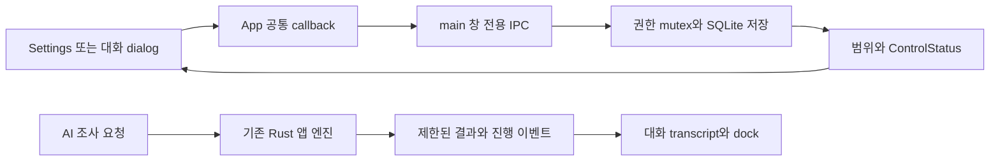

# Handoff: Mac 채팅·권한·선택 폴더 검사와 Git 공유

## Session Metadata

- Created: 2026-10-05 16:44:44 KST
- Project: BroomSweepy
- Branch: main
- Session: 01a06a3f-f2f6-72c0-9c0c-78a13e23b651
- Session duration: 현재 인계 작업 약15분; 누적 개발 세션 전체 시간은 미계측.
- 재개 출처: session_meta의 2026-09-29T07:00:22.668Z. 사용자 턴별 시각은 추정하지 않는다.

## Handoff Chain

이어받은 [권한 인계](2026-10-05-151100-remembered-permissions.md)에 선택 폴더 검사 정책을
추가한 후속 기록이다. [채팅 작업면 인계](2026-10-05-111101-chat-workbench.md)와
이전 검증 기록은 역사적 상태를 보존한다. 기존 인계 문서 전체를 대체하거나 지우지 않는다.

## Origin

사용자는 채팅이 멈춘 듯 보이는 진행 상태, 화면 밖 입력창, 좁은 설정 화면과 분산된 권한
제어를 개선하고 권한을 선택적으로 기억하길 원했다. 마지막 기능 요청은 “폴더검사는 그냥
다 허용해도 되잖아. 옵션에 굳이 넣을필요가 없는거 같은데?”였고 현재 요청은
“핸드오프하고 커밋 푸시하자.”다. 요구별 기록은 conversations의 2026-10-05 chat-workbench,
remembered-permissions, selected-folder-inspection, mac-handoff-push 문서로 연결한다.

## Current State Summary

채팅 작업면·실제 진행 이벤트·공유 권한 설정·Session/Remember 저장·선택 폴더 자동 범위
연결을 구현하고 ARM64 로컬 앱에 설치했다. 제목줄·글래스 수정 b6a66ec는 HTTPS fetch로
원격 main에도 있음을 확인했다. 소스27개 파일은17ae082
(`feat(desktop): refine chat workflow and scoped permissions`)로 커밋했다.
정제 문서·기억·대화를 별도 기록 커밋으로 만든 뒤 정상 푸시하는 마무리 단계다.
버전은1.7.0 개발본이며 태그·릴리스·공증 작업은 아니다.
인계 작성 이후의 커밋·푸시 완료 해시는 최종 응답과 원격 main 대조로 확인한다.

## Session Memory Review

- Mnemo project-storage/handoff-memory/self-improvement/session-learning/project-skill-improvement를 읽었다.
  실제 .git이 있는 프로젝트 루트와 docs/handoffs·memory·conversations 저장 경계를 확인했다.
- Architecture preflight: SKIPPED — architecture index와008/009/010의 실질 본문 확인.
  마지막 닥터 방문2026-09-29는30일 이내이며 생성기의 같은 판단을 중복 실행하지 않았다.
- Anchor index: RAN — 생성기15개 파일 역색인, 변경 전 control_server/lib/QA 역조회.
  기존001/003/004/005/006/007의 실행·공유 계약은 유지한다.
- Memory/index updates: architecture008 대화 작업면,009 선택적 권한 수명,010 선택 폴더
  검사 기록과 architecture/index·MEMORY 인덱스를 함께 커밋한다.009의 수명은 유지하고
  수동 검사 스위치만010의 후속 정책으로 바꾼다. MEMORY76줄/4982bytes로 상한 이내다.
- Retrieval verification: chat-workbench / permissions / folder-scan 검색으로 MEMORY에서
  008/009/010 본문·연결 대화를 재확인했다. 기존 Node x64/Rust ARM64 패키징 교훈도 조회했다.
- Observations: 이 저장소에 원시 observations 로그가 없다. 이번 인계에서 확인한 Node
  아키텍처 혼선과 SSH→HTTPS는 기존 gotchas와 중복으로 판별했다(reusable yes,
  relation duplicate, evidence verified/observed). 새 원시 백로그 정제나 offset 변경은 없다.
- Project skill improvement: candidate0 / deferred — 프로젝트 전용 SKILLS-CATALOG와
  승인된 로컬 스킬 대상이 없다. 전역 설치본을 수정하거나 새 스킬을 생성하지 않았다.
- Component map: NOT APPLICABLE — codemap/component-map.json 없음. 오래된 CodeMap은
  탐색 보조로만 쓰고 수동 재생성/복제하지 않는다. validate_handoff.py의 필수 절·기밀값·
  파일 링크 검사를 통과했다. 이 도구의 문서 준비 판정은 제품 완성도 점수가 아니다.

## Feature/Flow/Decision Snapshot

### Implemented Features

| Feature/Change | Visible Behavior | Entry Point | Implementation Anchors | Verification |
| --- | --- | --- | --- | --- |
| 대화 작업면 | 기록만 스크롤, 하단 입력 고정, 결과 접기·다음 질문 초안 유지 | 대화 | AssistantView.tsx / AssistantView.css | 합성 responsive/긴 대화·설치형 확인 |
| 실제 진행 상태 | 준비·앱 조회·결과 분석·경과 시간·취소 표시 | 질문 제출 | assistant_provider.rs / assistantProgress.ts | unit·slow/error fixture |
| 공유 연결 설정 | 전체 폭 Settings와 대상 옆 dialog, Escape 포커스 복귀 | 설정·대화 | App.tsx / ControlStatusPanel / SettingsView | 합성1280/760/390·WKWebView |
| 권한 수명 | 기본 Session, 명시적 Remember, 정확한 범위 재검증 | 권한 유지 방식 | permission_settings.rs / control_server.rs | Rust roundtrip·설치형 종료/재시작 |
| 선택 폴더 검사 | 별도 허용 스위치 없이 앱의 선택 root·설정으로 연결 | 메인 앱 폴더 선택 | selectedScanScope.ts / control_server.rs | 프런트7·Rust scope store·설치형 Settings |

### Feature Boundary

앱이 조회·검색·측정·검토 준비를 하고 LLM은 기능 요청과 결과 분석을 한다. 외부 MCP는
인증된 로컬 연결과 앱이 정한 범위만 사용한다. 폴더 검사 옵션 제거는 OS 접근 제한이나
클라우드 제외·자원 상한을 없애지 않는다. 삭제·앱 제거·프로세스 종료·Docker 정리는 최종
로컬 확인을 유지한다. CPU 청소, 임의 셸, MCP 자동 승인·영구 삭제 도구는 추가하지 않았다.
CLI 자체 read-only shell을 기술적으로 완전히 금지한 것은 아니며 별도 열린 이슈다.

### Menu / Screen Map

대화는 assistant 전용 높이 제한·transcript 스크롤·하단 dock을 사용한다. 설정은 전체 폭
연결 패널과 일반 설정을 사용하며 제목이 스크롤 내용을 덮지 않는다. 대상 옆 연결 버튼은
같은 ControlStatusPanel을 native dialog에 표시한다. 다른 메뉴 순서는 변경하지 않았다.

### Composition Diagram

### Flow Diagram

폴더 선택 → 기존 외부 범위 선철회 → 새 root·ScanConfig 연결/저장 → 로컬 선택 상태와
UI 표시. 철회 실패면 전환 중단, 철회 후 새 연결 실패면 오류를 보이되 로컬 검사 허용.
질문 저장 → 요청 nonce·session 이벤트 구독 → CLI 분석 → 앱 도구 조회 → 실제 결과 분석
→ 응답 저장·구독 해제. 재시작 → 저장 기록 상한/형식 검사 → scope/config 재검증 →
권한만 복원 → control listener 시작. 작업·plan·승인·token은 저장/복원하지 않는다.

### Decision Records

008은 sole-main-scroll을 transcript+dock으로 대체하되007 native glass를 보존한다.
009는 Session-only/무조건 저장/localStorage 권한을 배제하고 명시적 Remember를 쓴다.
010은 수동 검사 허용과 임의 외부 path를 배제하고 사용자가 고른 정확한 범위를 연결한다.
전체 자유 경로 권한이나 자동 삭제로 해석하지 않는다. 상세 대안·재검토 조건은 각 기억에 있다.

## Codebase Understanding

### Architecture Overview

기계 정본은 capabilities.rs이며 native/MCP가 같은 app_tools dispatcher와 기존 Rust
엔진을 재사용한다. 이번 작업은 그 권한·scope·진행 표시의 composition point만 바꾼다.
model data와 local presentation의 경계, bounded 결과·단계 상한·최종 승인 계약은 유지한다.

### Critical Files

- `apps/desktop/src/views/AssistantView.tsx`: 대화 상태/초안/이벤트 해제/검토 표시.
- `apps/desktop/src/lib/assistantProgress.ts`: nonce·session·payload 검증.
- `apps/desktop/src/lib/selectedScanScope.ts`: 범위 전환 순서와 실패 처리.
- `apps/desktop/src-tauri/src/permission_settings.rs`: bounded private SQLite grant 저장.
- `apps/desktop/src-tauri/src/control_server.rs`: runtime 범위·복원·main-window authority.
- `docs/architecture/app-capability-contract.md`: 기능·동의·실행 정본 문서.

## Work Completed

### Files Modified

Desktop App/AppShell/AssistantView/SettingsView/ControlStatusPanel/AssistantAppToolCard,
CSS·bridge·types·4언어 메시지·합성 fixtures와 progress/scope tests를 변경했다.
Rust provider/control/lib 및 새permission_settings, core ScanConfig serialize/eq,
capability 권한 설명과 미선택 오류 문구를 변경했다. README·DESIGN·capability 계약,
디자인 참조3개·기존header 후속·QA3개·대화4개·기억008/009/010과 인덱스를 공유한다.
마무리에서 control_server/lib의 포맷만 보정하고 QA의 native 허용 상태 설명을 일관되게 했다.

### Validation

- 이번 인계 재실행: npm check PASS, frontend60/0fail PASS, git diff --check PASS.
- 변경 Rust7개 파일의 edition2024/skip_children 포맷 검사 PASS.
- 전체 cargo fmt --all -- --check: FAIL — 미변경 app_tools.rs의 기존 포맷 차이.
  해당 파일은 이번 작업에서 수정하지 않았다. 전역 포맷 통과로 보고하지 않는다.
- 직전 동일 기능 검증: desktop219 PASS/기존 opt-in3 ignored, control23/MCP12 PASS.
  합계 Rust254+frontend60=314. 이후 Rust 변경은 포맷뿐이다.
- Core 전체 검증은 이전67 PASS/15 FAIL: 최소2048MiB 디스크 guard에 차단됨.
  현재 여유 약340MiB이므로 전체 재실행·Rust test 산출물 재생성·빌드 NOT RUN.
- 설치형 UI·ARM64 앱/sidecar·서명/무결성은 QA의 실제 완료 범위만 확인했다.
  이번 인계에서 UI를 다시 조작하거나 개인 폴더/질문을 전송하지 않았다.

## Pending Work

### Immediate Next Steps

1. 작성 중인 소스·기록 커밋과 정상 HTTPS push를 마치고 원격 main 해시·범위를 대조한다.
   이후 재개 시 먼저 Git 상태로 중복 커밋/재푸시가 필요한지 확인한다.
2. Mac 빌드는 `--target aarch64-apple-darwin`을 명시하거나 ARM64 Node를 사용한다.
   기존 explicit-target 성공 교훈을 재사용한다. 현재 디스크에서 새 빌드를 강행하지 않는다.
3. 충분한 디스크 확보를 사용자와 별도 협의한 뒤 core/실제 provider 종단·Windows·장시간
   자원 검증을 수행한다. CLI 자체 도구 제한 방식은 먼저 현재 설정/프롬프트를 감사한다.

### Blockers/Open Questions

실제 native 폴더 선택→검사 전체 흐름, 개인 파일·실제 AI 전송, Windows 실기와 메모리
soak는 이번 옵션 변경에서 NOT RUN이다. Mac 자동 패키징의 Node 아키텍처 혼선은 아직
개발 환경에 남는다. SSH는 공개키 실패, gh CLI는 없음; HTTPS 시스템 helper 경로를 쓴다.
태그·GitHub 릴리스 생성·인증 설치·강제 푸시는 이번 요청에 포함하지 않는다.

## Context for Resuming Agent

### Important Context

현재 설치 앱은 `/Applications/BroomSweepy.app`, 로컬1.7.0/ARM64/ad-hoc/미공증이다.
최종 자동 Tauri 포장은 x86_64 sidecar를 찾아 실패했지만 ARM64 release build는 통과했다.
생성된 plist/icon에 검증한ARM64 본체·MCP·document worker를 묶어 서명·교체·실행했다.
설치본 본체 SHA256은 `7c823b74a271c98ad57df2bd4979e78ecb0560156677e9c2dc9a1bc828610c0b`.
직전 앱은 `/private/tmp/broomsweepy-scan-scope-backup-TDLS2A/BroomSweepy.app`에 보존했다.
현재 Remember·시스템 조회ON·정리 검토ON·파일 공개OFF·자동 시작ON·메뉴 메모리ON·
DockerOFF·한국어는 사용자의 기존 선택이며 에이전트가 켜지 않았다.

출처 불명 `demo-assets/`5개 이미지는 커밋하지 않는다. 개인 native 캡처는 ignored이고
앱 DB·인증·로그·빌드 결과도 넣지 않는다. 자체 test113MiB와 archive/dylib92MiB만
정확한 경로·시각 검증 후 정리했으며 재빌드로 재생성 가능하다. 앱·백업·사용자 파일은 보존.

### Assumptions Made

현재 요청은 완료된 Mac 개발 작업과 정제 기록의 Git 공유 승인이다. 별도 앱 릴리스나
모든 플랫폼/CLI/실행 안전성 완료 선언으로 확대하지 않는다. 최신 macOS27은 Apple
Silicon 지원이고 Intel 앱 Rosetta 일반 지원은27까지라는 Apple 안내를 확인했지만,
이번 Git 작업에서 universal 코드 분기 삭제나 오래된 macOS 지원 정책 변경은 하지 않았다.

### Potential Gotchas

창 닫기는 메뉴 상주 때문에 완전 종료가 아닐 수 있다. Remember의 공개 허용과 삭제
최종 승인은 다르다. 오래된 대화 복원만으로 전역 외부 범위를 새로 연결하지 않는다.
실리콘 앱의 ARM64와 x64 Node/Rosetta를 혼동하면 target 생략 시 포장만 실패한다.
공유 문서의 이전 SHA·설정 상태는 해당 검증 시점 기록이며 최신 설치 SHA는 위를 따른다.

## Environment State

macOS ARM64/8GiB, Node x64, Rust nativeARM64, Python3.14.2. python·py·gh 없음.
직접 시작한 Vite와 build/test 실행은 종료됐다. 앱은 Settings에 남겼다.
사용 환경 변수 이름: CARGO_BUILD_JOBS, CARGO_INCREMENTAL, TAURI_ENV_TARGET_TRIPLE,
APPLE_SIGNING_IDENTITY, CODEX_THREAD_ID, TZ, GIT_TERMINAL_PROMPT. 비밀값은 기록하지 않는다.

## Related Resources

- [최신 scope QA](../qa/2026-10-05-selected-folder-inspection.md)
- [권한 QA](../qa/2026-10-05-remembered-permissions.md)
- [채팅 QA](../qa/2026-10-05-chat-workbench.md)
- [기능 계약](../architecture/app-capability-contract.md)
- [아키텍처 기억](../../memory/architecture/index.md)
- [현재 공유 요청](../../conversations/2026-10-05-mac-handoff-push.md)
- [Apple macOS27 호환성](https://support.apple.com/en-us/127455)
- [Apple Intel 앱·Rosetta 안내](https://support.apple.com/en-gb/102527)

#tags: mac-handoff, chat-workbench, scoped-permissions, git-push, arm64, arch:008, arch:009, arch:010, supersedes:#manual-scan-toggle
