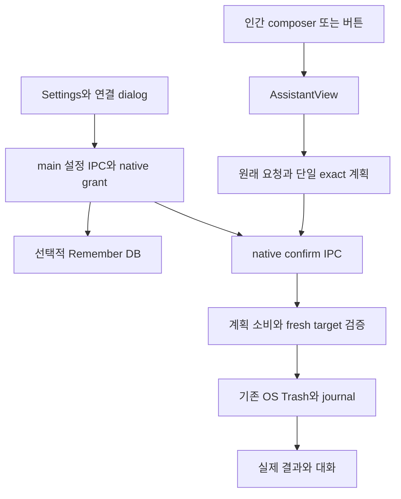
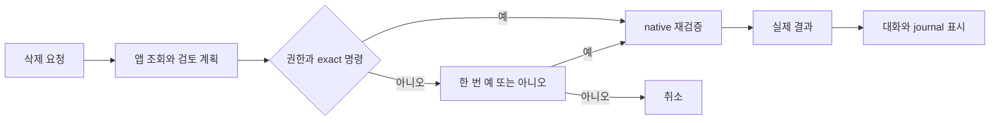

# Handoff: 채팅 삭제 확인과 native opt-in

## Session Metadata

- Created: 2026-10-05 19:27:41 KST; 설치 확인 후 보완.
- Project: BroomSweepy
- Branch: main
- Session duration: 시작 시각 미제공.
- Base: 0b5b555, 17ae082. 이번 변경 미커밋/미푸시.
- Trigger: 컨텍스트 압축 후 작업 연속성 보존, 동일 사건의 첫 인계.

## Origin

채팅 삭제를 예/아니오 한 번으로 줄이고 시간 제한을 없애며, 설정 권한으로 명확한
제거 요청을 추가 확인 없이 진행한다. 사용자는 삭제하자고 했는데 검토/체크/최종 버튼이
남아 있어 이미 처리된 줄 알고 기다렸다.
[요청 대화](../../conversations/2026-10-05-conversational-trash-consent.md#사용자-요청-턴-시각-미확인).
사용자 턴 시각/세션 UUID 미제공. 이 요구는 실제 사용자 자료 삭제/권한 활성화 승인이 아니다.

## Current State Summary

기본 한 번 질문, sole pending plan의 인간 예/아니오 로컬 처리, 기본 OFF 확인 생략
권한, 채팅 계획 TTL 제거와 실행 직전 재검증을 구현했다. Frontend63/Rust219 PASS,
ARM64 최신 번들 서명·맥 설치 교체 완료. Settings에서 기존 설정 유지와 새 권한OFF
표시 확인. 실제 자료 삭제·새 권한 활성화·공급자 호출 없음.
README/정본/QA/기억 갱신; 기존 공개1.7.0 다운로드와 별개, 커밋/푸시 안 함.

## Session Memory Review

- Architecture preflight: SKIPPED — 실제 기억 본문 있음, 닥터 마지막 방문2026-09-29/6일,
  30일 주기 미도래. 생성기의 조건 검사 결과이며 중복 doctor 안 함.
- Anchor index: RAN — 생성기 관련 변경15개; 구현 전 관련 source와 기억 파일도
  build_anchor_index.py --file로 조회하고 실제 본문을 읽어 판단.
- Memory/index updates:001 SUPERSEDED→011,011 CURRENT,009 후속 선호 연결,
  architecture index/MEMORY 갱신. 005 트리 수명 변경 없음.
- Retrieval verification: trash-consent/011 검색으로 MEMORY→011→대화/QA 확인.
  MEMORY76줄/4958bytes,100줄/5KB 이내.
- Observations: 세션 UUID/시작 시각 미제공, 과거 원시 gotcha/learned 로그를 추정해
  정제하지 않았다. 이번 요구·도구 결과만 기록; 백로그/offset 미변경.
- Project skill candidate: defer — 프로젝트 전용 스킬/카탈로그 없음.
  session-learning/project-skill-improvement 읽음. 전역 스킬 자동 수정/복사 안 함.

## Feature/Flow/Decision Snapshot

### Implemented Features

| Feature | Behavior | Entry | Anchors | Verification |
|---|---|---|---|---|
| 단일 질문 | exact path/scope + 예/아니오, modal/복수 체크 없음 | AI 도우미 | AssistantApplicationConfirmation, file/empty cards | 합성 UI |
| 인간 응답 로컬 처리 | 예/아니오는 CLI round 없음 | composer | assistantConfirmation, AssistantView | query1 유지/실행0 또는1 |
| 확인 생략 권한 | 정확히 이름 지정한 제거만 native 실행 | 설정 | ControlStatusPanel, permission_settings/control_server | unit/합성, 설치OFF 확인 |
| 무시간 일회용 계획 | 늦은 확인 허용, 변경/재시작/중복 소비 거부 | main IPC | assistant files/tools/application actions | Rust219 회귀 |

### Feature Boundary

내장 main UI의 인간 요청/native opt-in만 실행 권한이다. 모델/MCP 실행·권한 설정 도구
없음. 일반 파일/폴더·Mac 앱 본체는 확인 생략 가능. 관련 데이터·빈 폴더 범주 전체·
프로세스 종료·Docker·영구 삭제는 제외. 트리/지도/시스템 정리의 별도 TTL/확인 유지.
Windows 앱 제거는 OS 정식 화면, 앱 폴더/레지스트리 추측 삭제 없음.
정본: [capability contract](../architecture/app-capability-contract.md).

### Menu / Screen Map

AI 도우미: 인라인 질문→실제 결과. 앱 본체 계획은 Apps modal을 열지 않는다.
설정/대상 옆 연결과 권한: 확인 생략 + Session/Remember.
단독 앱 관리 화면은 기존 checkbox review 유지, 앱 계획 시간 만료만 제거.

### Composition Diagram

### Flow Diagram

### Decision Records

[011](../../memory/architecture/011-conversational-trash-consent.md)은001의 앱 소유 범위/
bounded 프로토콜을 계승하고 버튼 전용·5분 TTL만 대체한다.
무조건 자동 실행/중복 확인/단순 시간 만료는 제외. one-shot·fresh target·명확한 인간
명령을 기준으로 한다. 004 조사,005 트리,009 수명,010 선택 범위는 유지.

## Codebase Understanding

### Architecture Overview

앱/MCP 조회 dispatcher와 main confirm IPC 분리는 그대로다. 새 권한은 default-false
ControlStatus field이고 Remember 저장 성공 후 적용. Session 디스크 허용 없음,
구형 JSON은 false. individual plan/approval/nonce는 DB에 추가하지 않았다.
LLM 계약의 과거 button-only 문구는 main 인간 결정/native opt-in으로 정정.

### Critical Files

assistantConfirmation.ts, AssistantView.tsx: 인간 결정·exact 명령·단일 계획·결과/진행.
permission_settings.rs/control_server.rs: 수명·영속 철회·설정 IPC.
assistant_files.rs/assistant_tools.rs/application_actions.rs: null expiry·one-shot.

## Work Completed

### Tasks Finished

- 앱 인라인 카드, file/empty clock UI와 중복 체크 제거.
- default false/Remember/Session 회귀와 native 권한 재검사.
- App composition의 작업 lock/결과/보고서 무효화 재사용.
- 영어/일본어/중국어25키와 한국어 source, locale 계약 PASS.
- README3개/정본/design delta/QA/기억/대화 갱신.
- 최신 ARM64 main·문서 worker·MCP, ad-hoc 서명, 설치Settings 확인.

### Files Modified

UI: App/AssistantView/ApplicationsView, ControlStatusPanel, file/empty cards와 action CSS,
bridge/types/i18n, fixtures. 신규 assistantConfirmation/helper test/ApplicationConfirmation.
Rust: assistant files/tools/application actions/control server/permission settings/lib 등록.
Docs: README3개/정본/design refs3개/QA/인계/대화/001/009/011/MEMORY/index.
실제 변경 목록은 git diff --stat + untracked 목록으로 확인한다.
사용자 소유 demo-assets/ 미추적5개 이미지는 수정/삭제/스테이징하지 않았다.

### Decisions Made

기본 OFF, exact name+제거 명령+단일 완전 계획만 질문 생략.
automatic:true는 native 권한 재확인. 모델 출력은 승인 아님.
session/revision/선택/inventory/kind·신원·내용·경계·running 체크 유지.
불확실 실패 자동 재시도 없음. 대체 대상001→011;009 수명은 유지/후속 선호 추가.

## Verification

npm run check/frontend63 PASS; cargo test -p bloomsweepy-desktop --lib --release -j1:
219 PASS/3 ignored. Experience Contract, TypeScript/Vite/ARM app build PASS.
합성 UI: 오래된 plan, No0/Yes1/no provider round, opt-in 명령1/상담0,
대상 변경/권한 철회0,390px overflow없음,44px 버튼/키보드 ring.
[상세 QA](../qa/2026-10-05-conversational-trash-consent.md).

설치 host SHA-256: 5134cd0b4f7fbcccb5fa7608b10251f3bc7b060b1f7a2640b3ed0c96344bce16.
최신 index-Ce0Ou13X.js/native prompt 포함, main/2sidecar ARM64/strict signature PASS.
되돌리기: /private/tmp/broomsweepy-trash-consent-backup-KdjuMa/BroomSweepy.app.
기존 Remember/조회ON/정리 검토ON/자동 시작ON/메뉴 메모리ON/DockerOFF/한국어 유지,
새 확인 생략OFF. 실제 ON 복원/사용자 삭제/실제 LLM native 삭제는 미검증.

## Pending Work

### Immediate Next Steps

1. 사용자 요청으로 확인 생략을 켜고 명확한 제거를 요청하면 새 native 권한 사용.
   이 인계만으로 실제 자료를 지우거나 새 권한을 켜지 않는다.
2. 별도 승인된 disposable workflow에서 실제 LLM→native 전체 삭제 종단 검증.
3. 요청 시 Windows runtime/장시간 memory soak/커밋/푸시/릴리스. 현재 공개 파일/태그 유지.

### Blockers / Deferred

현재 구현/로컬 설치 blocker 없음. 실제 LLM native 삭제/Windows/OS motion 설정/
장시간 soak NOT RUN. 기존 약906kB JS chunk warning 유지, 새 의존성 없음.

## Context for Resuming Agent

### Important Context

Mac8GiB, Node x64/Rust ARM64. explicit --target aarch64-apple-darwin으로 main/sidecar
맞추고 CARGO_BUILD_JOBS=1/release profile로 자원을 관리한다.
앱은 새 OFF 옵션 Settings에 열어 둔다. 기억된 권한과 개별 계획 복원은 다르다.
main native grant를 MCP 공개 권한으로 오해하지 않는다.
트리005/지도 TTL과 추가 체크는 그대로다. 실제 사용자 자료 삭제/권한 활성화 안 함.

### Assumptions Made / Potential Gotchas

일반 삭제는 OS Trash, 관련 데이터/영구 작업까지 blanket grant가 아니다.
지시어/범주 전체/조건부는 한 번 질문. mock 횟수는 OS 이동 증거 아님.
창 닫기는 상주, 완전 종료는⌘Q. 로컬 ad-hoc build, notarized release 아님.
구형 데이터에 expiresAtUnixMs 숫자가 있어도 현재 UI는 clock 만료로 차단하지 않는다.

## Environment State

자체 QA 탭3개/Vite 종료 완료, viewport reset.
사용자용 /Applications/BroomSweepy.app는 실행 유지.
설치 screenshot은 local ignored docs/ui-audit/screenshots/2026-10-05-installed-trash-permission.png.
환경 변수 CARGO_BUILD_JOBS, 자격 증명/토큰 값 저장 없음.

## Related Resources

- [QA](../qa/2026-10-05-conversational-trash-consent.md)
- [정본](../architecture/app-capability-contract.md)
- [011](../../memory/architecture/011-conversational-trash-consent.md)
- [대화](../../conversations/2026-10-05-conversational-trash-consent.md)

#tags: 채팅삭제, 확인생략, 권한수명, 실행재검증, arch:001, arch:009, arch:011, supersedes:#conversational-file-workspace
