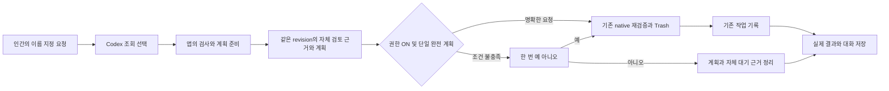

# Handoff: 채팅 확인 생략과 취소 표시 회귀 수정·설치·실제 검증

## Session Metadata

- Created: 2026-10-06 07:02:30 KST.
- Project: BroomSweepy; Branch: main.
- Session duration: 요청 시작 시각/세션 UUID 미제공.
- Trigger: 컨텍스트 압축의 작업 연속성 보존. 같은 압축 사건의 인계 한 번만 작성.

## Handoff Chain

Continues from: [실제 검증에서 발견한 회귀](./2026-10-05-201047-conversational-trash-native-verification.md).
Supersedes: None — 기존011의 확인 정책을 바꾸지 않고 발견한 구현 회귀를 수정.

## Origin

- 요구: 사용자 “버그 수정하자.”
- 출처: 현재2026-10-06 사용자 요청과 테스트 파일 승인 답변. 세션 UUID/요청 시작 시각 미제공.
- 해결할 문제: native 자체 review 래퍼가 확인 생략을 막고 취소한 계획의 대기 표시가 남음.
- 실제 삭제 승인: /private/tmp/broomsweepy-consent-fixed-e2e-qiarwz/consent-auto.txt 29B에
  사용자가 “이 테스트 파일만 허용”. 다른2파일은 보존. commit/push/release 요청 없음.

## Current State Summary

두 회귀 수정, TypeScript/66frontend/ARM64 production build PASS, 최신 개발본을
/Applications/BroomSweepy.app에 설치했다. 실제 Codex에서 검토→인간 아니오 취소와
확인 생략ON→정확한 명령→29B native macOS Trash 종단 PASS. 다른2파일58B 보존.
권한 Remember/ON 유지. 사용자 자료·앱 삭제와 영구 삭제는 없으며 공개 릴리스는 그대로다.

## Session Memory Review

- Architecture preflight: SKIPPED — 본문 있음, 닥터2026-09-29/7일, 30일 미도래.
- Anchor index: RAN — 생성기의16개 변경 파일 조회와011/MEMORY/계약 조회. 기존 설계 뒤집기 없음.
- Memory/index updates: [011](../../memory/architecture/011-conversational-trash-consent.md)의
  과거 실패를 보존하고 수정 조건/실제 검증/한계 추가. MEMORY 검색어 native-review와 날짜 갱신.
- Retrieval verification: MEMORY의 trash-consent/native-review→011→이번 대화/QA 링크 확인.
- Observations: 세션 UUID/시작 시각 미제공이라 원시 gotcha/learned 관찰 정제는 보류.
  명시한 현재 요청·소스·실행 결과만011에 보완, 기존 백로그/offset 미변경.
- Project skill candidate: defer; reusable=yes/relation=duplicate/evidence=verified.
  native 래퍼 없는 fixture의 허위 자신감은011/QA에 기록. 프로젝트 전용 스킬/카탈로그가 없어
  target=none. 전역 스킬 수정·자동 생성·반복 개선 실험은 하지 않음.

## Feature/Flow/Decision Snapshot

### Implemented Features

| Feature/Change | Visible Behavior | Implementation Anchors | Verification |
|----------------|------------------|------------------------|--------------|
| 확인 생략 회귀 | 같은 native 자체 검토와 완전 계획이면 기존 실행 연결 | apps/desktop/src/lib/assistantConfirmation.ts | 실제 Codex→29B native Trash PASS |
| 취소 대기 회귀 | 자체 revision만 정리하고 취소 대화 저장 | apps/desktop/src/views/AssistantView.tsx | 실제 Codex→아니오 PASS, unrelated memory 합성 보존 |
| 합성 응답 충실도 | native 래퍼/복수·오래된·불완전 결과 회귀 | apps/desktop/src/assistant-tools-fixture.tsx |66frontend PASS, 합성 UI 경계 PASS |

### Feature Boundary

main UI가 선택한 기존 작업 공간만 다룬다. 모델/MCP 실행 도구나 권한 범위를 추가하지
않는다. 다른 검토/불완전 결과/상담은 자동 실행하지 않는다. 기본 OFF/Remember 정책,
실행 직전 native 권한·신원·선택·일회용 검증과 Trash/journal 유지. 빈 폴더 종류 전체,
관련 앱 데이터/프로세스/Docker/영구 삭제는 여전히 자동 권한 제외.

### Menu / Screen Map

AI 도우미 → 대화 → 기존 인라인 질문/근거/결과, 하단 입력. 새 화면/스타일 변경 없음.

### Composition Diagram

### Decision Records

자체 래퍼를 두 번째 승인으로 세지 않는다. 출처·freshScan·reviewPrepared·revision을
대조하고 다른 결과는 completed만 허용한다. 모든 review 무시는 다른 기능 오승인 위험으로
제외. 기존011 CURRENT 유지, 새 supersedes 없음.

## Work Completed

- npm run check PASS; npm run test:all 66 PASS.
- 합성 UI: ON 자동 실행1, OFF 아니오0/추가 query0/대기 제거, 예1,
  file+memory는 자동0/파일취소 후 memory 보존, 대상 변경·권한 철회0/재시도 없음.
- ARM64 app-only production build와 ad-hoc deep/strict 검증 PASS.
- 새 설치 host SHA가 번들과 일치:
  b6cf38985c1058fdfc7454897f8a6e85d0a011d1d5e61e1dbdaa1791791fdce8.
- 새 자체87B 대화의 실제 Codex 검토 요청→아니오: 계획/자체 대기 제거, 취소 저장.
- 승인된 정확한 파일 명령→추가 질문 없이29B 파일1개 실제 Trash 이동, 결과 경로 확인.
  stat에서 auto파일 부재, cancel/keep각29B 보존.

### Files Modified — 이번 턴만

- apps/desktop/src/lib/assistantConfirmation.ts: 자체 검토 matching/자동 실행 predicate.
- apps/desktop/src/views/AssistantView.tsx: predicate 사용/자체 래퍼 제거/취소 저장.
- apps/desktop/src/assistant-tools-fixture.tsx: 실제 형태 결과/복수 검토 case.
- apps/desktop/tests/assistantConfirmation.test.ts:3개 회귀 검사.
- 계약 문서/기존QA/011/MEMORY/이번 대화/이 인계에 근거 보완.
- 기존 다른 dirty 소스/README/권한 구현/demo-assets/는 보존. 이번 턴 Rust 수정 없음.

## Pending Work

이번 두 회귀의 이 맥 검증은 완료. 다음 요청에서만 아래 확장을 진행한다:

### Immediate Next Steps

1. Windows 런타임/장시간 RAM soak/실제 내용 있는 폴더·앱 본체 자동 이동은 NOT RUN.
2. crates/bloomsweepy-control/src/capabilities.rs의 파일 검토 설명에 남은 mandatory final
   confirmation 문구를011 opt-in 계약과 별도로 대조. 이번 두 frontend 회귀 수정에는 미변경.
3. commit/push/release는 현재 미요청/미실행. 공개v1.7.0과 설치 개발본을 혼동하지 않는다.
4. Rust219 PASS는 이전 턴 결과; 이번 frontend-only 수정에는 전체 suite NOT RUN.
   ARM64 native 컴파일과 실제 모델→native 실행은 이번 턴 별도 검증.

## Context for Resuming Agent

### Important Context

- 실제 native는 항상 자체 review 래퍼를 제공한다. 이를 없는 합성 fixture로 검사하지 않는다.
- native 근거 없는/오래된 응답은 확인 생략하지 않고 fail closed. 모델 응답은 승인 아님.
- parent 앱 completion의 일반 review 정리 정책은 이번 수정 범위 밖이며 무조건 광역 제거를
  확장하지 않는다. 이번 로컬 취소는 unrelated memory 검토 보존을 합성으로 확인했다.
- 실제 원본 사용자 자료/개인 대화는 이 새 격리 Codex 검증에 포함하지 않았다.
- 새로운 삭제/권한 확대 테스트는 정확한 대상 승인을 확인하고 진행한다.

## Environment State

- macOS ARM64/8GiB, 약6.5GB 여유; Node x64/Rosetta. 기존907.48kB main JS 경고 잔존.
- 설치1.7.0 개발본/ad-hoc, 새 frontend index-QsmxU81u.js. 앱은 성공 결과 화면에 열어 둠.
- 이전 앱 recoverable backup: /private/tmp/broomsweepy-consent-fix-backup-63GsJb/BroomSweepy.app.
- 자체2파일58B와 격리 대화는 보존. 휴지통29B는 복원 가능; 비우지 않음.
- 자체 hidden QA tab15와 Vite session51494는 종료. 다른 탭/서비스 미변경.
- 권한 Remember/확인 생략ON 유지. 별도 env/credential 변경 없음.

## Related Resources

- [QA](../qa/2026-10-05-conversational-trash-consent.md#두-회귀-수정-및-실제-on-종단-2026-10-06-0701-kst)
- [대화](../../conversations/2026-10-06-conversational-trash-regressions-fixed.md)
- [011](../../memory/architecture/011-conversational-trash-consent.md)
- 실제 로컬 ignored 화면: docs/ui-audit/screenshots/2026-10-06-native-cancel-fixed.png,
  docs/ui-audit/screenshots/2026-10-06-native-auto-trash-fixed.png.

#tags: 버그수정, 확인생략, 취소상태, native-review, 종단검증, arch:011
