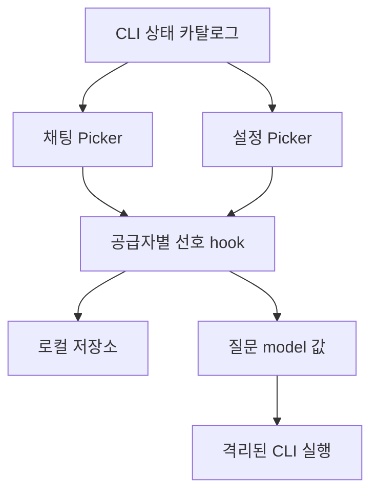

# Handoff: CLI 모델 선택 — 최종 맥 설치·실제 응답·재실행 검증 완료

## Session Metadata
- Created: 2026-10-06 08:59:05 KST
- Updated: 2026-10-06 10:19 KST — 사용자 잠금 해제 후 설치형 검증 재개·완료.
- Project: BroomSweepy
- Branch: main
- Session duration: 컨텍스트 압축 시 중간 기록; 시작 시각 미제공.

## Handoff Chain
- Continues from: [삭제 확인 회귀 수정](2026-10-06-070230-conversational-trash-regressions-fixed.md)
- Supersedes: none — 삭제 권한 계약 변경 없음.

## Origin
| 항목 | 내용 |
|------|------|
| 요구 | CLI 연결 시 모델 선택을 설정이나 채팅 입력창에 제공 |
| 출처 | 현재 사용자 턴 “그리고 cli연결할때…모델선택?”; session UUID 미제공 |
| 해결할 문제 | Ollama 외에는 선택 모델을 지정할 수 없고 CLI 기본값만 사용하던 불편 |

## Current State Summary
백엔드/프런트 구현·TSC/74frontend·225native/3ignored·합성 UI·ARM64 빌드 완료. 첫 설치의 카탈로그 오류를 실제 visibility:list로 수정하고 provider31/2ignored 및 최종 production build/deep strict 서명 검증 PASS. 잠금 해제 후 최종 설치본 해시 일치, 실제 Codex 공개4개 표시, Luna 선택의 실제 단문 응답2회, 설정 공유·⌘Q 재실행 선택/대화 복원 PASS. 기존 데이터·권한·보존 파일 유지; 커밋·푸시 없음.

## Session Memory Review
- Architecture preflight: SKIPPED — 본문 존재, 마지막 닥터2026-09-29, 30일 미도래.
- Anchor index: 생성 도구가 기존 변경 파일16개를 조회. 직접 새 Picker 조회는 연결 결정 없음. 기존 dirty 파일은 이번 구현으로 간주하지 않는다.
- Installation continuation: QA/012/대화/현재 핸드오프 수정 전 anchor 조회, 추가 연결 결정 없음. 같은 모델 선택 기록에 실제 결과만 보완; 새로운 대체 결정 없음.
- Memory/index updates: [012](../../memory/architecture/012-cli-model-selection.md), architecture index, MEMORY의 cli-model 연결. MEMORY77줄4999B.
- Retrieval verification: cli-model/012로 MEMORY→index→본문→현재 요청 대화 링크 재검색 확인.
- Observations: UUID 미제공. 현재 요청의 명시적 구현·시험만 기록, 일별 기존 관찰/백로그 정제 안 함.
- Project skill improvement: 후보 없음 — 프로젝트 전용 스킬을 수정할 요구/근거 없음.
- Validator: 필수 항목/비밀검사 PASS,90/100. `supersedes: none`의 값 없이 키 존재만 검사하는 도구가 supersedes 태그 경고를 냄; 실제 대체 결정은 없고 거짓 supersedes 태그를 붙이지 않음. 전역 도구 수정은 범위 밖.

## Feature/Flow/Decision Snapshot
### Implemented Features
| Feature | Visible Behavior | Entry Point | Anchors | Verification |
|---------|------------------|-------------|---------|--------------|
| 공용 모델 선택 | 입력창/설정에서 공급자별 선택·로컬 기억 | AssistantModelPicker, Settings | assistantModelPreference.ts, useAssistantModelPreference.ts | TSC·8단위·합성 기본 흐름 PASS |
| native 연결 | Codex/Claude --model, 기본값 null | ask_assistant | assistant_provider.rs | native225 +visibility 수정 provider31 PASS; Luna 선택 실제 응답2회 PASS |
| 카탈로그 | Codex CLI→bundled, Claude aliases, Ollama installed | provider status | assistant_provider.rs | 실제 Codex debug models 확인; UI는 ID/표시명만 |

### Feature Boundary
| Area | Does | Does Not Do | Source of Truth |
|------|------|-------------|-----------------|
| 선호 | 이 컴퓨터에 provider/모델만 저장 | 권한·로그인·계정·CLI 전역 설정 수정 | assistantModelPreference.ts |
| 카탈로그 | 상한 있는 메타데이터 표시 | 계정별 접근권 보장·응답 모델 추정 | assistant_provider.rs |
| 실행 | 선택 ID를 별도 인자로 전달 | 오류 시 다른 모델로 자동 전환·새 삭제 권한 | assistant_provider.rs |

### Menu / Screen Map
| Menu | Screen | Features | Route/Path | Status |
|------|--------|----------|------------|--------|
| AI 도우미 | AssistantView | 하단 모델 선택·현재 공급자 모델 기억 | 로컬 view | 구현·맥 설치형 QA PASS |
| 설정 | SettingsView | 같은 기본 선호·목록 다시 확인 | 로컬 view | 구현·동기화/권한 유지 확인 PASS |

### Composition Diagram

### Flow Diagram

### Decision Records
| Decision | Alternatives | Rationale | Record |
|----------|--------------|-----------|--------|
| 공용 Picker와 공급자별 map | 설정 전용: 대화 중 변경 불편; 별도 UI: 동기화 오류 | 하나의 선호 상태 재사용 |012 |
| CLI 메타데이터 목록 | 고정 Codex 모델 이름/desktop cache: 버전 불일치 | 현재 설치 CLI가 정본, 계정 접근권은 별도 |012 |
| 오류 시 선택 유지 | 자동 기본값 전환: 의도와 비용 모델 변경 | 사용자 명시 선택 보존 |012 |

## Work Completed

### Files Modified
이번 작업: assistant_provider.rs, AssistantView.tsx, SettingsView.tsx, types.ts, assistant-tools-fixture.tsx, i18n/index.tsx·ja.json·zh-CN.json. 신규 Picker/SettingsPanel 각TSX·CSS, preference helper/hook/test. 기존 삭제 자동 확인·취소 수정과 demo-assets/는 보존.
설정에서 busy 스냅샷을 받으면 새로고침까지 막히던 리뷰 P2를 수정: refresh는 loading만으로 제한해 최신 상태를 다시 읽을 수 있다. 모델/공급자 선택의 busy guard는 유지.
최종 설치 후 Codex/GPT-5.6-Luna를 선택한 자체 세션에서 파일 작업 없는 연결 문구와17×19 질문에
실제 답변이 완료되었다. ⌘Q 정상 종료/main process 부재 후 재실행에서 공급자·모델·대화12개 복원.
응답 헤더 모델은 요청 echo이며 서버 resolved version 독립 증거가 아니다. exec argv 관찰은
짧은 실행에서 선행 login status만 포착했으므로 별도 모델 인자 실측으로 보고하지 않는다.
인자 구성은 소스/통과한 argv 단위 검사가 근거다.

## Pending Work

### Immediate Next Steps
1. 현재 모델 선택 요청은 완료. 앱은 AI 화면 Codex/GPT-5.6-Luna로 열어 둔다.
2. Windows 런타임·다른 모델의 계정 접근권·Grok/Antigravity/Ollama 실제 생성·장시간 자원/FPS/OS스크린리더는 별도 검증. Claude 실제 응답은 사용자 이전 범위대로 생략.
3. 후속 commit/push/release는 사용자가 요청할 때 진행. 기존 dirty 변경/사용자 demo-assets와 앱 backup을 임의 정리하지 않는다.

## Context for Resuming Agent

### Important Context
- 메모리8GiB, 설치형 재시작 시 디스크6.6GiB 여유. debug 빌드 대신 ARM64 release -j1 재사용.
- 사용자 권한 기억·확인 생략 ON은 그대로. 이전 임시 consent-auto.txt29B만 휴지통 이동 승인되었으며 이번 작업은 삭제 없음.
- /private/tmp/broomsweepy-consent-fixed-e2e-qiarwz/consent-cancel.txt, keep-this.txt는 보존. 이전 앱 backup /private/tmp/broomsweepy-consent-fix-backup-63GsJb도 삭제하지 않는다.
- Codex0.153.4 catalog와 데스크톱 cache0.159.0 목록이 다르다. cache/인증/사용자 이력 읽지 않음.
- Grok/Antigravity 현재 연동은 기본값 전용; 설치 없어서 실제 검증 불가. Claude aliases는 실제 버전 보장이 아니다.
- 최종 준비 번들: target/aarch64-apple-darwin/release/bundle/macos/BroomSweepy.app. arm64/ad-hoc deep strict PASS, 실행파일 SHA256 277c38d26ca7ed217aa65e38728a8e5b3358bee58a783048eb60df0ebfbb9dcf.
- 현재 /Applications는 최종 SHA256277c38d… 설치본. 작업 전 원본 backup /private/tmp/broomsweepy-model-selection-backup-DtiHZi/BroomSweepy.app, 초기165f64c… 모델 빌드는 같은 폴더의 BroomSweepy-before-catalog-fix.app에 보존. 데이터 폴더는 교체/삭제하지 않음.

## Environment State
- 자체 Vite56753와 임시 tab16 모두 종료; viewport reset. 사용자 탭 유지.
- Cargo/프런트 빌드 및 테스트 모두 종료. CUA modelInstalledApp은 최신 설치 앱에 바인딩, 사용자 잠금 해제 후 정상 조작 확인. lock 우회/로그인/권한 변경 안 함.
- 실제 설치형 증거는 docs/ui-audit/screenshots/2026-10-06/model-native-*.png (local ignored). 설치 전 합성 증거와 구분.
- 민감 env 값 기록 없음.

## Related Resources
- [기능 정본](../architecture/app-capability-contract.md)
- [대화 디자인](../design-refs/2026-10-05-layout-chat-workbench.md)
- [기존 삭제 회귀 QA](../qa/2026-10-05-conversational-trash-consent.md)

#tags: 모델선택, cli연동, 설정동기화, 맥설치, 재시작, arch:012
