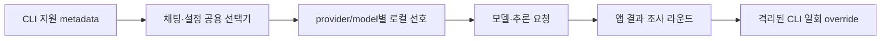

# Handoff: CLI 업데이트와 모델별 추론 강도 선택

## Session Metadata
- Created: 2026-10-06 14:02:07 KST
- Updated: 2026-10-06 14:16 KST — 구현/설치/실제 응답 완료, 마지막 재실행은 Mac잠금 대기.
- Project: BroomSweepy
- Branch: main
- Session duration: 컨텍스트 압축 시 중간 기록; 시작 시각·session UUID 미제공.

## Handoff Chain
- Continues from: [모델 선택 맥 설치 검증](2026-10-06-085905-cli-model-selection.md)
- Supersedes: none — 모델 선택 계약 확장, 삭제 권한 변경 없음.

## Origin
- 요구: “추론강도는 안나오네? … 최신이6 …” 이후 “수정 다 하자. 업데이트 하자”.
- 출처: 현재 사용자 요청; session UUID 미제공. 이전 모델 선택·설치 작업을 이어 확장.
- 범위: 공식 Codex CLI 업데이트, 채팅/설정 공용 추론 선택, 지원 metadata·저장·실행 연결, 맥 빌드 교체와 실제 응답/재시작 검사. commit/push/release는 이번 요청에 없음.

## Current State Summary
Codex 공식 `codex update`0.153.4→0.160.1, 공개7개/model별 default/support 실측. 프런트85PASS/native229PASS3ignored·독립 리뷰·합성 UI PASS. ARM64 빌드3m43s/최종 bundle 재서명·설치본9b799c1f… deep strict PASS. 실제6.1-Sol+medium exec argv/격리 플래그·단문 응답·설정 공유·권한/데이터 유지 PASS. 마지막 screenshot/완전 재실행 전에 Mac이 자동 잠금되어 CUA 중단. 잠금 해제 요청됨; 그 재시작 복원만 아직 NOT RUN.

## Session Memory Review
- Architecture preflight: SKIPPED — 본문012 존재, 닥터2026-09-29로30일 미도래.
- Anchor index: 이번 변경 전 backend/주요 frontend 조회에 연결 결정 없음; 기존012는 직접 읽어 확장 근거 확인.
- Memory/index updates: 기존012/architecture index에 추론 계약과 실제/미실행 근거 보완. MEMORY77줄4999B 유지.
- Retrieval verification: MEMORY cli-model→012→모델 정본/QA/현재 대화 연결 확인.
- Observations: session UUID 미제공. 이번 명시적 구현·시험만 기록, 일별 관찰/백로그 정제 안 함.
- Project skill improvement: 후보 없음 — 프로젝트 전용 스킬 수정 요구·근거 없음.
- Validator: required/secret 검사 PASS,80/100 READY. `supersedes: none` 키-only 오탐은 거짓 supersedes 태그로 맞추지 않는다.

## Feature/Flow/Decision Snapshot
### Implemented Features
| Feature | Visible Behavior | Entry Point | Anchors | Verification |
|---------|------------------|-------------|---------|--------------|
| 모델별 추론 강도 | 지원 목록·기본값·모델별 기억 | chat/settings Picker | assistantModelPreference.ts | frontend85PASS, 합성 UI PASS |
| native 실행 연결 | 해당 질문의 모든 라운드에 강도 override | ask_assistant | assistant_provider.rs | native229PASS/3ignored·실제6.1/medium argv·응답 PASS |

- Codex catalog→모델별 지원 enum/default→공용 picker→provider+model별 선호→질문 `reasoningEffort`→각 조사 라운드의 별도 CLI `--config model_reasoning_effort=…`.
- 기본값/null은 override 인자 생략. 명시 강도는 명시 Codex 모델에만 적용. 다른 공급자에 임의로 매핑하지 않음.
- 설치 CLI가 metadata 정본. enum whitelist/bounds로 지침·인증·모델 설명을 UI에 반입하지 않음.
- 오류 시 모델/강도 자동 fallback 없음. CLI 전역 설정·로그인·앱 파일 권한/삭제 동의/격리 실행은 유지.
- 모델 라벨/응답 강도는 요청 echo이며 서버 resolved version 증거가 아님.

### Composition Diagram

## Work Completed
- `.local/bin/codex update` 공식 installer로0.160.1 적용, help/catalog projection 확인.
- backend worker: assistant_provider.rs만 소유; DTO/default/validation/argv/parser/error 검사35PASS/2ignored, rustfmt/diff PASS.
- frontend worker: 지정 소유 파일에서 기존version1 호환/per-model enum/stale/저장 상한·locale 구현 완료,85PASS.
- 독립 읽기 리뷰 및 current-choice truncate delta 리뷰: findings 없음. 메인의 합성390/desktop·4locale·default/지원축소/oldhost/busy/settings/reload PASS.
- production build와 설치본 서명/해시·실제 모델/강도 전달·응답/설정 공유 PASS. 새 번들의 linker-only 서명 resource 실패는 기존entitlements로 bundle 재서명 후 해결; 공증 아님.
- README/정본/디자인/QA/대화/012/현재 핸드오프 보완. 앱·자료·권한·CLI로그인/전역설정 보존. commit/push/release 없음.

## Pending Work
### Immediate Next Steps
1. 사용자 “풀었어” 후 CUA fresh AX부터. 새 앱 Settings의6.1-Sol/중간 공유는 이미 확인; 이어 ⌘Q/main process 부재→재실행→AI에서6.1-Sol/중간/자체 대화16개 복원 확인. 새 모델 질의·파일 작업 반복할 필요 없음.
2. QA/012/대화/현재 핸드오프에 재실행 실제 결과·screenshot 보완. 모든 검사 재실행/재빌드 불필요.
3. Windows/다른 공급자/계정별 모든 강도/장시간·OS스크린리더는 별도. commit/push/release/기존 backup 정리는 사용자 요청 시.

## Context for Resuming Agent
### Important Context
- 8GiB ARM64 Mac, 설치 후 디스크5.2GiB 여유. release 캐시/-j1 사용, debug build 피함.
- 기존 dirty 변경·사용자 demo-assets/·모든 backup 보존. 앱 데이터 폴더 교체/삭제 안 함.
- 권한 기억/확인 생략ON 등 유지; 로그인·globalconfig·MCP·파일 삭제 권한 확대 없음.
- `/private/tmp/broomsweepy-consent-fixed-e2e-qiarwz/consent-cancel.txt`와 `keep-this.txt`는 보존, 이번 작업에서 파일 삭제/검사 테스트하지 않음.
- 기존277c38d… app은 /private/tmp/broomsweepy-reasoning-update-backup-Tej4i8/BroomSweepy.app에 보존. /Applications 및 준비 bundle SHA2569b799c1f7f47f49283fe5b364e8bde8d2e93c21145baa3c05676467da4c94a15 일치.
- CUA는 압축 후 `cua.rewriteDocumentation()`부터, native app rebind/fresh AX indices. 이전 own Vite/tab은 종료됨.
- GPT-6.1-Sol default low, 6-Luna/5.6-Luna max까지(no ultra). 지원 값은 actual catalog로 제한. 저장된5.6-Luna를 startup에서 자동 최신 모델로 바꾸지 않음.
- 현재 앱은6.1-Sol/중간 선택·자체 대화16개, Settings 화면에서 실행 중(main PID64920). 잠금이 첫 CUA click에서 막았으므로 그 뒤 screenshot/⌘Q는 실행되지 않았다. lock 우회/자동 해제 시도 안 함.
- own Vite36616/tab17 종료·viewport reset·fixture한국어 복원. Cargo/build/argv probe 모두 종료. backend/review/frontend workers 완료.

## Related Resources
- [모델/추론 정본](../architecture/assistant-model-selection.md)
- [이전 모델 QA](../qa/2026-10-06-cli-model-selection.md)
- [기억012](../../memory/architecture/012-cli-model-selection.md)

#tags: 추론강도, cli업데이트, 모델선택, 맥설치, arch:012
